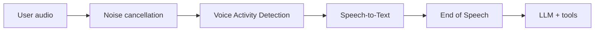

Listen settings control how Rapida handles user audio before the assistant responds. Use this section for `listen.*` runtime options and deployment settings related to speech-to-text, noise cancellation, voice activity detection, and end-of-speech.

<Info>
Listen settings are used by voice-capable deployments: Phone Call, Web Widget with microphone input, and Web App / SDK with microphone input. Text-only channels do not use listen configuration.
</Info>

## Configure it

Open your assistant, select **Configure Assistant**, then open **Deployments**. Listen settings appear in the **Voice Input** step for each deployment that supports microphone or phone audio.

| Area | What it controls |
|------|------------------|
| Speech-to-Text | Provider, credential, model, language, and transcription behavior. |
| Noise cancellation | Background noise removal before VAD and STT. |
| Voice Activity Detection | Speech start/stop detection and barge-in sensitivity. |
| End of Speech | Turn completion detection and silence timeout behavior. |

## Configuration pages

<CardGroup cols={2}>
  <Card title="Speech-to-Text" icon="mic" href="/assistants/speech-to-text">
    Choose the provider, credential, model, and language used to transcribe user speech.
  </Card>
  <Card title="Noise Cancellation" icon="audio-waveform" href="/assistants/noise-cancellation">
    Clean background noise before VAD and STT process the user's audio.
  </Card>
  <Card title="Voice Activity Detection" icon="activity" href="/assistants/voice-activity-detection">
    Tune speech detection, silence frames, and barge-in sensitivity.
  </Card>
  <Card title="End of Speech Detection" icon="clock" href="/assistants/end-of-speech">
    Decide when the user has finished a turn and the assistant should respond.
  </Card>
</CardGroup>

## Recommended starting point

| Area | Start with |
|------|------------|
| STT | A streaming provider and model that matches your channel audio. |
| Noise cancellation | RNNoise enabled for phone calls and noisy browser environments. |
| VAD | Silero VAD. |
| EOS | Pipecat Smart Turn for natural conversations, or Silence-Based for simple IVR-style flows. |

<Tip>
Tune listen settings from real conversation logs. If a caller gets cut off, start with EOS and VAD. If transcription is wrong, check language, audio quality, noise cancellation, and STT model.
</Tip>

## Troubleshooting map

| Symptom | First place to look |
|---------|---------------------|
| Assistant responds before the user is done | [End of Speech Detection](/assistants/end-of-speech) |
| Assistant interrupts on coughs or background noise | [Voice Activity Detection](/assistants/voice-activity-detection) and [Noise Cancellation](/assistants/noise-cancellation) |
| Transcript is wrong or incomplete | [Speech-to-Text](/assistants/speech-to-text) |
| Phone calls behave differently from web sessions | Deployment-level Voice Input settings |

## Related

<CardGroup cols={2}>
  <Card title="Experience" icon="sliders-horizontal" href="/assistants/configuration/experience">
    Configure greeting, idle timeout, error message, and session duration.
  </Card>
  <Card title="Speak" icon="volume-2" href="/assistants/configuration/speak">
    Configure text-to-speech and spoken output.
  </Card>
  <Card title="Phone Call Deployment" icon="phone" href="/voice-deployment-options/phone">
    Configure required voice input for phone calls.
  </Card>
  <Card title="Web App / SDK Deployment" icon="monitor" href="/voice-deployment-options/web-app">
    Configure optional voice input for custom apps.
  </Card>
</CardGroup>
