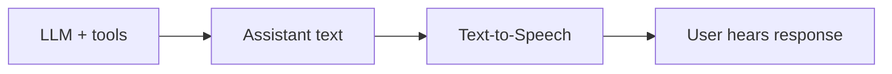

Speak settings control how assistant text becomes audio. Use this section for `speak.*` runtime options and deployment settings related to text-to-speech, voices, pronunciation, ambient audio, and speech delivery.

<Info>
Speak settings are used by voice-capable deployments: Phone Call, Web Widget with spoken responses, and Web App / SDK with spoken responses. Text-only channels do not use speak configuration.
</Info>

## Configure it

Open your assistant, select **Configure Assistant**, then open **Deployments**. Speak settings appear in the **Voice Output** step for each deployment that supports spoken responses.

| Area | What it controls |
|------|------------------|
| Text-to-Speech | Provider, credential, model, voice, language, and speech synthesis behavior. |
| Pronunciation | How dates, times, numbers, addresses, URLs, acronyms, and domain terms are spoken. |
| Delivery | Pause behavior, conjunction boundaries, and optional ambient audio. |

## Configuration pages

<CardGroup cols={2}>
  <Card title="Text-to-Speech" icon="volume-2" href="/assistants/text-to-speech">
    Choose the provider, voice, model, language, pronunciation, and speech delivery settings.
  </Card>
  <Card title="Custom TTS" icon="settings" href="/integrations/tts/custom">
    Connect a custom WebSocket speech synthesis provider with DSL rules.
  </Card>
</CardGroup>

## Recommended starting point

| Area | Start with |
|------|------------|
| TTS | A low-latency streaming voice that supports the assistant's primary language. |
| Pronunciation | Enable dictionaries for numbers, currency, dates, times, URLs, and domain terms that users will hear often. |
| Prompt | Short spoken responses, usually one or two sentences. |

<Tip>
Tune speak settings by listening to full conversations in the target channel. A voice that sounds good in a browser preview can still sound unclear over phone audio.
</Tip>

## Troubleshooting map

| Symptom | First place to look |
|---------|---------------------|
| Assistant voice starts slowly | [Text-to-Speech](/assistants/text-to-speech) model latency and response length |
| Assistant mispronounces product names or numbers | [Text-to-Speech](/assistants/text-to-speech) pronunciation dictionaries |
| Assistant sounds rushed | Conjunction boundaries, pause duration, and prompt response length |
| Voice sounds poor on phone | Test through [Phone Call](/voice-deployment-options/phone), not only browser preview |

## Related

<CardGroup cols={2}>
  <Card title="Experience" icon="sliders-horizontal" href="/assistants/configuration/experience">
    Configure greeting, idle timeout, error message, and session duration.
  </Card>
  <Card title="Listen" icon="mic" href="/assistants/configuration/listen">
    Configure speech-to-text, VAD, noise cancellation, and end-of-speech.
  </Card>
  <Card title="Phone Call Deployment" icon="phone" href="/voice-deployment-options/phone">
    Configure required voice output for phone calls.
  </Card>
  <Card title="Web Widget Deployment" icon="message-square" href="/voice-deployment-options/web-widget">
    Configure optional spoken responses in the web widget.
  </Card>
</CardGroup>
