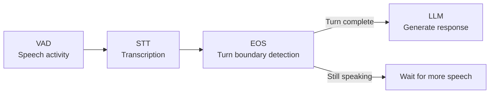

End of Speech (EOS) detection determines **when a caller has finished their turn** and the assistant should start responding. It is the single most impactful setting for perceived conversation latency — a fast EOS means the assistant responds quickly, but a premature EOS means the assistant cuts the caller off mid-sentence.

EOS works downstream of VAD. While VAD detects whether the caller is actively making sound (frame-by-frame), EOS decides whether a period of silence means "I'm done talking" or "I'm pausing to think".

<Warning>
**Deprecation notice:** LiveKit Turn Detector EOS is being disabled and will be deprecated due to a licensing issue. Do not use it for new assistants.
</Warning>

---

## Providers

Rapida supports three EOS providers, ranging from a simple silence timer to ML-powered turn detection models.

| Provider | Description |
|----------|-------------|
| **[Silence-Based](#silence-based-eos)** | Fixed silence timeout. Simple, reliable, zero compute overhead. The default. |
| **[Pipecat Smart Turn](#pipecat-smart-turn-eos)** | Whisper-based audio model (~8 MB). Predicts turn completion directly from speech audio. |
| **[LiveKit Turn Detector](#livekit-turn-detector-eos)** | Language model that predicts turn completion from transcribed text. Context-aware with conversation history. |

---

## Silence-Based EOS

The simplest approach: after the last speech activity, wait for a fixed duration of silence, then trigger end-of-speech. No ML model, no inference overhead.

**Why choose Silence-Based:**
- Zero additional compute — no model to load or run
- Predictable, deterministic behaviour — the timeout is exactly what you configure
- Works with any language, any accent, any audio quality
- Easiest to reason about and debug

**When to use:** Most deployments, especially when starting out. Silence-based EOS is the default and works well for the majority of voice AI use cases. It is the right choice when you want simplicity and predictability, or when your callers speak in short, clear turns (IVR menus, yes/no questions, appointment booking).

**When it falls short:** Callers who pause mid-sentence (e.g., "I'd like to book a flight to... hmm... London") will be interrupted if the pause exceeds the timeout. This is where model-based EOS providers add value.

### Parameters

| Parameter | Config Key | Default | Range | Description |
|-----------|-----------|---------|-------|-------------|
| Activity Timeout | `microphone.eos.timeout` | `1000 ms` | 500 – 4000 ms | Duration of silence after the last speech activity before triggering end-of-speech. |

<Tip>
**Timeout tuning guide:**
- **500 – 600 ms** — Very fast. The assistant responds almost immediately when the caller pauses. Best for IVR-style interactions with short, predictable answers ("yes", "no", "option 2"). Callers will be cut off if they pause to think.
- **700 – 800 ms** — Fast and balanced. Good default for most conversational assistants. Short enough to feel responsive, long enough for typical sentence-internal pauses.
- **1000 – 1500 ms** — Relaxed. Gives callers time to pause and continue. Good for complex conversations where callers need to recall information (account numbers, addresses, medical details).
- **2000 – 4000 ms** — Very patient. Use for elderly callers, non-native speakers, or scenarios where callers frequently pause mid-thought. Increases perceived latency significantly.
</Tip>

<Note>
The default when switching to Silence-Based EOS in the UI is **700 ms**. The backend default (when no value is set) is **1000 ms**. The 700 ms UI default is optimized for a balance between responsiveness and natural conversation flow.
</Note>

---

## Pipecat Smart Turn EOS

[Pipecat Smart Turn](https://github.com/pipecat-ai/smart-turn) uses a Whisper-based audio model (~8 MB) to predict whether the caller has finished their turn directly from the speech audio waveform. Unlike silence-based detection, it understands prosodic cues — falling intonation, slowing speech rate, and other acoustic signals that indicate turn completion.

**Why choose Pipecat Smart Turn:**
- Detects turn completion from **audio features**, not just silence — catches prosodic cues like falling intonation at the end of a sentence
- ~10 ms inference time per prediction — negligible latency impact
- Supports 23 languages out of the box
- Small model size (~8 MB ONNX)
- Uses a rolling audio buffer (~5 seconds) for context — doesn't need the full conversation history

**When to use:** Conversations where callers frequently pause mid-sentence. Pipecat Smart Turn significantly reduces premature turn-taking compared to silence-based detection because it can distinguish between a "thinking pause" (flat or rising intonation) and a "finished speaking" pause (falling intonation, complete sentence prosody).

Best for: customer support, complex information gathering (addresses, travel bookings), multilingual deployments where pause patterns vary by language.

**How it works:**
1. Audio from the caller is accumulated in a rolling buffer (max ~5 seconds at 16 kHz)
2. When a final STT transcript arrives, the model runs inference on the buffered audio
3. The model outputs a probability between 0 and 1 indicating likelihood of turn completion
4. If probability >= threshold → use `quick_timeout` (short wait, then fire)
5. If probability < threshold → use `silence_timeout` (long wait, keep listening)
6. Interim STT transcripts reset the timer with the `fallback_timeout`

### Parameters

| Parameter | Config Key | Default | Range | Description |
|-----------|-----------|---------|-------|-------------|
| Turn Completion Threshold | `microphone.eos.threshold` | `0.5` | 0.1 – 0.9 | Probability threshold for turn completion. When the model's prediction exceeds this value, it considers the turn complete and uses the quick timeout. |
| Quick Timeout | `microphone.eos.quick_timeout` | `200 ms` | 50 – 1000 ms | Short silence buffer after the model predicts "turn complete". Gives the caller a brief window to correct themselves ("yes... actually wait") before the assistant responds. |
| Extended Timeout | `microphone.eos.silence_timeout` | `2000 ms` | 500 – 5000 ms | Silence duration used when the model predicts the caller is still speaking. Acts as a long patience window for mid-thought pauses. |
| Fallback Timeout | `microphone.eos.timeout` | `500 ms` | 500 – 4000 ms | Silence timeout used for interim STT transcripts and when model inference fails. Falls back to simple silence-based behaviour. |

<AccordionGroup>
  <Accordion title="Parameter tuning recommendations">

**Turn Completion Threshold (0.1 – 0.9)**

| Range | Behaviour |
|-------|-----------|
| 0.1 – 0.3 | Aggressive. The model triggers on weak signals. Faster responses but more false triggers. Good for IVR-style interactions. |
| 0.4 – 0.6 | Balanced. Default is 0.5. The model needs moderate confidence before triggering. Best for general-purpose conversations. |
| 0.7 – 0.9 | Conservative. Only strong turn-completion signals trigger. Use when false interruptions are very costly (legal, medical). |

**Quick Timeout (50 – 1000 ms)**

| Range | Behaviour |
|-------|-----------|
| 50 – 150 ms | Almost instant response after model says "done". Snappy but no correction window. |
| 200 – 300 ms | Default range. Brief correction window. Good balance. |
| 500 – 1000 ms | Long correction window. Use if callers frequently say "wait" or "actually". |

**Extended Timeout (500 – 5000 ms)**

| Range | Behaviour |
|-------|-----------|
| 500 – 1000 ms | Short patience. If the model keeps saying "not done", force EOS quickly anyway. |
| 2000 ms | Default. Gives callers 2 seconds to continue after a pause. |
| 3000 – 5000 ms | Very patient. For callers who take long pauses mid-thought. |

  </Accordion>
</AccordionGroup>

---

## LiveKit Turn Detector EOS

The [LiveKit Turn Detector](https://github.com/livekit/turn-detector) uses a language model to predict turn completion from **transcribed text** combined with **conversation history**. Unlike Pipecat (which analyzes audio), LiveKit analyzes the linguistic content of what was said to determine if the caller is done.

**Why choose LiveKit Turn Detector:**
- **Context-aware** — uses conversation history (up to 6 turns by default) to make better predictions. If the assistant asked "What is your address?", the model knows the caller is likely still speaking during a pause after saying "123 Main Street"
- **Text-based analysis** — catches semantic cues that audio models miss. For example, "My address is 123" is clearly incomplete, regardless of intonation
- **Reduces false triggers** on addresses, phone numbers, and lists — the model understands that these naturally contain pauses between segments
- Available in two model variants: English-only (66 MB, optimized) and Multilingual (378 MB, 14 languages)

**When to use:** Conversations with structured data collection where callers frequently pause mid-answer. The LiveKit model excels at preventing premature turn-taking during:
- Address dictation ("123 Main Street... apartment 4B... New York")
- Phone numbers ("area code 212... 555... 1234")
- Lists or multi-part answers
- Complex questions requiring thought

**How it works:**
1. Final STT transcripts are accumulated into the current user turn
2. When a final transcript arrives, the model builds a chat template from conversation history + current text
3. The model predicts an end-of-utterance probability
4. If probability >= threshold → use `quick_timeout`
5. If probability < threshold → use `silence_timeout`
6. Assistant responses (from `LLMResponseDonePacket`) are recorded in history for context

### Parameters

| Parameter | Config Key | Default | Range | Description |
|-----------|-----------|---------|-------|-------------|
| Model | `microphone.eos.model` | `en` | `en`, `multilingual` | Model variant. `en` is 66 MB and optimized for English. `multilingual` is 378 MB and supports Chinese, German, Dutch, English, Portuguese, Spanish, French, Italian, Japanese, Korean, Russian, Turkish, Indonesian, and Hindi. |
| Turn Completion Threshold | `microphone.eos.threshold` | `0.0289` | 0.001 – 0.1 | Probability threshold for turn completion. This value is much lower than Pipecat's threshold because the LiveKit model outputs probabilities on a different scale. The default `0.0289` is the "unlikely threshold" from LiveKit's reference configuration. |
| Quick Timeout | `microphone.eos.quick_timeout` | `250 ms` | 50 – 500 ms | Short buffer after model says "done" before firing EOS. Catches fast corrections. |
| Safety Timeout | `microphone.eos.silence_timeout` | `1500 ms` | 500 – 5000 ms | Maximum silence before forcing EOS when the model keeps predicting "not done". Acts as a safety fallback to prevent indefinite waiting. |
| Fallback Timeout | `microphone.eos.timeout` | `500 ms` | 300 – 2000 ms | Silence timeout for interim transcripts and model inference failures. |

<Warning>
The LiveKit threshold range (0.001 – 0.1) is very different from Pipecat's (0.1 – 0.9). Do not copy threshold values between providers — they use fundamentally different models with different probability distributions.
</Warning>

<AccordionGroup>
  <Accordion title="Model selection guide">

**English model (`en`, 66 MB)**

| Aspect | Detail |
|--------|--------|
| Optimisation | Faster inference, smaller memory footprint |
| Accuracy | Better for English conversations than the multilingual model |
| When to use | Your callers speak English, even with accents (the STT provider handles accent recognition; LiveKit only sees the transcribed text) |

**Multilingual model (`multilingual`, 378 MB)**

| Aspect | Detail |
|--------|--------|
| Languages | Chinese (zh), German (de), Dutch (nl), English (en), Portuguese (pt), Spanish (es), French (fr), Italian (it), Japanese (ja), Korean (ko), Russian (ru), Turkish (tr), Indonesian (id), Hindi (hi) |
| Init time | Takes longer to load at session start (~100–200 ms extra) |
| When to use | Your callers speak non-English languages or you handle mixed-language conversations |

  </Accordion>
  <Accordion title="Parameter tuning recommendations">

**Threshold (0.001 – 0.1)**

| Value | Behaviour |
|-------|-----------|
| 0.01 – 0.02 | Conservative. The model needs high confidence to trigger. Fewer false interruptions but slower response. |
| 0.0289 | Default. Matches LiveKit's "unlikely threshold" — a good balance between responsiveness and accuracy. |
| 0.05 – 0.1 | Aggressive. Triggers on weaker signals. Faster responses but more false turns, especially during pauses in structured data. |

**Safety Timeout (500 – 5000 ms)**

| Range | Behaviour |
|-------|-----------|
| 500 – 1000 ms | Short safety net. If the model keeps saying "not done" for 1 second, fire anyway. Use for fast-paced conversations. |
| 1500 ms | Default. Good balance. |
| 3000 – 5000 ms | Very patient. The model gets a long time to keep predicting. Use when callers dictate very long multi-part answers. |

  </Accordion>
</AccordionGroup>

---

## Choosing a provider

| Criteria | Silence-Based | Pipecat Smart Turn | LiveKit Turn Detector |
|----------|--------------|-------------------|----------------------|
| **Approach** | Fixed silence timer | Audio model (prosody) | Language model (text + history) |
| **Model size** | None | ~8 MB ONNX | 66 MB (en) / 378 MB (multilingual) |
| **Init time** | Instant | ~20–50 ms | ~50–200 ms |
| **Inference time** | None | ~10 ms per prediction | ~5–15 ms per prediction |
| **Context used** | Silence duration only | Last ~5s of audio | Transcribed text + conversation history |
| **Languages** | All (language-agnostic) | 23 languages | English or 14 languages |
| **Handles mid-sentence pauses** | No | Yes (prosodic cues) | Yes (semantic understanding) |
| **Handles structured data** | No | Partially | Yes (understands incomplete addresses, numbers) |
| **Compute overhead** | Zero | Low | Moderate |

### Decision guide

<Steps>
  <Step title="Start with Silence-Based">
    For most new assistants, Silence-Based EOS with a 700 ms timeout is the right starting point. It's simple, predictable, and works well for 80% of use cases.
  </Step>
  <Step title="Switch to Pipecat if callers get cut off">
    If your conversation logs show frequent premature turn-taking — callers being interrupted mid-sentence during natural pauses — switch to Pipecat Smart Turn. Its audio model catches prosodic cues that silence timers miss.
  </Step>
  <Step title="Switch to LiveKit for structured data collection">
    If your assistant collects addresses, phone numbers, or multi-part answers where callers naturally pause between segments, LiveKit's text-based model with conversation history is the strongest choice. It understands that "123 Main Street" after "What is your address?" is likely incomplete.
  </Step>
</Steps>

<Tip>
You can combine any EOS provider with any VAD provider. They are independent components in the voice pipeline. A common high-quality configuration is **Silero VAD + LiveKit EOS** or **Silero VAD + Pipecat Smart Turn EOS**.
</Tip>

---

## How EOS providers interact with VAD

VAD and EOS work together but serve different purposes:

| Stage | VAD | EOS |
|-------|-----|-----|
| **What it detects** | "Is the caller making sound right now?" | "Has the caller finished their complete thought?" |
| **Granularity** | Frame-by-frame (every 10–16 ms) | Per-utterance (after each STT transcript) |
| **Output** | Speech onset/offset events, activity heartbeats | End-of-speech signal that triggers LLM response |
| **Affected by** | Audio signal quality, background noise | Pause patterns, speech content, conversation context |

The VAD continuously sends **speech activity heartbeats** while the caller is speaking. These heartbeats reset the EOS silence timer, preventing the EOS from firing while the caller is actively speaking. When speech stops, the VAD stops sending heartbeats, and the EOS timer begins counting down.

For the model-based EOS providers (Pipecat and LiveKit), the EOS also receives the final STT transcript. On receiving a final transcript, the model runs inference to decide whether to use the quick timeout (turn complete) or extended timeout (still speaking).

---

## Next steps

<CardGroup cols={2}>
  <Card title="Voice Activity Detection" icon="shield" href="/assistants/voice-activity-detection">
    Configure VAD providers and understand speech detection parameters.
  </Card>
  <Card title="Create an Assistant" icon="plus" href="/assistants/create-assistant">
    Set up EOS as part of the full voice pipeline configuration.
  </Card>
</CardGroup>
