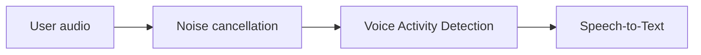

Noise cancellation removes background audio before Rapida runs Voice Activity Detection and Speech-to-Text. It helps prevent false speech detection and improves transcription quality when users speak from phones, shared offices, vehicles, cafes, or other noisy environments.

<Info>
Noise cancellation is configured in **Voice Input** under **Show advanced settings**. It is part of the deployment voice configuration, so each deployment can use its own setting.
</Info>

## Provider

Rapida exposes **RNNoise** as the standard noise cancellation provider.

RNNoise is designed for real-time speech enhancement. It reduces steady background noise while preserving speech intelligibility, making it a good default for phone calls and browser microphone sessions.

| Provider | Best for | Notes |
|----------|----------|-------|
| RNNoise | Phone calls, office noise, keyboard noise, light traffic, cafes | Default choice for most voice deployments. |

## When to use it

Enable noise cancellation when:

- Calls happen over PSTN or mobile networks.
- Users may be in offices, stores, vehicles, cafes, or shared spaces.
- VAD triggers on background audio.
- STT receives noisy audio and produces unstable transcripts.
- You want one safer default across many caller environments.

You may disable or avoid it when:

- Audio is already clean studio-quality input.
- Another upstream system already performs strong noise suppression.
- You hear speech artifacts after enabling it.
- The STT provider performs better with untouched audio in your test calls.

<Warning>
Do not use noise cancellation to hide poor microphone placement, severe clipping, or echo. It can reduce background noise, but it cannot recover speech that was not captured clearly.
</Warning>

## How it affects the pipeline

| Component | Effect |
|-----------|--------|
| VAD | Cleaner audio reduces false speech starts from background noise. |
| STT | Cleaner speech can improve transcript stability and word accuracy. |
| EOS | Better VAD activity signals make turn detection more predictable. |
| TTS | No direct effect. TTS happens after the assistant generates text. |

## Tuning with VAD

Noise cancellation and VAD should be tuned together.

| Symptom | What to adjust |
|---------|----------------|
| Background noise interrupts assistant speech | Keep RNNoise enabled and raise VAD threshold. |
| Quiet speakers are missed | Keep RNNoise enabled, then lower VAD threshold slightly. |
| Words are clipped at the start | Lower VAD threshold or reduce minimum speech frames. |
| Speech gets split into multiple chunks | Increase VAD minimum silence frames. |

See [Voice Activity Detection](/assistants/voice-activity-detection) for VAD provider and threshold details.

## Channel guidance

| Channel | Recommendation |
|---------|----------------|
| Phone Call | Enable RNNoise by default. Phone audio is often compressed, narrowband, and noisy. |
| Web Widget | Enable RNNoise when users may speak from uncontrolled environments. |
| Web App / SDK | Enable RNNoise for support, sales, healthcare, field, or accessibility workflows. Test clean in-app microphone flows before deciding. |

## Troubleshooting

| Symptom | Likely cause | What to do |
|---------|--------------|------------|
| Transcript includes background words or sounds | Noise cancellation off or VAD too sensitive | Enable RNNoise and raise VAD threshold. |
| User speech sounds processed or thin | Noise suppression too aggressive for the input | Test with RNNoise disabled for clean microphones. |
| Assistant still interrupts on noise | VAD threshold too low | Raise VAD threshold after enabling RNNoise. |
| STT accuracy is still poor | Wrong language/model, bad input audio, or clipped speech | Check [Speech-to-Text](/assistants/speech-to-text) and VAD settings. |

## Related

<CardGroup cols={2}>
  <Card title="Listen" icon="mic" href="/assistants/configuration/listen">
    Understand where noise cancellation sits in speech input configuration.
  </Card>
  <Card title="Voice Activity Detection" icon="activity" href="/assistants/voice-activity-detection">
    Tune speech detection after noise cancellation.
  </Card>
  <Card title="Speech-to-Text" icon="mic" href="/assistants/speech-to-text">
    Choose the transcription provider and model.
  </Card>
  <Card title="End of Speech Detection" icon="clock" href="/assistants/end-of-speech">
    Tune turn completion after VAD and STT.
  </Card>
</CardGroup>
