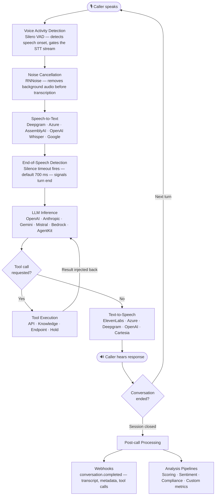
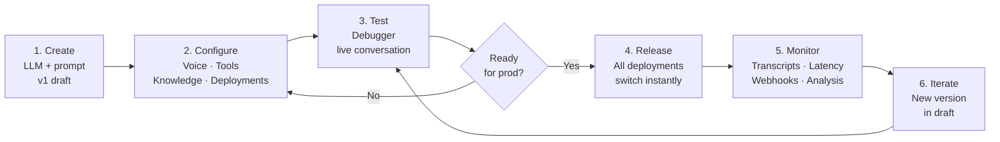

An **assistant** is the core unit of Rapida. It packages everything needed to run a production voice AI conversation — the LLM and prompt, the voice pipeline (STT, VAD, TTS), knowledge sources, tools, and deployment channels — into a single versioned object.

One assistant configuration drives every channel. The same prompt, model, and voice settings that handle your inbound phone calls also power your web widget and WhatsApp deployment. Change something once and it propagates everywhere.

<Info>
Assistants are **version-controlled**. Every prompt or model change creates a new draft version. Versions must be explicitly released — live deployments are never changed automatically.
</Info>

## Anatomy of an assistant

<CardGroup cols={2}>
  <Card title="Prompt & Model" icon="cpu">
    The system prompt defines persona, scope, and behaviour. The LLM provider and model (OpenAI, Anthropic, Gemini, Mistral, Bedrock, or a custom AgentKit backend) power the reasoning. Model parameters — temperature, max tokens, stop sequences — are tunable per version.
  </Card>
  <Card title="Voice Pipeline" icon="mic">
    Converts caller audio to text and assistant text back to speech. Configurable STT provider, VAD sensitivity, noise cancellation, end-of-speech detection, TTS provider, voice model, and pronunciation rules — independently tunable per deployment channel.
  </Card>
  <Card title="Knowledge Bases" icon="book-open">
    One or more knowledge bases attached for retrieval-augmented generation. At call time, the assistant retrieves the most relevant document chunks and injects them as context before calling the LLM.
  </Card>
  <Card title="Tools" icon="zap">
    Functions the LLM can invoke mid-conversation: query knowledge, call external APIs, invoke endpoint LLM prompts, hold a call, or end the session. The LLM decides when to call each tool based on its description.
  </Card>
  <Card title="Deployments" icon="phone">
    Each channel — phone, web widget, web app, WhatsApp — is a separate deployment attached to the assistant. Deployments share the assistant's brain but can have per-channel voice and experience settings.
  </Card>
  <Card title="Webhooks" icon="activity">
    Post-call webhooks fire at conversation start, completion, and failure. Deliver transcripts, metadata, and tool call results to your CRM, data warehouse, or alerting system in real time.
  </Card>
  <Card title="Post-call Analysis" icon="bar-chart">
    Analysis pipelines run LLM prompts against completed transcripts to produce sentiment scores, intent labels, CSAT predictions, compliance flags, and custom metrics.
  </Card>
</CardGroup>

---

## How a voice conversation works

Every conversation follows the same pipeline from audio-in to audio-out. Understanding this flow helps you tune latency, accuracy, and behaviour at each stage.

<Note>
The EOS timeout (default 700ms) is the primary latency control between the caller finishing speaking and the assistant beginning to respond. Reduce it for snappy IVR-style interactions; increase it for conversational use cases where callers pause mid-thought.
</Note>

---

## Deployment channels

The same assistant is deployable across every channel. Each deployment is independently configured for voice settings and conversation experience while sharing the assistant's prompt, model, and tools.

<CardGroup cols={2}>
  <Card title="Phone" icon="phone" href="/voice-deployment-options/phone">
    Inbound and outbound PSTN calls. Connect Twilio, Vonage, Exotel, Asterisk, or any SIP trunk. The assistant handles full voice conversations with live call transfer and session controls.
  </Card>
  <Card title="Web Widget" icon="globe" href="/voice-deployment-options/web-widget">
    Embeddable voice and chat widget. Add to any web page with a script tag. Supports text, voice input, and voice output — configurable per deployment.
  </Card>
  <Card title="Web App (React SDK)" icon="monitor" href="/voice-deployment-options/web-app">
    Full-featured voice integration inside your own React application. Audio streams over WebRTC directly — no relay servers, no iframes.
  </Card>
  <Card title="WhatsApp" icon="message-circle" href="/voice-deployment-options/whatsapp">
    Conversational AI on WhatsApp Business via the Meta webhook API. Maintains multi-turn context across messages.
  </Card>
  <Card title="API / SDK" icon="terminal" href="/api-reference/installation">
    Trigger and manage assistants programmatically. Initiate calls, pass runtime variables, stream transcripts, and receive webhook events from Python, Node.js, Go, or React.
  </Card>
  <Card title="Debugger" icon="activity" href="/assistants/create-assistant">
    Browser-based testing environment. Talk to your assistant before it touches production — inspect transcripts, tool calls, and LLM responses in real time.
  </Card>
</CardGroup>

---

## The assistant lifecycle

**1. Create** — Define the assistant with an LLM provider and initial system prompt. The first version (`v1`) is created automatically in draft state.

**2. Configure** — Attach knowledge bases, add tools, tune the voice pipeline, and set up deployments. Each deployment channel has its own voice settings and experience configuration.

**3. Test** — Use the built-in Debugger deployment to run live conversations before any real traffic hits the assistant. Inspect transcripts, latency breakdowns, and tool invocations.

**4. Release** — Promote a version from draft to live. All active deployments switch to the released version immediately.

**5. Monitor** — Every conversation generates structured logs: full transcript, per-turn latency, tool call results, LLM token usage, and EOS timing. Webhook events and analysis pipeline outputs flow to your downstream systems.

**6. Iterate** — Create a new version with updated prompt or model parameters. Test in the Debugger. Release when confident. Previous versions are preserved and can be re-released for instant rollback.

<Tip>
Use separate assistants for distinct products or personas rather than a single assistant with complex conditional logic in the prompt. Assistants are cheap to create — isolation keeps prompts focused and version history clean.
</Tip>

---

## In this section

<CardGroup cols={2}>
  <Card title="Create an Assistant" icon="plus" href="/assistants/create-assistant">
    Step-by-step guide through creation, prompt setup, model configuration, voice pipeline, and tools.
  </Card>
  <Card title="Version Control" icon="git-branch" href="/assistants/create-new-version">
    Create, compare, and release new versions. Roll back instantly if something goes wrong.
  </Card>
  <Card title="Tools" icon="zap" href="/assistants/tools/overview">
    Add knowledge retrieval, API calls, endpoint invocations, hold, and end-of-conversation tools.
  </Card>
  <Card title="Knowledge" icon="book-open" href="/assistants/knowledge/add-knowledge">
    Attach knowledge bases and tune retrieval settings for your use case.
  </Card>
  <Card title="Webhooks" icon="activity" href="/assistants/webhook/overview">
    Configure event-driven delivery of transcripts and call data to external systems.
  </Card>
  <Card title="Logs" icon="list" href="/activity/conversation-logs">
    Browse conversation transcripts, tool call traces, LLM token usage, and latency breakdowns for every session.
  </Card>
  <Card title="Post-call Analysis" icon="bar-chart" href="/assistants/analysis/overview">
    Run LLM-powered analysis pipelines against completed conversations.
  </Card>
  <Card title="AgentKit" icon="cpu" href="/assistants/agentkit">
    Replace Rapida's built-in LLM with your own gRPC backend — LangChain, CrewAI, or custom logic.
  </Card>
  <Card title="Twilio Integration" icon="phone" href="/assistants/twilio-integration">
    Step-by-step guide for connecting a Twilio phone number to your assistant.
  </Card>
</CardGroup>
