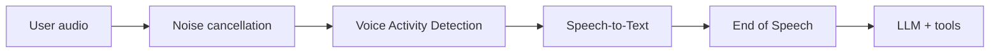

Speech-to-Text (STT) converts user speech into text for the assistant. STT quality affects everything downstream: the LLM only sees what the transcription provider returns.

<Info>
STT is configured in the **Voice Input** step of a Phone Call, Web Widget, or Web App / SDK deployment.
</Info>

## Setup flow

<Steps>
  <Step title="Create the provider credential">
    Add the STT provider credential in **Credentials**. The deployment wizard can only select credentials that already exist.
  </Step>

  <Step title="Open the deployment voice input step">
    Go to **Configure Assistant** -> **Deployments**, create or edit a voice-capable deployment, then open **Voice Input**.
  </Step>

  <Step title="Choose the STT provider">
    Select the provider that will transcribe user audio.
  </Step>

  <Step title="Select the model">
    Choose the provider-specific model. For phone calls, prefer real-time or telephony-friendly models. For browser audio, use the provider's recommended real-time model.
  </Step>

  <Step title="Set language when required">
    Select the primary user language when the provider requires it. Use multilingual or automatic detection only when the provider supports it and your use case needs it.
  </Step>

  <Step title="Tune advanced voice input">
    Configure noise cancellation, VAD, and EOS from **Show advanced settings**. These settings control what audio reaches STT and when a user turn is complete.
  </Step>
</Steps>

## Supported providers

| Provider | Typical use |
|----------|-------------|
| Deepgram | Low-latency streaming transcription and telephony use cases. |
| AssemblyAI | Real-time transcription with strong conversation-oriented models. |
| Azure Cognitive Services | Enterprise Microsoft environments and multilingual deployments. |
| Google Speech Service | Google Cloud speech recognition workflows. |
| OpenAI | OpenAI transcription models for voice applications. |
| AWS Transcribe | AWS-native speech recognition. |
| Cartesia | Voice AI workflows that also use Cartesia TTS. |
| Sarvam AI | Indian language voice applications. |
| Groq | Low-latency Whisper-compatible transcription. |
| Speechmatics | Broad language coverage and accent robustness. |
| NVIDIA | NVIDIA-hosted speech models. |
| Custom STT | Your own WebSocket-compatible STT backend. |

## Configuration fields

The exact fields vary by provider, but STT configuration usually includes:

| Field | What it controls |
|-------|------------------|
| Credential | Which stored provider credential Rapida uses. |
| Model | The transcription model. This is usually the main accuracy/latency tradeoff. |
| Language | The expected user language or provider language code. |

Some providers expose only a model because language is inferred, encoded in the model, or configured provider-side.

## Choosing a provider

| Need | Recommended direction |
|------|-----------------------|
| Lowest latency | Use a provider with streaming transcription and a real-time model. |
| Phone calls | Choose a model that handles 8 kHz telephony audio well. |
| Browser microphone | Use a real-time model that performs well on cleaner wideband audio. |
| Noisy environments | Pair the provider with [Noise Cancellation](/assistants/noise-cancellation) and stricter [VAD](/assistants/voice-activity-detection). |
| Multilingual users | Use explicit language selection or a provider with reliable language detection. |
| Private provider | Use [Custom STT](/integrations/stt/custom). |

<Warning>
Do not judge STT accuracy from one setting alone. Wrong VAD, disabled noise cancellation, or aggressive EOS can produce clipped or incomplete audio that looks like an STT issue.
</Warning>

## Channel guidance

### Phone calls

Phone calls often use narrowband or compressed audio. Prefer STT models that are tested for telephony and real-time streaming. Keep RNNoise enabled for most phone deployments.

Start with:

| Area | Starting point |
|------|----------------|
| Model | Real-time or telephony-friendly model. |
| Noise cancellation | RNNoise enabled. |
| VAD | Silero VAD with balanced threshold. |
| EOS | Pipecat Smart Turn or Silence-Based at 700-1000 ms. |

### Web widget and web app

Browser microphone audio is often cleaner than phone audio, but user environments vary widely. Use a real-time model and test with laptop microphones, headsets, and mobile browsers.

Start with:

| Area | Starting point |
|------|----------------|
| Model | Real-time model for browser audio. |
| Noise cancellation | Enabled for uncontrolled environments. |
| VAD | Silero VAD. |
| EOS | Pipecat Smart Turn for natural conversation. |

## Troubleshooting

| Symptom | Likely cause | What to adjust |
|---------|--------------|----------------|
| Transcripts miss quiet speech | VAD threshold too high or wrong STT model | Lower VAD threshold and test another STT model. |
| Transcripts include background noise | Noise cancellation off or VAD too sensitive | Enable RNNoise and raise VAD threshold. |
| User words are cut off at the beginning | VAD speech confirmation too strict | Lower minimum speech frames or VAD threshold. |
| Assistant responds to incomplete transcript | EOS too aggressive | Tune [End of Speech Detection](/assistants/end-of-speech). |
| Multilingual users are transcribed incorrectly | Language mismatch | Set the correct language or use a multilingual-capable provider. |

## Related

<CardGroup cols={2}>
  <Card title="Listen" icon="mic" href="/assistants/configuration/listen">
    See how STT fits into speech input configuration.
  </Card>
  <Card title="Noise Cancellation" icon="audio-waveform" href="/assistants/noise-cancellation">
    Clean audio before it reaches STT.
  </Card>
  <Card title="Custom STT" icon="settings" href="/integrations/stt/custom">
    Connect a custom WebSocket transcription provider with DSL rules.
  </Card>
  <Card title="Voice Activity Detection" icon="activity" href="/assistants/voice-activity-detection">
    Tune when user speech starts and stops.
  </Card>
  <Card title="End of Speech Detection" icon="clock" href="/assistants/end-of-speech">
    Decide when the transcript is ready for the assistant to answer.
  </Card>
</CardGroup>
