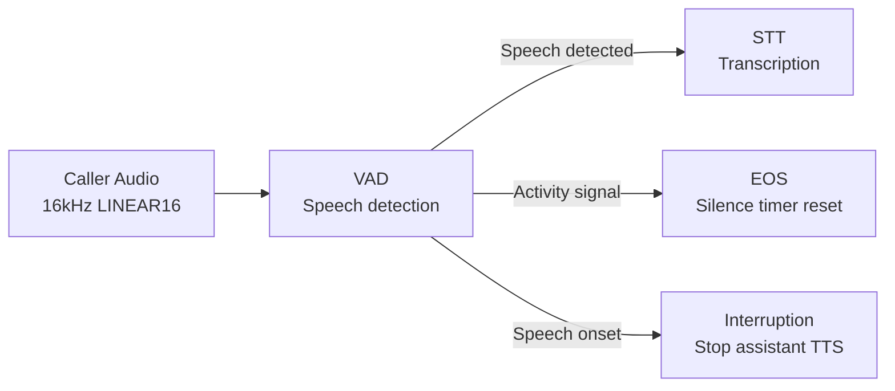

Voice Activity Detection (VAD) determines when a caller is speaking and when they are silent. It is the first stage of the voice pipeline — audio flows through VAD before reaching STT or End of Speech. A well-tuned VAD prevents background noise from triggering transcription, enables barge-in (interrupting the assistant mid-sentence), and feeds the End of Speech detector with speech activity signals.

All VAD providers in Rapida process **16 kHz LINEAR16 mono** audio and run locally — no network calls, no API keys, no added latency.

<Warning>
**Deprecation notice:** TEN VAD is being deprecated due to a licensing issue. Do not use it for new assistants.
</Warning>

---

## Providers

Rapida supports three VAD providers. Each shares the same three configuration parameters but uses a different detection model and approach.

| Provider | Description |
|----------|-------------|
| **[Silero VAD](#silero-vad)** | The default. Lightweight ONNX model (~2 MB) with strong accuracy across languages and noise conditions. Best general-purpose choice. |
| **[TEN VAD](#ten-vad)** | TEN Framework library with fixed 16 ms frame hops. Slightly lower latency per frame than Silero. Good for latency-critical deployments. |
| **[FireRed VAD](#firered-vad)** | DFSMN streaming model with Kaldi-compatible fbank features and a 4-state postprocessor. Higher accuracy on noisy or overlapping speech at the cost of slightly more compute. |

---

## Silero VAD

[Silero VAD](https://github.com/snakers4/silero-vad) is a pre-trained ONNX model developed by the Silero team. It is one of the most widely adopted open-source VAD models, used in production by projects like Pipecat, LiveKit, and dozens of voice AI platforms.

**Why choose Silero VAD:**
- Battle-tested in production across thousands of voice applications
- Small model size (~2 MB ONNX) with fast inference
- Strong accuracy across languages — trained on over 100 languages
- Works well in both clean and moderately noisy environments
- Default provider in Rapida — zero configuration needed to get started

**When to use:** Most deployments. If you have no specific reason to change, Silero is the right default.

### Parameters

| Parameter | Config Key | Default | Range | Description |
|-----------|-----------|---------|-------|-------------|
| VAD Threshold | `microphone.vad.threshold` | `0.5` | 0.3 – 1.0 | Speech probability threshold. Each audio frame produces a probability score between 0 and 1. Frames above this threshold are classified as speech. |
| Min Silence Frames | `microphone.vad.min_silence_frame` | `20` | 1 – 30 | Minimum consecutive silence frames before ending a speech segment. Each frame is 10 ms, so the default of 20 = 200 ms of silence required to close a speech segment. |
| Min Speech Frames | `microphone.vad.min_speech_frame` | `8` | 1 – 20 | Minimum consecutive speech frames before confirming speech onset. Each frame is 10 ms, so the default of 8 = 80 ms of speech required before triggering an interruption. |

<Tip>
**Threshold tuning guide:**
- **0.3 – 0.4** — Very sensitive. Use only in extremely quiet, controlled environments (e.g., a recording studio). Will pick up breathing, lip smacks, and faint background sounds.
- **0.5 – 0.6** — Balanced. Good for most phone and web deployments. The default of 0.5 works well for clean audio; raise to 0.6 for moderate background noise.
- **0.7 – 0.8** — Strict. Use in noisy environments (call centres, cars, outdoor) to reduce false triggers. May miss very quiet or soft-spoken callers.
- **0.9 – 1.0** — Very strict. Only loud, clear speech triggers detection. Risk of missing normal conversational speech.
</Tip>

---

## TEN VAD

TEN VAD is part of the [TEN Framework](https://github.com/TEN-framework/ten-vad), an open-source real-time communication framework. It uses a native C library for frame-level speech probability scoring.

**Why choose TEN VAD:**
- Fixed 256-sample hop size (16 ms at 16 kHz) provides consistent, predictable frame timing
- Native C implementation — lower per-frame overhead than ONNX inference
- Lightweight with no model file to load from disk
- Good choice when you want the lowest possible per-frame processing time

**When to use:** Latency-critical deployments where every millisecond matters, or when you want a non-ONNX alternative. TEN VAD processes frames slightly faster than Silero because it avoids the ONNX runtime overhead, though the practical difference in end-to-end latency is small (single-digit milliseconds).

### Parameters

| Parameter | Config Key | Default | Range | Description |
|-----------|-----------|---------|-------|-------------|
| VAD Threshold | `microphone.vad.threshold` | `0.5` | 0.3 – 1.0 | Speech probability threshold. Same semantics as Silero — frames above this value are classified as speech. |
| Min Silence Frames | `microphone.vad.min_silence_frame` | `20` | 1 – 30 | Minimum consecutive silence frames (each ~10 ms) before ending a speech segment. Default 20 = 200 ms. |
| Min Speech Frames | `microphone.vad.min_speech_frame` | `8` | 1 – 20 | Minimum consecutive speech frames (each ~10 ms) before confirming speech onset. Default 8 = 80 ms. |

<Note>
TEN VAD uses a hysteresis offset of 0.15 for speech offset detection — speech ends only when the probability drops below `threshold - 0.15`. This prevents rapid toggling at the threshold boundary during natural speech.
</Note>

---

## FireRed VAD

[FireRed VAD](https://github.com/FireRedTeam/FireRedASR) is a DFSMN (Deep Feed-forward Sequential Memory Network) streaming model developed by the FireRed team at Ant Group. It uses Kaldi-compatible fbank feature extraction and CMVN normalization, with a sophisticated 4-state postprocessor for speech boundary detection.

**Why choose FireRed VAD:**
- Uses a 4-state machine (Silence → Possible Speech → Speech → Possible Silence) for more precise speech boundary detection
- Probability smoothing via a moving average window reduces jitter from frame-to-frame noise
- Better at handling overlapping speech and noisy environments than simpler threshold-based approaches
- Designed for streaming — processes 25 ms frames with 10 ms shifts for fine-grained detection

**When to use:** Noisy environments, call centre deployments, or scenarios where precise speech boundary detection matters more than raw speed. FireRed VAD's postprocessor is more sophisticated than Silero's or TEN's, which makes it better at avoiding false triggers in challenging audio conditions.

### Parameters

| Parameter | Config Key | Default | Range | Description |
|-----------|-----------|---------|-------|-------------|
| Speech Threshold | `microphone.vad.threshold` | `0.5` | 0.3 – 1.0 | Probability threshold for speech detection. Applied after smoothing — the postprocessor uses a moving average window (size 5) to smooth raw probabilities before comparing against this threshold. |
| Min Silence Frames | `microphone.vad.min_silence_frame` | `20` | 1 – 30 | Minimum consecutive silence frames before ending a speech segment. Each frame is 10 ms. Directly controls the `MinSilenceFrame` in the postprocessor state machine. |
| Min Speech Frames | `microphone.vad.min_speech_frame` | `8` | 1 – 20 | Minimum consecutive speech frames before confirming speech onset. Each frame is 10 ms. Controls how long the postprocessor stays in the "Possible Speech" state before transitioning to confirmed "Speech". |

<Info>
FireRed VAD's postprocessor internally uses a smoothed speech threshold of `0.4` (after moving average) and pads speech start by 5 frames (50 ms) to capture the onset of the utterance that triggered detection. The max speech frame limit is 2000 frames (20 seconds) — after which a forced speech end is emitted.
</Info>

---

## Choosing a provider

| Criteria | Silero VAD | TEN VAD | FireRed VAD |
|----------|-----------|---------|-------------|
| **Model size** | ~2 MB ONNX | No model file (native library) | ~5 MB ONNX |
| **Init time** | Fast (~10–30 ms) | Very fast (~5 ms) | Fast (~10–30 ms) |
| **Accuracy** | High | Good | High |
| **Noise robustness** | Good | Moderate | Best |
| **Languages** | 100+ | Language-agnostic | Language-agnostic |
| **Best for** | General purpose | Latency-critical | Noisy environments |

<Tip>
**Start with Silero VAD** (the default). Switch to FireRed VAD if you're seeing false triggers from background noise, or to TEN VAD if you're optimizing for the absolute lowest processing overhead.
</Tip>

---

## How VAD parameters affect the conversation

### Min Speech Frames — barge-in sensitivity

The `min_speech_frame` parameter controls how quickly the assistant detects that a caller has started speaking and triggers a **barge-in** (interrupting assistant speech).

- **Lower values (1–4 frames, 10–40 ms):** The assistant stops speaking almost instantly when the caller makes any sound. Good for fast-paced IVR-style interactions. Risk: short sounds like coughs or "um" trigger interruption.
- **Default (8 frames, 80 ms):** Balanced. Requires ~80 ms of sustained speech before interrupting the assistant. Filters out most accidental sounds.
- **Higher values (12–20 frames, 120–200 ms):** The assistant only stops when the caller has clearly started a full utterance. Good for avoiding false interruptions during one-way information delivery (e.g., reading terms and conditions). Risk: the caller has to speak for longer before the assistant stops.

### Min Silence Frames — speech segment boundary

The `min_silence_frame` parameter controls how long the VAD waits in silence before considering a speech segment finished.

- **Lower values (5–10 frames, 50–100 ms):** Speech segments are split at short pauses. Words spoken with natural gaps between them may be split into multiple segments.
- **Default (20 frames, 200 ms):** Covers typical intra-sentence pauses. Most natural speech is captured as a single continuous segment.
- **Higher values (25–30 frames, 250–300 ms):** Only longer pauses end a segment. Good for speakers who pause frequently mid-sentence.

<Warning>
VAD silence frames are different from End of Speech timeout. VAD determines **speech segment boundaries** (is the caller actively making sound right now?). End of Speech determines **turn boundaries** (has the caller finished their complete thought?). Both work together — VAD feeds activity signals to the EOS detector.
</Warning>

---

## Next steps

<CardGroup cols={2}>
  <Card title="End of Speech Detection" icon="clock" href="/assistants/end-of-speech">
    Configure how the assistant detects when a caller has finished their turn.
  </Card>
  <Card title="Create an Assistant" icon="plus" href="/assistants/create-assistant">
    Set up VAD as part of the full voice pipeline configuration.
  </Card>
</CardGroup>
