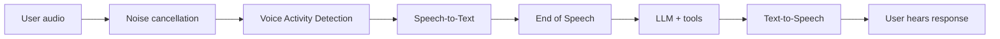

The voice pipeline controls how Rapida captures user audio, prepares it for transcription, detects when the user has finished speaking, and speaks the assistant response back to the user.

Use this overview to understand the full flow. Use the dedicated pages in this section when you need to tune one part of the pipeline.

<Info>
Voice input and voice output are configured per deployment. The same assistant can use different voice settings for Phone Call, Web Widget, and Web App / SDK deployments.
</Info>

## Configure it

Open your assistant, select **Configure Assistant**, then open **Deployments**. Voice settings appear inside each deployment that supports audio.

| Deployment | Voice input | Voice output | Notes |
|------------|-------------|--------------|-------|
| Phone Call | Required | Required | Caller audio and assistant speech are both required for live calls. |
| Web Widget | Optional | Optional | Can run as text-only, voice-input-only, voice-output-only, or full voice. |
| Web App / SDK | Optional | Optional | Your application controls the UI while Rapida handles the audio pipeline. |
| WhatsApp | Not used | Not used | WhatsApp uses text messages, not the voice pipeline. |

## Pipeline components

<CardGroup cols={2}>
  <Card title="Noise Cancellation" icon="audio-waveform" href="/assistants/noise-cancellation">
    Clean background noise before VAD and STT process the user's audio.
  </Card>
  <Card title="Speech-to-Text" icon="mic" href="/assistants/speech-to-text">
    Choose the provider, credential, model, and language used to transcribe user speech.
  </Card>
  <Card title="Text-to-Speech" icon="volume-2" href="/assistants/text-to-speech">
    Choose the provider, voice, model, language, pronunciation, and speech delivery settings.
  </Card>
  <Card title="Voice Activity Detection" icon="activity" href="/assistants/voice-activity-detection">
    Tune speech detection, silence frames, and barge-in sensitivity.
  </Card>
  <Card title="End of Speech Detection" icon="clock" href="/assistants/end-of-speech">
    Decide when the user has finished a turn and the assistant should respond.
  </Card>
</CardGroup>

## Recommended starting point

| Area | Start with |
|------|------------|
| STT | A streaming provider and model that matches your channel audio. |
| Noise cancellation | RNNoise enabled for phone calls and noisy browser environments. |
| VAD | Silero VAD. |
| EOS | Pipecat Smart Turn for natural conversations, or Silence-Based for simple IVR-style flows. |
| TTS | A low-latency streaming voice that supports the assistant's primary language. |
| Prompt | Short spoken responses, usually one or two sentences. |

<Tip>
Tune the pipeline from real conversation logs. If a caller gets cut off, start with EOS and VAD. If transcription is wrong, check language, audio quality, noise cancellation, and STT model. If the assistant feels slow, check EOS timeout, LLM latency, and TTS latency.
</Tip>

## Troubleshooting map

| Symptom | First place to look |
|---------|---------------------|
| Assistant responds before the user is done | [End of Speech Detection](/assistants/end-of-speech) |
| Assistant interrupts on coughs or background noise | [Voice Activity Detection](/assistants/voice-activity-detection) and [Noise Cancellation](/assistants/noise-cancellation) |
| Transcript is wrong or incomplete | [Speech-to-Text](/assistants/speech-to-text) |
| Assistant voice is slow, unnatural, or mispronounces terms | [Text-to-Speech](/assistants/text-to-speech) |
| Phone calls behave differently from web sessions | Deployment-level voice input/output settings |

## Related

<CardGroup cols={2}>
  <Card title="Phone Call Deployment" icon="phone" href="/voice-deployment-options/phone">
    Configure required voice input and output for phone calls.
  </Card>
  <Card title="Web Widget Deployment" icon="globe" href="/voice-deployment-options/web-widget">
    Add optional microphone input and spoken responses to the website widget.
  </Card>
  <Card title="Web App / SDK Deployment" icon="monitor" href="/voice-deployment-options/web-app">
    Build a custom voice interface while Rapida handles the audio pipeline.
  </Card>
  <Card title="Create an Assistant" icon="plus" href="/assistants/create-assistant">
    Create the assistant before configuring deployment voice settings.
  </Card>
</CardGroup>
