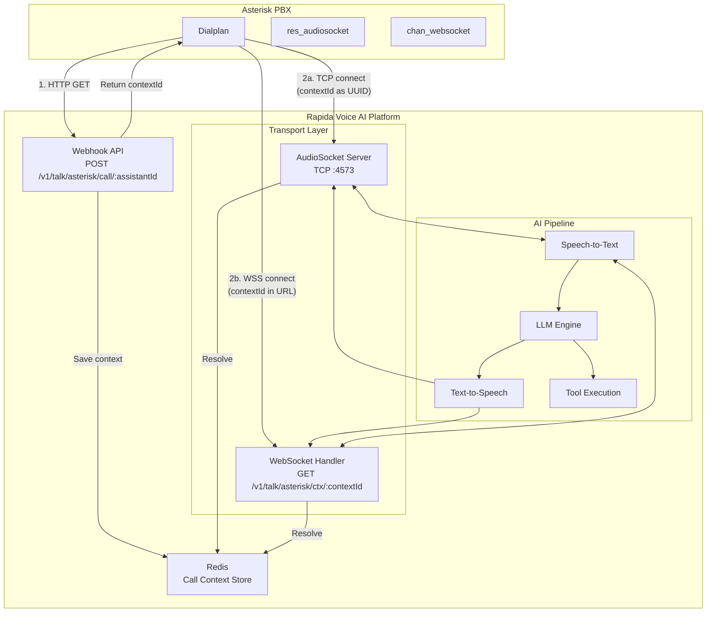
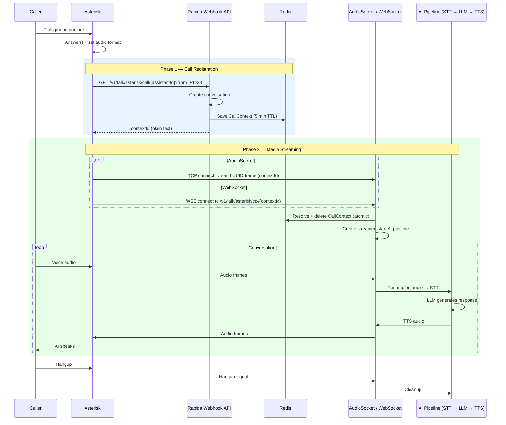
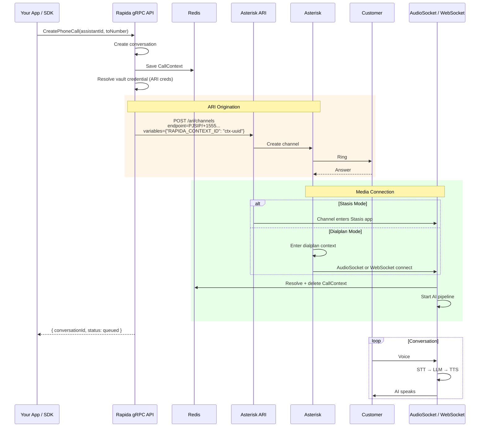
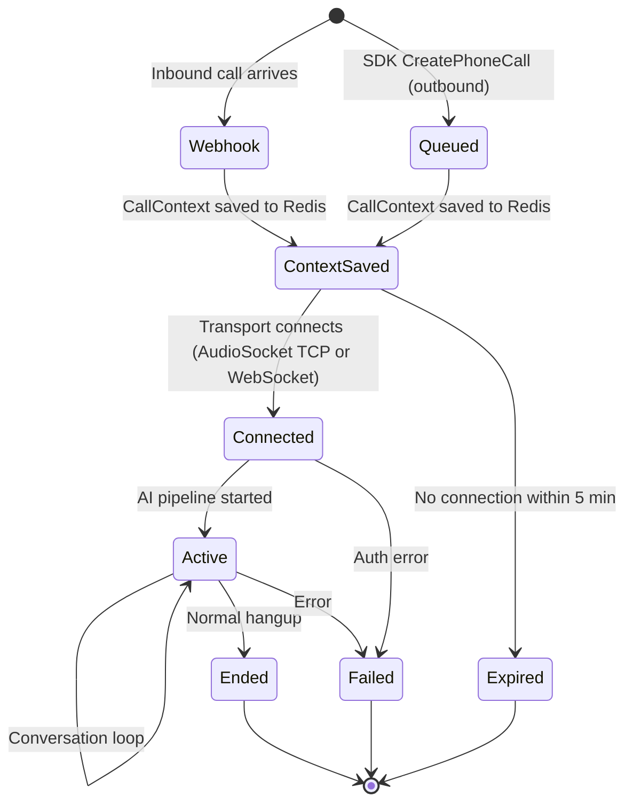
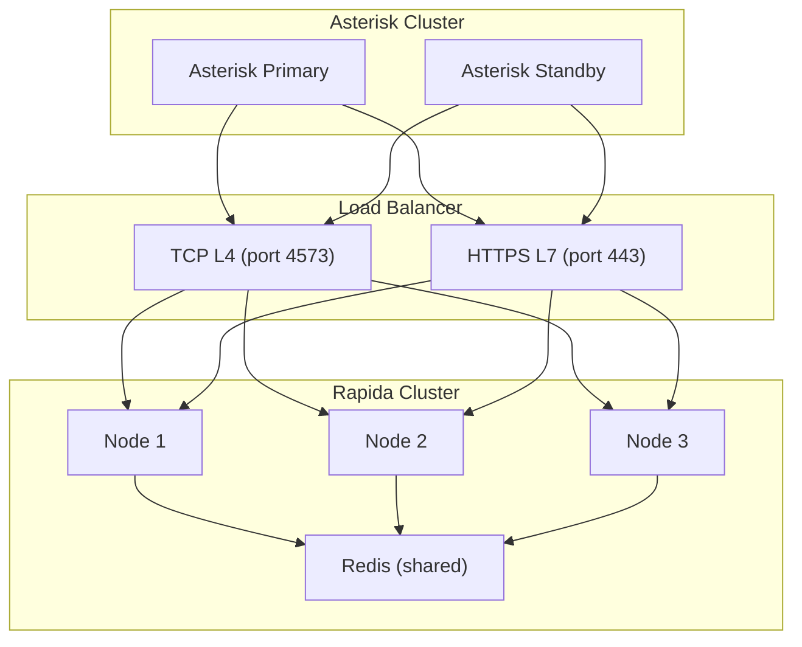

Asterisk is the world's most popular open-source telephony platform. Rapida integrates with Asterisk using two transport methods — **AudioSocket** (native TCP protocol) and **WebSocket** (`chan_websocket`) — enabling real-time bidirectional audio streaming for AI-powered voice conversations.

<Info>
Both transports follow the same two-phase flow: an HTTP webhook registers the call, then a media connection (TCP or WebSocket) carries the audio. Choose the transport that fits your Asterisk version and network topology.
</Info>

## Transport Comparison

| Feature | AudioSocket (Native) | WebSocket |
|---------|---------------------|-----------|
| **Asterisk Module** | `res_audiosocket` | `chan_websocket` |
| **Protocol** | Raw TCP | WebSocket (wss://) |
| **Port** | 4573 | 443 (standard HTTPS) |
| **Audio Codec** | SLIN 16-bit 8kHz | μ-law 8kHz |
| **Firewall** | Requires TCP 4573 open | Uses standard HTTPS port |
| **TLS** | Not built-in | Native TLS via wss:// |
| **Asterisk Version** | 16+ | 20+ |
| **Best For** | LAN / private network | Cloud / NAT traversal |

---

## Architecture Overview

Both transports share the same backend pipeline. The only difference is the **Streamer layer** that bridges the media connection to the AI pipeline.



### Two-Phase Call Setup

Every Asterisk call (inbound or outbound, AudioSocket or WebSocket) follows this pattern:

1. **Phase 1 — Webhook**: An HTTP request registers the call and gets a `contextId`
2. **Phase 2 — Media**: A transport connection (TCP or WebSocket) streams audio using that `contextId`

This design decouples call setup from media transport, allowing the same webhook to serve both AudioSocket and WebSocket.

---

## Prerequisites

<CardGroup cols={2}>
  <Card title="Asterisk Server" icon="server">
    Asterisk 16+ (AudioSocket) or 20+ (WebSocket) with the required module loaded
  </Card>
  <Card title="Rapida Account" icon="key">
    Active Rapida account with an API key (`rpd-xxx`)
  </Card>
  <Card title="Voice Assistant" icon="robot">
    A configured Rapida voice assistant with phone deployment enabled
  </Card>
  <Card title="Network Access" icon="network-wired">
    TCP 4573 (AudioSocket) or HTTPS 443 (WebSocket) to Rapida
  </Card>
</CardGroup>

<Note>
For **outbound calls**, you also need Asterisk ARI enabled with credentials stored in a Rapida vault credential.
</Note>

---

## Quick Start — Inbound Calls

Choose your transport and follow the matching setup:

<Tabs>
  <Tab title="AudioSocket (Native TCP)">

### 1. Verify Module

```bash
asterisk -rx "module show like audiosocket"
```

If not loaded:
```ini
# /etc/asterisk/modules.conf
[modules]
load = res_audiosocket.so
```

### 2. Configure Dialplan

```ini
# /etc/asterisk/extensions.conf

[globals]
RAPIDA_API_KEY = rpd-xxx-your-api-key
RAPIDA_HOST    = websocket-01.in.rapida.ai
RAPIDA_AS_HOST = socket-01.in.rapida.ai
RAPIDA_PORT    = 4573
ASSISTANT_ID   = 123456789

[rapida-inbound]
exten => _X.,1,Answer()
 same => n,Set(CHANNEL(audioreadformat)=slin)
 same => n,Set(CHANNEL(audiowriteformat)=slin)
 ; Phase 1: Call the webhook to get contextId
 same => n,Set(CTX=${CURL(https://${RAPIDA_HOST}/v1/talk/asterisk/call/${ASSISTANT_ID}?from=${CALLERID(num)}&x-api-key=${RAPIDA_API_KEY})})
 same => n,GotoIf($["${CTX}" = ""]?error)
 ; Phase 2: Connect AudioSocket with contextId as UUID
 same => n,AudioSocket(${CTX},${RAPIDA_AS_HOST}:${RAPIDA_PORT})
 same => n,Hangup()
 same => n(error),Playback(an-error-has-occurred)
 same => n,Hangup()
```

### 3. Reload

```bash
asterisk -rx "dialplan reload"
```

  </Tab>
  <Tab title="WebSocket">

### 1. Verify Module

```bash
asterisk -rx "module show like chan_websocket"
```

If not loaded:
```ini
# /etc/asterisk/modules.conf
[modules]
load = chan_websocket.so
```

### 2. Configure Dialplan

```ini
# /etc/asterisk/extensions.conf

[globals]
RAPIDA_API_KEY = rpd-xxx-your-api-key
RAPIDA_HOST    = websocket-01.in.rapida.ai
ASSISTANT_ID   = 123456789

[rapida-inbound-ws]
exten => _X.,1,Answer()
 ; Phase 1: Call the webhook to get contextId
 same => n,Set(CTX=${CURL(https://${RAPIDA_HOST}/v1/talk/asterisk/call/${ASSISTANT_ID}?from=${CALLERID(num)}&x-api-key=${RAPIDA_API_KEY})})
 same => n,GotoIf($["${CTX}" = ""]?error)
 ; Phase 2: Connect WebSocket with contextId in URL path
 same => n,WebSocket(wss://${RAPIDA_HOST}/v1/talk/asterisk/ctx/${CTX}?x-api-key=${RAPIDA_API_KEY})
 same => n,Hangup()
 same => n(error),Playback(an-error-has-occurred)
 same => n,Hangup()
```

### 3. Reload

```bash
asterisk -rx "dialplan reload"
```

  </Tab>
</Tabs>

---

## Inbound Call Flow — Detailed

### Sequence Diagram



### What Happens at Each Step

| Step | Component | Action |
|------|-----------|--------|
| 1 | Asterisk dialplan | Answers call, sets SLIN audio format |
| 2 | `CURL()` function | HTTP GET to Rapida webhook — creates conversation, saves `CallContext` to Redis |
| 3 | Webhook response | Returns `contextId` as plain text (UUID) |
| 4a | `AudioSocket()` app | Opens TCP to Rapida:4573, sends `contextId` as UUID frame |
| 4b | `WebSocket()` app | Opens WSS to `wss://host/v1/talk/asterisk/ctx/{contextId}` |
| 5 | Rapida transport | Atomically reads and deletes `CallContext` from Redis (prevents replay) |
| 6 | AI pipeline | STT → LLM → TTS loop until hangup |

---

## Outbound Call Flow — Detailed

Outbound calls are initiated via the **Rapida SDK** (gRPC `CreatePhoneCall` RPC) or REST API. Rapida uses Asterisk's **ARI (Asterisk REST Interface)** to originate the call.

### Prerequisites for Outbound

<Steps>
  <Step title="Enable ARI on Asterisk">
    ```ini
    # /etc/asterisk/ari.conf
    [general]
    enabled = yes
    pretty = yes

    [rapida]
    type = user
    read_only = no
    password = your-ari-password
    ```

    ```ini
    # /etc/asterisk/http.conf
    [general]
    enabled = yes
    bindaddr = 0.0.0.0
    bindport = 8088
    ```

    Reload:
    ```bash
    asterisk -rx "module reload res_ari.so"
    asterisk -rx "module reload res_http_websocket.so"
    ```
  </Step>

  <Step title="Create Vault Credential in Rapida">
    In the Rapida dashboard, go to **Credentials → Create Credential** and select **Asterisk**. Provide:

    | Field | Required | Example | Description |
    |-------|----------|---------|-------------|
    | `ari_url` | Yes | `http://asterisk.local:8088` | Base URL of Asterisk ARI |
    | `ari_user` | Yes | `rapida` | ARI username |
    | `ari_password` | Yes | `your-ari-password` | ARI password |
    | `endpoint_technology` | No | `PJSIP` | SIP technology (default: PJSIP) |
    | `trunk` | No | `my-sip-trunk` | SIP trunk name for routing |
  </Step>

  <Step title="Configure Outbound Dialplan">
    ARI can originate calls in two modes. Choose one:

    <Tabs>
      <Tab title="Stasis App Mode (Recommended)">
        ARI originates the channel directly into a Stasis application — no dialplan needed for the outbound leg. The channel is handled programmatically.

        ```ini
        # /etc/asterisk/stasis.conf (or use existing ARI app)
        ; No dialplan needed — ARI handles the channel via the "rapida" app
        ```

        Rapida sends: `POST /ari/channels?endpoint=PJSIP/+15551234567&app=rapida`
      </Tab>
      <Tab title="Dialplan Mode">
        ARI originates the channel into a dialplan context, which routes to AudioSocket or WebSocket:

        ```ini
        # /etc/asterisk/extensions.conf

        [rapida-outbound]
        exten => s,1,Set(CHANNEL(audioreadformat)=slin)
         same => n,Set(CHANNEL(audiowriteformat)=slin)
         ; RAPIDA_CONTEXT_ID is passed as a channel variable by ARI
         same => n,AudioSocket(${RAPIDA_CONTEXT_ID},${RAPIDA_AS_HOST}:${RAPIDA_PORT})
         same => n,Hangup()

        [rapida-outbound-ws]
        exten => s,1,NoOp(Outbound WebSocket call)
         ; RAPIDA_CONTEXT_ID is passed as a channel variable by ARI
         same => n,WebSocket(wss://${RAPIDA_HOST}/v1/talk/asterisk/ctx/${RAPIDA_CONTEXT_ID}?x-api-key=${RAPIDA_API_KEY})
         same => n,Hangup()
        ```

        Set deployment options in Rapida to route via dialplan:
        - `context`: `rapida-outbound` (or `rapida-outbound-ws`)
        - `extension`: `s`
      </Tab>
    </Tabs>
  </Step>

  <Step title="Assign Credential to Phone Deployment">
    In the assistant's **Phone Deployment**, select the Asterisk vault credential and configure:

    | Option | Value | Description |
    |--------|-------|-------------|
    | Telephony Provider | `asterisk` | Selects Asterisk integration |
    | Credential | (your vault credential) | ARI connection details |
    | Phone Number | `+15559876543` | Caller ID for outbound |
    | Context | *(optional)* | Dialplan context for outbound |
    | Extension | *(optional)* | Dialplan extension (default: `s`) |
    | App | *(optional)* | Stasis app name (default: `rapida`) |
  </Step>
</Steps>

### Outbound Sequence Diagram



### SDK Code Examples (Outbound)

<Tabs>
  <Tab title="Python">
    ```python
    from rapida import Rapida

    client = Rapida(api_key="rpd-xxx-your-key")

    call = client.calls.create(
        assistant_id=123456789,
        to_number="+15551234567",
        from_number="+15559876543",  # optional, uses deployment default
        metadata={"campaign": "follow-up"},
    )

    print(f"Call queued: conversation_id={call.conversation.id}")
    ```
  </Tab>
  <Tab title="Node.js">
    ```typescript
    import { Rapida } from 'rapida';

    const client = new Rapida({ apiKey: 'rpd-xxx-your-key' });

    const call = await client.calls.create({
      assistantId: 123456789,
      toNumber: '+15551234567',
      fromNumber: '+15559876543',
      metadata: { campaign: 'follow-up' },
    });

    console.log(`Call queued: ${call.conversation.id}`);
    ```
  </Tab>
  <Tab title="Go">
    ```go
    import "github.com/rapidaai/rapida"

    client := rapida.NewClient("rpd-xxx-your-key")

    call, err := client.Calls.Create(ctx, &rapida.CreateCallRequest{
        AssistantID: 123456789,
        ToNumber:    "+15551234567",
        FromNumber:  "+15559876543",
        Metadata:    map[string]any{"campaign": "follow-up"},
    })
    ```
  </Tab>
  <Tab title="cURL">
    ```bash
    curl -X POST https://api.rapida.ai/v1/talk/call \
      -H "Authorization: Bearer rpd-xxx-your-key" \
      -H "Content-Type: application/json" \
      -d '{
        "assistant": { "assistant_id": 123456789 },
        "to_number": "+15551234567",
        "from_number": "+15559876543",
        "metadata": { "campaign": "follow-up" }
      }'
    ```
  </Tab>
</Tabs>

---

## AudioSocket Protocol Reference

### Frame Format

Each frame has a 3-byte header followed by a variable-length payload:

```
+----------+------------------+----------------------+
| Type     | Length            | Payload              |
| 1 byte   | 2 bytes (BE)     | 0-65535 bytes        |
+----------+------------------+----------------------+
```

### Frame Types

| Type | Hex | Direction | Description |
|------|-----|-----------|-------------|
| Hangup | `0x00` | Both | Call termination |
| UUID | `0x01` | Asterisk → Rapida | Context ID (sent as first frame) |
| Silence | `0x02` | Asterisk → Rapida | Silence indicator |
| Audio | `0x10` | Both | Audio data (SLIN 16-bit) |
| Error | `0xFF` | Both | Error condition |

### Audio Format

| Property | AudioSocket (SLIN) | WebSocket (μ-law) | Rapida Internal |
|----------|-------------------|-------------------|-----------------|
| Encoding | Signed Linear 16-bit | μ-law 8-bit | Linear PCM 16-bit |
| Sample Rate | 8000 Hz | 8000 Hz | 16000 Hz |
| Channels | Mono | Mono | Mono |

Rapida handles all resampling and codec conversion transparently.

---

## Status Callbacks

Rapida sends status updates to Asterisk via ARI events. You can also configure a **webhook** on the assistant to receive call lifecycle events.

### Event Callback URL

```
POST https://{RAPIDA_HOST}/v1/talk/asterisk/ctx/{contextId}/event?x-api-key={apiKey}
```

This endpoint is automatically configured during outbound call setup. For inbound calls, Asterisk can optionally POST events to this URL.

### Event Types

| Event | Trigger |
|-------|---------|
| `webhook` | Initial call registration |
| `channel_created` | ARI channel created (outbound) |
| `call.connected` | Media connection established |
| `call.ended` | Call terminated normally |
| `call.failed` | Error during call |

---

## Credential Configuration

### Vault Credential Fields

When creating an Asterisk credential in the Rapida vault, provide:

```json
{
  "ari_url": "http://your-asterisk-server:8088",
  "ari_user": "rapida",
  "ari_password": "your-ari-password",
  "endpoint_technology": "PJSIP",
  "trunk": "my-sip-trunk"
}
```

| Field | Required | Default | Description |
|-------|----------|---------|-------------|
| `ari_url` | **Yes** (outbound only) | — | Base URL of Asterisk ARI HTTP server |
| `ari_user` | **Yes** (outbound only) | — | ARI username |
| `ari_password` | **Yes** (outbound only) | — | ARI password |
| `endpoint_technology` | No | `PJSIP` | Channel technology: `PJSIP`, `SIP`, `IAX2`, `DAHDI` |
| `trunk` | No | — | SIP trunk for routing: builds `PJSIP/trunk/number` |

<Warning>
Vault credentials are encrypted at rest. The ARI password is never exposed in API responses or logs.
</Warning>

### Phone Deployment Options

These options are configured on the assistant's phone deployment:

| Option | Default | Description |
|--------|---------|-------------|
| `phone` | — | Default caller ID for outbound calls |
| `context` | *(none)* | Asterisk dialplan context for outbound |
| `extension` | `s` | Dialplan extension |
| `app` | `rapida` | Stasis application name |
| `endpoint_technology` | `PJSIP` | Overrides vault credential |
| `trunk` | — | Overrides vault credential |

---

## Full Configuration Examples

### Example 1: Inbound Only (AudioSocket)

Simplest setup — no ARI needed, no vault credential required for inbound-only.

<Tabs>
  <Tab title="Asterisk Config">
    ```ini
    # /etc/asterisk/extensions.conf
    [globals]
    RAPIDA_API_KEY = rpd-xxx-your-api-key
    RAPIDA_HOST    = websocket-01.in.rapida.ai
    RAPIDA_PORT    = 4573
    ASSISTANT_ID   = 123456789

    [from-pstn]
    ; Route all inbound calls to Rapida AI
    exten => _X.,1,Answer()
     same => n,Set(CHANNEL(audioreadformat)=slin)
     same => n,Set(CHANNEL(audiowriteformat)=slin)
     same => n,Set(CTX=${CURL(https://${RAPIDA_HOST}/v1/talk/asterisk/call/${ASSISTANT_ID}?from=${CALLERID(num)}&x-api-key=${RAPIDA_API_KEY})})
     same => n,GotoIf($["${CTX}" = ""]?error)
     same => n,AudioSocket(${CTX},${RAPIDA_AS_HOST}:${RAPIDA_PORT})
     same => n,Hangup()
     same => n(error),Playback(an-error-has-occurred)
     same => n,Hangup()
    ```
  </Tab>
  <Tab title="Network Requirements">
    ```
    Asterisk → Rapida: TCP 4573 (AudioSocket)
    Asterisk → Rapida: HTTPS 443 (webhook API)
    ```
  </Tab>
</Tabs>

### Example 2: Inbound Only (WebSocket)

No firewall port needed beyond HTTPS — ideal for cloud-hosted Asterisk.

```ini
# /etc/asterisk/extensions.conf
[globals]
RAPIDA_API_KEY = rpd-xxx-your-api-key
RAPIDA_HOST    = websocket-01.in.rapida.ai
ASSISTANT_ID   = 123456789

[from-pstn-ws]
exten => _X.,1,Answer()
 same => n,Set(CTX=${CURL(https://${RAPIDA_HOST}/v1/talk/asterisk/call/${ASSISTANT_ID}?from=${CALLERID(num)}&x-api-key=${RAPIDA_API_KEY})})
 same => n,GotoIf($["${CTX}" = ""]?error)
 same => n,WebSocket(wss://${RAPIDA_HOST}/v1/talk/asterisk/ctx/${CTX}?x-api-key=${RAPIDA_API_KEY})
 same => n,Hangup()
 same => n(error),Playback(an-error-has-occurred)
 same => n,Hangup()
```

### Example 3: Inbound + Outbound (Full Setup)

Complete setup with ARI for outbound calls and AudioSocket for media.

<Tabs>
  <Tab title="extensions.conf">
    ```ini
    [globals]
    RAPIDA_API_KEY = rpd-xxx-your-api-key
    RAPIDA_HOST    = websocket-01.in.rapida.ai
    RAPIDA_PORT    = 4573
    ASSISTANT_ID   = 123456789

    ; ---- Inbound: PSTN → Rapida AI ----
    [rapida-inbound]
    exten => _X.,1,Answer()
     same => n,Set(CHANNEL(audioreadformat)=slin)
     same => n,Set(CHANNEL(audiowriteformat)=slin)
     same => n,Set(CTX=${CURL(https://${RAPIDA_HOST}/v1/talk/asterisk/call/${ASSISTANT_ID}?from=${CALLERID(num)}&x-api-key=${RAPIDA_API_KEY})})
     same => n,GotoIf($["${CTX}" = ""]?error)
     same => n,AudioSocket(${CTX},${RAPIDA_AS_HOST}:${RAPIDA_PORT})
     same => n,Hangup()
     same => n(error),Playback(an-error-has-occurred)
     same => n,Hangup()

    ; ---- Outbound: Rapida ARI → Customer ----
    ; ARI originates into this context; RAPIDA_CONTEXT_ID is a channel variable
    [rapida-outbound]
    exten => s,1,Set(CHANNEL(audioreadformat)=slin)
     same => n,Set(CHANNEL(audiowriteformat)=slin)
     same => n,AudioSocket(${RAPIDA_CONTEXT_ID},${RAPIDA_AS_HOST}:${RAPIDA_PORT})
     same => n,Hangup()
    ```
  </Tab>
  <Tab title="ari.conf">
    ```ini
    [general]
    enabled = yes
    pretty = yes

    [rapida]
    type = user
    read_only = no
    password = your-ari-password
    ```
  </Tab>
  <Tab title="http.conf">
    ```ini
    [general]
    enabled = yes
    bindaddr = 0.0.0.0
    bindport = 8088
    ```
  </Tab>
  <Tab title="Rapida Vault Credential">
    ```json
    {
      "ari_url": "http://asterisk.local:8088",
      "ari_user": "rapida",
      "ari_password": "your-ari-password",
      "endpoint_technology": "PJSIP",
      "trunk": "my-sip-trunk"
    }
    ```
  </Tab>
  <Tab title="Deployment Options">
    ```json
    {
      "phone": "+15559876543",
      "context": "rapida-outbound",
      "extension": "s"
    }
    ```
  </Tab>
  <Tab title="Network Requirements">
    ```
    Asterisk → Rapida: TCP 4573 (AudioSocket)
    Asterisk → Rapida: HTTPS 443 (webhook API)
    Rapida → Asterisk: TCP 8088 (ARI, outbound only)
    ```
  </Tab>
</Tabs>

### Example 4: WebSocket-Only (Inbound + Outbound)

Zero custom ports — everything runs over HTTPS.

<Tabs>
  <Tab title="extensions.conf">
    ```ini
    [globals]
    RAPIDA_API_KEY = rpd-xxx-your-api-key
    RAPIDA_HOST    = websocket-01.in.rapida.ai
    ASSISTANT_ID   = 123456789

    ; ---- Inbound ----
    [rapida-inbound-ws]
    exten => _X.,1,Answer()
     same => n,Set(CTX=${CURL(https://${RAPIDA_HOST}/v1/talk/asterisk/call/${ASSISTANT_ID}?from=${CALLERID(num)}&x-api-key=${RAPIDA_API_KEY})})
     same => n,GotoIf($["${CTX}" = ""]?error)
     same => n,WebSocket(wss://${RAPIDA_HOST}/v1/talk/asterisk/ctx/${CTX}?x-api-key=${RAPIDA_API_KEY})
     same => n,Hangup()
     same => n(error),Playback(an-error-has-occurred)
     same => n,Hangup()

    ; ---- Outbound (ARI routes here with RAPIDA_CONTEXT_ID) ----
    [rapida-outbound-ws]
    exten => s,1,WebSocket(wss://${RAPIDA_HOST}/v1/talk/asterisk/ctx/${RAPIDA_CONTEXT_ID}?x-api-key=${RAPIDA_API_KEY})
     same => n,Hangup()
    ```
  </Tab>
  <Tab title="Rapida Deployment Options">
    ```json
    {
      "phone": "+15559876543",
      "context": "rapida-outbound-ws",
      "extension": "s"
    }
    ```
  </Tab>
</Tabs>

---

## Call Lifecycle

### State Machine



### Captured Metrics

Each call automatically records:

| Metric | Description |
|--------|-------------|
| `call.duration` | Total call time (seconds) |
| `call.talk_duration` | Active speech time |
| `call.status` | `completed`, `failed`, `no_answer` |
| `call.disconnected_by` | `user`, `assistant`, `system` |

---

## Troubleshooting

<AccordionGroup>
  <Accordion title="Connection Refused (AudioSocket)">
    **Symptoms:** `AudioSocket()` returns immediately, no audio

    **Checklist:**
    - Verify Rapida host is reachable: `nc -zv socket-01.in.rapida.ai 4573`
    - Check firewall allows TCP 4573 outbound
    - Ensure `res_audiosocket.so` is loaded
    - Verify the contextId (token) is non-empty in the dialplan
  </Accordion>

  <Accordion title="WebSocket Connection Failed">
    **Symptoms:** `WebSocket()` fails, no audio

    **Checklist:**
    - Verify WSS URL is correct: `wss://websocket-01.in.rapida.ai/v1/talk/asterisk/ctx/{contextId}?x-api-key={your-api-key}`
    - Ensure `chan_websocket.so` is loaded
    - Check TLS certificate trust on the Asterisk server
    - Verify Asterisk version is 20+ for `chan_websocket`
  </Accordion>

  <Accordion title="Call Context Not Found">
    **Symptoms:** Transport connects but immediately drops with "call context not found"

    **Checklist:**
    - Context ID expires after **5 minutes** — ensure fast connection after webhook
    - Each contextId is single-use (atomically deleted on first connection)
    - Don't reuse contextIds across calls
    - Verify the webhook returned a valid contextId (not an error message)
  </Accordion>

  <Accordion title="No Audio / One-Way Audio (AudioSocket)">
    **Symptoms:** AI speaks but doesn't hear, or vice versa

    **Checklist:**
    - Set `CHANNEL(audioreadformat)=slin` and `CHANNEL(audiowriteformat)=slin`
    - Verify `res_audiosocket` module is loaded
    - Check Asterisk timing: `asterisk -rx "timing test"`
  </Accordion>

  <Accordion title="Choppy Audio / Delays">
    **Symptoms:** Audio artifacts, long pauses

    **Checklist:**
    - Check network latency to Rapida: `ping websocket-01.in.rapida.ai` (target < 100ms)
    - Verify no packet loss on the path
    - For WebSocket: ensure no proxy is buffering WebSocket frames
    - Reduce network hops if possible
  </Accordion>

  <Accordion title="ARI Outbound Call Fails">
    **Symptoms:** SDK call returns error, no ring on customer phone

    **Checklist:**
    - Verify ARI is enabled: `asterisk -rx "http show status"`
    - Check ARI credentials in vault: `ari_url`, `ari_user`, `ari_password`
    - Verify endpoint format: `PJSIP/trunk/number` or `PJSIP/number`
    - Check ARI URL is reachable from Rapida: must not be behind NAT without port forwarding
    - Review Asterisk CLI: `asterisk -rvvv` for ARI request logs
  </Accordion>

  <Accordion title="RAPIDA_CONTEXT_ID Empty in Outbound Dialplan">
    **Symptoms:** Outbound call connects but AudioSocket/WebSocket has no context

    **Checklist:**
    - Verify ARI channel variables are configured: `{"variables": {"RAPIDA_CONTEXT_ID": "..."}}`
    - Check the dialplan references `${RAPIDA_CONTEXT_ID}` (exact case)
    - Verify deployment options include `context` and `extension`
  </Accordion>
</AccordionGroup>

### Debug Commands

```bash
# Check modules
asterisk -rx "module show like audiosocket"
asterisk -rx "module show like chan_websocket"

# Enable verbose debugging
asterisk -rx "core set debug 5"

# Monitor active channels
asterisk -rx "core show channels verbose"

# Check ARI status
asterisk -rx "http show status"

# View dialplan
asterisk -rx "dialplan show rapida-inbound"

# Test network connectivity
nc -zv socket-01.in.rapida.ai 4573   # AudioSocket
curl -I https://websocket-01.in.rapida.ai  # HTTPS/WebSocket
```

---

## High Availability

### Multi-Node Deployment



**Dialplan with failover (AudioSocket):**

```ini
[rapida-inbound-ha]
exten => _X.,1,Answer()
 same => n,Set(CHANNEL(audioreadformat)=slin)
 same => n,Set(CHANNEL(audiowriteformat)=slin)
 same => n,Set(CTX=${CURL(https://${RAPIDA_HOST}/v1/talk/asterisk/call/${ASSISTANT_ID}?from=${CALLERID(num)}&x-api-key=${RAPIDA_API_KEY})})
 same => n,GotoIf($["${CTX}" = ""]?error)
 same => n,AudioSocket(${CTX},rapida-primary:4573)
 same => n,GotoIf($["${AUDIOSOCKET_STATUS}" = "FAILED"]?failover)
 same => n,Hangup()
 same => n(failover),AudioSocket(${CTX},rapida-secondary:4573)
 same => n,Hangup()
 same => n(error),Playback(an-error-has-occurred)
 same => n,Hangup()
```

---

## API Reference

### Inbound Webhook

```http
GET /v1/talk/asterisk/call/{assistantId}
```

| Parameter | Location | Required | Description |
|-----------|----------|----------|-------------|
| `assistantId` | Path | Yes | Rapida assistant ID |
| `from` | Query | Yes | Caller phone number |
| `x-api-key` | Query or Header | Yes | API key for authentication |
| `channel_id` | Query | No | Asterisk channel ID |

**Response:** Plain text `contextId` (UUID)

### WebSocket Media Endpoint

```http
GET /v1/talk/asterisk/ctx/{contextId}
Upgrade: websocket
```

| Parameter | Location | Required | Description |
|-----------|----------|----------|-------------|
| `contextId` | Path | Yes | Context ID from webhook response |
| `x-api-key` | Query | Yes | API key for authentication |

### Status Callback

```http
POST /v1/talk/asterisk/ctx/{contextId}/event
```

Receives ARI-style JSON events with a `type` field.

---

## Related Resources

<CardGroup cols={2}>
  <Card title="Voice Deployment Options" icon="phone" href="/voice-deployment-options/phone">
    Overview of all voice deployment channels
  </Card>
  <Card title="Create an Assistant" icon="robot" href="/assistants/create-assistant">
    Build your voice AI assistant
  </Card>
  <Card title="Webhooks" icon="webhook" href="/assistants/webhook/overview">
    Configure event notifications
  </Card>
  <Card title="API Reference" icon="code" href="/api-reference/call/create-call">
    Call API documentation
  </Card>
</CardGroup>
