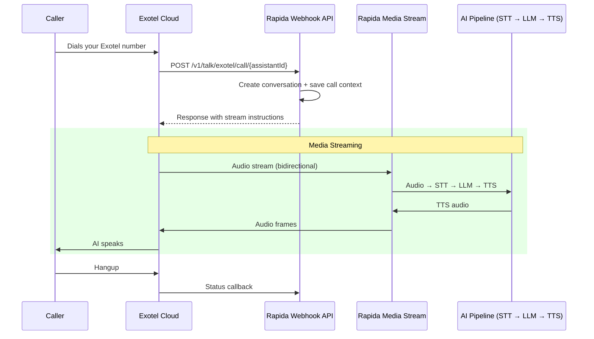

Exotel is a cloud telephony platform widely used across India and Southeast Asia, offering programmable voice and messaging APIs. Rapida integrates with Exotel to enable AI-powered phone conversations using Exotel's media streaming capabilities.

<Info>
Exotel is particularly well-suited for businesses operating in India and SEA, offering local virtual numbers, regulatory compliance, and reliable connectivity in those regions.
</Info>

## How It Works



---

## Prerequisites

<CardGroup cols={2}>
  <Card title="Exotel Account" icon="phone">
    An active Exotel account with at least one virtual number and an Exotel App (applet)
  </Card>
  <Card title="Rapida Account" icon="key">
    An active Rapida account with a configured voice assistant
  </Card>
</CardGroup>

You will need your **Account SID**, **Client ID**, and **Client Secret**, which you can find in the [Exotel Dashboard](https://my.exotel.com/).

---

## Step 1: Set Up Provider Credentials

Store your Exotel API credentials in Rapida so the platform can authenticate with Exotel for outbound calls and webhook handling.

<Steps>
<Step title="Navigate to External Integrations">
Go to **Integration > Tools** in the Rapida dashboard. You will see a grid of available external integrations.


</Step>

<Step title="Select Exotel">
Find the **Exotel** card and click **"Setup Credential"**.
</Step>

<Step title="Enter Your Exotel Credentials">


A modal will appear. Fill in the following fields:

| Field | Description | Where to Find |
|-------|-------------|---------------|
| **Key Name** | A friendly name for this credential (e.g., "Production Exotel") | Your choice |
| **Account SID** | Your Exotel Account SID | [Exotel Dashboard](https://my.exotel.com/) → Settings → API |
| **Client ID** | Your Exotel API Client ID | Exotel Dashboard → Settings → API Credentials |
| **Client Secret** | Your Exotel API Client Secret | Exotel Dashboard → Settings → API Credentials |

Click **"Configure"** to save.

<Warning>
Keep your Client Secret secure. It is used for API authentication and should not be shared publicly.
</Warning>
</Step>

<Step title="Verify Connection">
After saving, the Exotel card should display **"Connected"**. Click on it to see credential details, last updated time, and management options.
</Step>
</Steps>

---

## Step 2: Configure Phone Deployment

With credentials saved, configure your assistant's phone deployment to use Exotel.

<Steps>
<Step title="Open Your Assistant">
Navigate to **Assistants** and select the assistant you want to deploy via phone.
</Step>

<Step title="Go to Phone Deployment">
Click **"Deploy"** → **"Phone"** to open the phone deployment configuration page.
</Step>

<Step title="Select Exotel as Telephony Provider">
In the **Telephony** section:

1. Select **Exotel** from the telephony provider dropdown
2. Choose the Exotel credential you created in Step 1 from the **Credential** dropdown
3. Enter your **Phone** number — the Exotel virtual number for inbound calls and outbound caller ID
4. Enter the **App ID** — your Exotel applet identifier that routes calls to Rapida

<Tip>
The **App ID** is the Exotel applet (flow) identifier. You create this in the Exotel dashboard and configure it to forward calls to Rapida's webhook URL.
</Tip>
</Step>

<Step title="Configure Experience Settings">
Set up the conversation experience:

| Setting | Description | Default |
|---------|-------------|---------|
| **Greeting** | The first message the AI speaks when answering | *(optional)* |
| **Error Message** | Message spoken when an error occurs | *(optional)* |
| **Idle Timeout** | Seconds before prompting an idle caller | `30` |
| **Idle Message** | Message spoken when caller is idle | `"Are you there?"` |
| **Idle Timeout Retries** | How many times to retry before ending call | `2` |
| **Max Call Duration** | Maximum call length in seconds | `300` |
</Step>

<Step title="Configure Audio Providers">
Select your **Speech-to-Text** (STT) and **Text-to-Speech** (TTS) providers. These determine how audio is transcribed and synthesized during the call.
</Step>

<Step title="Save Deployment">
Click **"Deploy"** to save. Your assistant is now ready to handle phone calls via Exotel.
</Step>
</Steps>

---

## Step 3: Configure Your Exotel App

Point your Exotel app (applet) to Rapida so incoming calls are routed to your AI assistant.

<Steps>
<Step title="Open Exotel Dashboard">
Go to the [Exotel Dashboard](https://my.exotel.com/) and navigate to **App Bazaar** or **Flows**.
</Step>

<Step title="Create or Edit an App">
Create a new app or edit an existing one. Configure the app to connect incoming calls to an external URL.

Set the **webhook URL** to:

```
https://websocket-01.in.rapida.ai/v1/talk/exotel/call/{your-assistant-id}?x-api-key={your-api-key}
```

Replace `{your-assistant-id}` with your Rapida assistant ID.
</Step>

<Step title="Link Phone Number">
Assign your Exotel virtual number to this app so inbound calls are routed through it.
</Step>

<Step title="Save">
Save the app configuration. Your Exotel number is now connected to Rapida.
</Step>
</Steps>

---

## Making Outbound Calls

Once your phone deployment is configured, you can initiate outbound calls using the Rapida API or SDKs.

<Tabs>
  <Tab title="Python">
    ```python
    from rapida import Rapida

    client = Rapida(api_key="rpd-xxx-your-key")

    call = client.calls.create(
        assistant_id=123456789,
        to_number="+919876543210",
        from_number="+911234567890",  # optional, uses deployment default
        metadata={"campaign": "follow-up"},
    )

    print(f"Call queued: conversation_id={call.conversation.id}")
    ```
  </Tab>
  <Tab title="Node.js">
    ```typescript
    import { Rapida } from 'rapida';

    const client = new Rapida({ apiKey: 'rpd-xxx-your-key' });

    const call = await client.calls.create({
      assistantId: 123456789,
      toNumber: '+919876543210',
      fromNumber: '+911234567890',
      metadata: { campaign: 'follow-up' },
    });

    console.log(`Call queued: ${call.conversation.id}`);
    ```
  </Tab>
  <Tab title="cURL">
    ```bash
    curl -X POST https://api.rapida.ai/v1/talk/call \
      -H "Authorization: Bearer rpd-xxx-your-key" \
      -H "Content-Type: application/json" \
      -d '{
        "assistant": { "assistant_id": 123456789 },
        "to_number": "+919876543210",
        "from_number": "+911234567890",
        "metadata": { "campaign": "follow-up" }
      }'
    ```
  </Tab>
</Tabs>

---

## Features

| Feature | Description |
|---------|-------------|
| **Inbound Calls** | Customers call your Exotel number and speak with your AI assistant |
| **Outbound Calls** | Initiate calls programmatically via SDK or API |
| **Real-time Streaming** | Bidirectional audio via Exotel media streams |
| **Call Recording** | Automatic conversation capture for review and compliance |
| **India & SEA Numbers** | Local virtual numbers for Indian and Southeast Asian markets |
| **Number Masking** | Protect customer and agent phone numbers during calls |
| **Regulatory Compliance** | Compliant with TRAI and regional telecom regulations |

---

## Troubleshooting

<AccordionGroup>
  <Accordion title="Calls don't reach Rapida">
    - Verify the webhook URL in your Exotel App configuration
    - Ensure the URL uses `https://` and the correct assistant ID
    - Confirm the phone number is assigned to the correct Exotel App
  </Accordion>

  <Accordion title="One-way audio or no audio">
    - Verify your Exotel credential (Account SID, Client ID, Client Secret) is correct in Rapida
    - Check that your STT and TTS providers are configured in the phone deployment
    - Ensure the App ID in your phone deployment matches the Exotel app
  </Accordion>

  <Accordion title="Outbound calls fail">
    - Verify the Exotel credential is connected in **Integration > Tools**
    - Ensure the `from_number` is a valid Exotel number assigned to your account
    - Check that the phone deployment is configured and saved with the correct App ID
  </Accordion>

  <Accordion title="App ID issues">
    - The App ID should match the Exotel applet/flow identifier exactly
    - Verify the app is active and not paused in the Exotel dashboard
    - Ensure the app has the correct webhook URL configured
  </Accordion>
</AccordionGroup>

---

## Related Resources

<CardGroup cols={2}>
  <Card title="Create an Assistant" icon="bot" href="/assistants/create-assistant">
    Build your voice AI assistant
  </Card>
  <Card title="Phone Deployment" icon="phone" href="/voice-deployment-options/phone">
    Overview of phone deployment options
  </Card>
  <Card title="Outbound Call API" icon="code" href="/api-reference/call/create-call">
    API reference for creating calls
  </Card>
  <Card title="Conversation Logs" icon="list" href="/activity/conversation-logs">
    View call history and transcripts
  </Card>
</CardGroup>

For more information on Exotel's platform, visit the [Exotel Developer Documentation](https://developer.exotel.com/).
