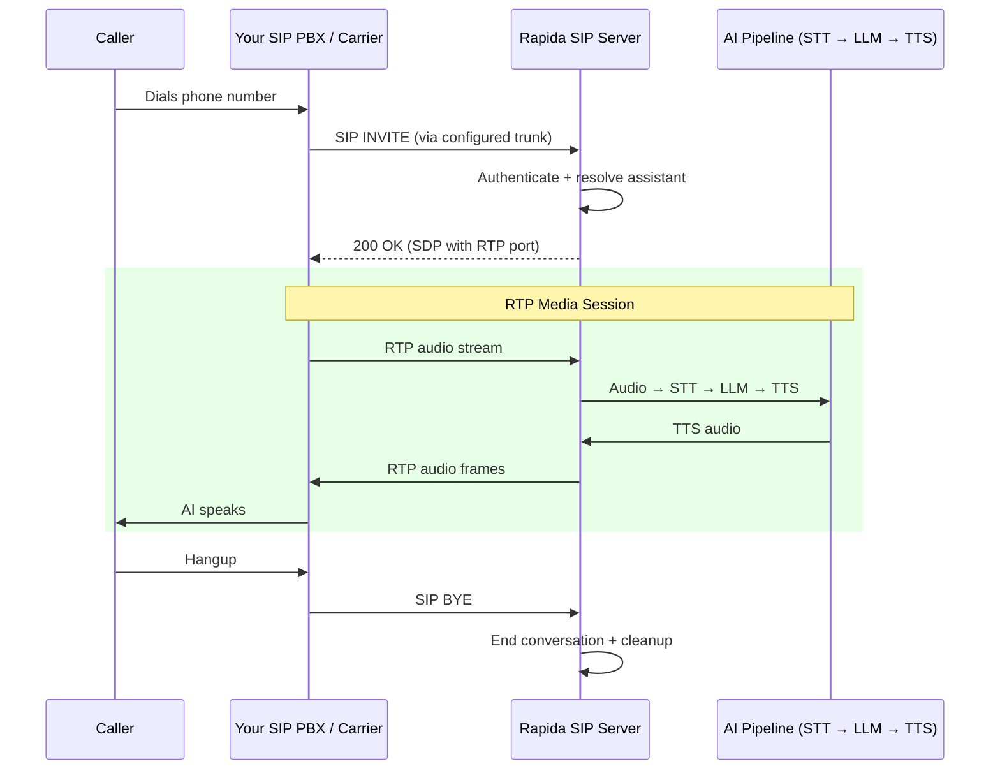

SIP (Session Initiation Protocol) Trunking provides a direct connection between your telephony infrastructure and Rapida. This is ideal for organizations that already use a SIP-compatible PBX (such as FreeSWITCH, Kamailio, or hosted SIP providers) and want to connect their existing phone lines to an AI voice assistant without relying on a specific cloud telephony vendor.

<Info>
SIP Trunk is a **bring-your-own-carrier** option. Rapida runs a native SIP server that accepts inbound SIP INVITE requests and establishes RTP media sessions directly. This provides the lowest latency path for voice AI interactions.
</Info>

## How It Works



---

## Prerequisites

<CardGroup cols={2}>
  <Card title="SIP Infrastructure" icon="server">
    A SIP-compatible PBX, carrier, or VoIP provider that can send calls to an external SIP URI
  </Card>
  <Card title="Rapida Account" icon="key">
    An active Rapida account with a configured voice assistant
  </Card>
</CardGroup>

You will need:
- Your SIP trunk provider's **SIP URI** (e.g., `sip:trunk.provider.com:5060`)
- Optional **SIP Username** and **Password** if your trunk requires authentication

---

## Step 1: Set Up Provider Credentials

Store your SIP trunk credentials in Rapida so the platform can authenticate with your SIP infrastructure.

<Steps>
<Step title="Navigate to External Integrations">
Go to **Integration > Tools** in the Rapida dashboard. You will see a grid of available external integrations.


</Step>

<Step title="Select SIP Trunk">
Find the **SIP Trunk** card and click **"Setup Credential"**.
</Step>

<Step title="Enter Your SIP Credentials">
A modal will appear. Fill in the following fields:

| Field | Description | Required |
|-------|-------------|----------|
| **Key Name** | A friendly name for this credential (e.g., "Office PBX") | Yes |
| **SIP URI** | The SIP trunk endpoint (e.g., `sip:trunk.provider.com:5060`) | Yes |
| **SIP Username** | Authentication username for the SIP trunk | No |
| **SIP Password** | Authentication password for the SIP trunk | No |

Click **"Configure"** to save.

<Tip>
If your SIP provider uses IP-based authentication (allow-listing Rapida's IP), you can leave the username and password fields empty.
</Tip>
</Step>

<Step title="Verify Connection">
After saving, the SIP Trunk card should display **"Connected"**. Click on it to see credential details, last updated time, and management options.
</Step>
</Steps>

---

## Step 2: Configure Phone Deployment

With credentials saved, configure your assistant's phone deployment to use SIP.

<Steps>
<Step title="Open Your Assistant">
Navigate to **Assistants** and select the assistant you want to deploy via phone.
</Step>

<Step title="Go to Phone Deployment">
Click **"Deploy"** → **"Phone"** to open the phone deployment configuration page.
</Step>

<Step title="Select SIP Trunk as Telephony Provider">
In the **Telephony** section:

1. Select **SIP Trunk** from the telephony provider dropdown
2. Choose the SIP credential you created in Step 1 from the **Credential** dropdown
3. Enter the **Caller ID** — the phone number to display for outbound calls (e.g., `+15551234567`)
</Step>

<Step title="Configure Experience Settings">
Set up the conversation experience:

| Setting | Description | Default |
|---------|-------------|---------|
| **Greeting** | The first message the AI speaks when answering | *(optional)* |
| **Error Message** | Message spoken when an error occurs | *(optional)* |
| **Idle Timeout** | Seconds before prompting an idle caller | `30` |
| **Idle Message** | Message spoken when caller is idle | `"Are you there?"` |
| **Idle Timeout Retries** | How many times to retry before ending call | `2` |
| **Max Call Duration** | Maximum call length in seconds | `300` |
</Step>

<Step title="Configure Audio Providers">
Select your **Speech-to-Text** (STT) and **Text-to-Speech** (TTS) providers. These determine how audio is transcribed and synthesized during the call.
</Step>

<Step title="Save Deployment">
Click **"Deploy"** to save. Your assistant is now ready to handle phone calls via SIP.
</Step>
</Steps>

---

## Step 3: Configure Your PBX / SIP Provider

Route calls from your PBX or SIP carrier to Rapida's SIP server.

<Steps>
<Step title="Create a SIP Trunk in Your PBX">
In your PBX admin panel (FreeSWITCH, Asterisk, Kamailio, or hosted provider), create a new SIP trunk pointing to Rapida's SIP endpoint.

**Rapida SIP Server:**
```
sip:sip.rapida.ai:5060
```

Configure your trunk with:
- **Outbound Proxy**: `sip.rapida.ai:5060`
- **Transport**: UDP or TCP
- **Codec**: G.711 μ-law (PCMU) preferred, G.711 A-law (PCMA) supported
</Step>

<Step title="Create a Dial Plan Rule">
Add a dial plan entry that routes specific numbers or patterns to the Rapida SIP trunk.

**FreeSWITCH example:**
```xml
<extension name="rapida-ai">
  <condition field="destination_number" expression="^(5551234567)$">
    <action application="bridge" data="sofia/external/sip:sip.rapida.ai:5060"/>
  </condition>
</extension>
```

**Asterisk example (extensions.conf):**
```ini
[rapida-trunk]
exten => _X.,1,Dial(SIP/rapida-trunk/${EXTEN})
```
</Step>

<Step title="Verify Routing">
Place a test call to confirm the call reaches Rapida and the AI assistant answers.
</Step>
</Steps>

---

## Making Outbound Calls

Once your phone deployment is configured, you can initiate outbound calls through your SIP trunk using the Rapida API or SDKs.

<Tabs>
  <Tab title="Python">
    ```python
    from rapida import Rapida

    client = Rapida(api_key="rpd-xxx-your-key")

    call = client.calls.create(
        assistant_id=123456789,
        to_number="+15551234567",
        metadata={"campaign": "follow-up"},
    )

    print(f"Call queued: conversation_id={call.conversation.id}")
    ```
  </Tab>
  <Tab title="Node.js">
    ```typescript
    import { Rapida } from 'rapida';

    const client = new Rapida({ apiKey: 'rpd-xxx-your-key' });

    const call = await client.calls.create({
      assistantId: 123456789,
      toNumber: '+15551234567',
      metadata: { campaign: 'follow-up' },
    });

    console.log(`Call queued: ${call.conversation.id}`);
    ```
  </Tab>
  <Tab title="cURL">
    ```bash
    curl -X POST https://api.rapida.ai/v1/talk/call \
      -H "Authorization: Bearer rpd-xxx-your-key" \
      -H "Content-Type: application/json" \
      -d '{
        "assistant": { "assistant_id": 123456789 },
        "to_number": "+15551234567",
        "metadata": { "campaign": "follow-up" }
      }'
    ```
  </Tab>
</Tabs>

---

## Features

| Feature | Description |
|---------|-------------|
| **Bring Your Own Carrier** | Use any SIP-compatible provider or on-premise PBX |
| **Direct SIP Connection** | Native SIP INVITE/BYE handling with RTP media — no intermediary cloud provider |
| **Low Latency** | Direct RTP audio path minimizes round-trip delay |
| **Inbound Calls** | Accept calls routed from your PBX to the AI assistant |
| **Outbound Calls** | Initiate calls programmatically via SDK or API through your SIP trunk |
| **Call Recording** | Automatic conversation capture for review and compliance |
| **Codec Support** | G.711 μ-law (PCMU), G.711 A-law (PCMA) |
| **Flexible Auth** | Digest authentication or IP-based allow-listing |

---

## Supported PBX / Providers

SIP Trunk works with any standard SIP-compliant system, including:

| System | Type |
|--------|------|
| **FreeSWITCH** | Open-source softswitch |
| **Asterisk** | Open-source PBX (also has dedicated integration) |
| **Kamailio** | SIP proxy/router |
| **Twilio Elastic SIP** | Cloud SIP trunking |
| **Vonage SIP Connect** | Cloud SIP trunking |
| **Bandwidth** | Cloud SIP trunking |
| **Telnyx** | Cloud SIP trunking |
| **SignalWire** | Cloud SIP trunking |

<Tip>
If you're using Twilio, Vonage, Exotel, or Asterisk, consider using the dedicated integrations for those providers — they offer additional features like webhook-based call control and provider-specific optimizations.
</Tip>

---

## Troubleshooting

<AccordionGroup>
  <Accordion title="SIP INVITE rejected or no response">
    - Verify the SIP URI in your credential is correct and reachable
    - Check that your PBX can route to `sip.rapida.ai:5060` (firewall/NAT rules)
    - If using authentication, ensure username and password are correct
    - Try both UDP and TCP transport if one doesn't work
  </Accordion>

  <Accordion title="One-way audio or no audio">
    - Check RTP port ranges — ensure your firewall allows UDP traffic for RTP media
    - Verify codec negotiation — Rapida supports G.711 μ-law (PCMU) and G.711 A-law (PCMA)
    - If behind NAT, ensure your PBX has proper STUN/TURN or external media IP configuration
    - Verify STT and TTS providers are configured in the phone deployment
  </Accordion>

  <Accordion title="Outbound calls fail">
    - Verify the SIP credential is connected in **Integration > Tools**
    - Ensure the phone deployment is configured and saved
    - Check that your SIP trunk allows outbound calls from Rapida's IP
  </Accordion>

  <Accordion title="Audio quality issues">
    - Use a wired network connection for your PBX when possible
    - Prefer G.711 μ-law (PCMU) codec for compatibility
    - Minimize network hops between your PBX and Rapida
    - Check for packet loss or jitter on the RTP path using network monitoring tools
  </Accordion>
</AccordionGroup>

---

## Related Resources

<CardGroup cols={2}>
  <Card title="Create an Assistant" icon="robot" href="/assistants/create-assistant">
    Build your voice AI assistant
  </Card>
  <Card title="Phone Deployment" icon="phone" href="/voice-deployment-options/phone">
    Overview of phone deployment options
  </Card>
  <Card title="Asterisk Integration" icon="server" href="/integrations/telephony/asterisk">
    Dedicated Asterisk PBX integration with AudioSocket
  </Card>
  <Card title="Conversation Logs" icon="list" href="/activity/conversation-logs">
    View call history and transcripts
  </Card>
</CardGroup>
