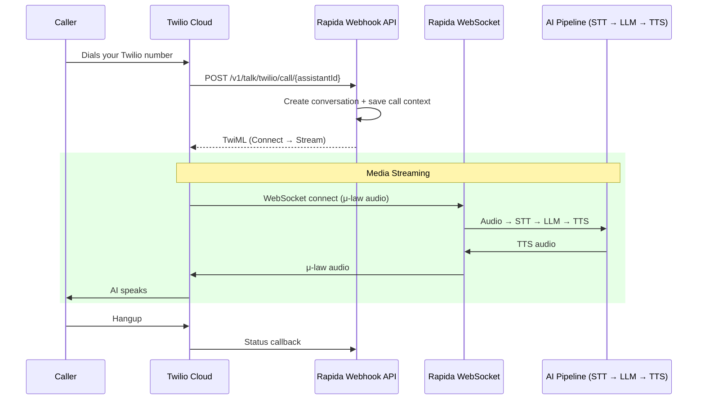

Twilio is a cloud communications platform that provides programmable voice, messaging, and video services. Rapida integrates with Twilio to enable AI-powered phone conversations — both inbound (customers call your Twilio number) and outbound (your assistant calls customers).

<Info>
Twilio uses **WebSocket media streams** for real-time audio. When a call connects, Twilio opens a WebSocket to Rapida carrying μ-law encoded audio at 8kHz. Rapida handles all codec conversion and resampling transparently.
</Info>

## How It Works



---

## Prerequisites

<CardGroup cols={2}>
  <Card title="Twilio Account" icon="phone">
    An active Twilio account with at least one phone number
  </Card>
  <Card title="Rapida Account" icon="key">
    An active Rapida account with a configured voice assistant
  </Card>
</CardGroup>

You will need your **Twilio Account SID** and **Auth Token**, which you can find on the [Twilio Console dashboard](https://console.twilio.com/).

---

## Step 1: Set Up Provider Credentials

First, store your Twilio API credentials in Rapida so the platform can authenticate with Twilio for outbound calls and webhook validation.

<Steps>
<Step title="Navigate to External Integrations">
Go to **Integration > Tools** in the Rapida dashboard. You will see a grid of available external integrations.


</Step>

<Step title="Select Twilio">
Find the **Twilio** card and click **"Setup Credential"**.
</Step>

<Step title="Enter Your Twilio Credentials">


A modal will appear. Fill in the following fields:

| Field | Description | Where to Find |
|-------|-------------|---------------|
| **Key Name** | A friendly name for this credential (e.g., "Production Twilio") | Your choice |
| **Account Token** | Your Twilio Auth Token | [Twilio Console](https://console.twilio.com/) → Auth Token |
| **Account SID** | Your Twilio Account SID | [Twilio Console](https://console.twilio.com/) → Account SID |

Click **"Configure"** to save.
</Step>

<Step title="Verify Connection">
After saving, the Twilio card should display **"Connected"**. Click on it to see credential details, last updated time, and management options.
</Step>
</Steps>

---

## Step 2: Configure Phone Deployment

With credentials saved, configure your assistant's phone deployment to use Twilio.

<Steps>
<Step title="Open Your Assistant">
Navigate to **Assistants** and select the assistant you want to deploy via phone.
</Step>

<Step title="Go to Phone Deployment">
Click **"Deploy"** → **"Phone"** to open the phone deployment configuration page.
</Step>

<Step title="Select Twilio as Telephony Provider">
In the **Telephony** section:

1. Select **Twilio** from the telephony provider dropdown
2. Choose the Twilio credential you created in Step 1 from the **Credential** dropdown
3. Enter your **Phone** number — this is the Twilio phone number that will receive inbound calls and serve as the caller ID for outbound calls (e.g., `+15551234567`)
</Step>

<Step title="Configure Experience Settings">
Set up the conversation experience:

| Setting | Description | Default |
|---------|-------------|---------|
| **Greeting** | The first message the AI speaks when answering | *(optional)* |
| **Error Message** | Message spoken when an error occurs | *(optional)* |
| **Idle Timeout** | Seconds before prompting an idle caller | `30` |
| **Idle Message** | Message spoken when caller is idle | `"Are you there?"` |
| **Idle Timeout Retries** | How many times to retry before ending call | `2` |
| **Max Call Duration** | Maximum call length in seconds | `300` |
</Step>

<Step title="Configure Audio Providers">
Select your **Speech-to-Text** (STT) and **Text-to-Speech** (TTS) providers. These determine how audio is transcribed and synthesized during the call.

<Note>
For Twilio calls, audio arrives in **μ-law 8kHz** format. Rapida automatically resamples to 16kHz for the STT provider and converts TTS output back to μ-law for Twilio.
</Note>
</Step>

<Step title="Save Deployment">
Click **"Deploy"** to save. Your assistant is now ready to handle phone calls via Twilio.
</Step>
</Steps>

---

## Step 3: Configure Your Twilio Phone Number

Point your Twilio phone number's webhook to Rapida so incoming calls are routed to your AI assistant.

<Steps>
<Step title="Open Twilio Console">
Go to [Twilio Console → Phone Numbers → Active Numbers](https://console.twilio.com/us1/develop/phone-numbers/manage/incoming) and select your phone number.
</Step>

<Step title="Set Voice Webhook">
Under **Voice Configuration**, set:

| Field | Value |
|-------|-------|
| **A call comes in** | Webhook |
| **URL** | `https://websocket-01.in.rapida.ai/v1/talk/twilio/call/{your-assistant-id}` |
| **HTTP Method** | `POST` |

Replace `{your-assistant-id}` with your Rapida assistant ID.
</Step>

<Step title="Set Status Callback (Optional)">
To receive call lifecycle events (ringing, answered, completed):

| Field | Value |
|-------|-------|
| **Status Callback URL** | `https://websocket-01.in.rapida.ai/v1/talk/twilio/ctx/{contextId}/event` |
| **Status Callback Events** | `initiated`, `ringing`, `answered`, `completed` |

<Note>
The status callback URL uses a `contextId` returned during the call setup. Twilio sends events to this URL automatically when configured in TwiML.
</Note>
</Step>

<Step title="Save">
Click **Save** in the Twilio console. Your phone number is now connected to Rapida.
</Step>
</Steps>

---

## Making Outbound Calls

Once your phone deployment is configured, you can initiate outbound calls using the Rapida API or SDKs.

<Tabs>
  <Tab title="Python">
    ```python
    from rapida import Rapida

    client = Rapida(api_key="rpd-xxx-your-key")

    call = client.calls.create(
        assistant_id=123456789,
        to_number="+15551234567",
        from_number="+15559876543",  # optional, uses deployment default
        metadata={"campaign": "follow-up"},
    )

    print(f"Call queued: conversation_id={call.conversation.id}")
    ```
  </Tab>
  <Tab title="Node.js">
    ```typescript
    import { Rapida } from 'rapida';

    const client = new Rapida({ apiKey: 'rpd-xxx-your-key' });

    const call = await client.calls.create({
      assistantId: 123456789,
      toNumber: '+15551234567',
      fromNumber: '+15559876543',
      metadata: { campaign: 'follow-up' },
    });

    console.log(`Call queued: ${call.conversation.id}`);
    ```
  </Tab>
  <Tab title="cURL">
    ```bash
    curl -X POST https://api.rapida.ai/v1/talk/call \
      -H "Authorization: Bearer rpd-xxx-your-key" \
      -H "Content-Type: application/json" \
      -d '{
        "assistant": { "assistant_id": 123456789 },
        "to_number": "+15551234567",
        "from_number": "+15559876543",
        "metadata": { "campaign": "follow-up" }
      }'
    ```
  </Tab>
</Tabs>

---

## Features

| Feature | Description |
|---------|-------------|
| **Inbound Calls** | Customers call your Twilio number and speak with your AI assistant |
| **Outbound Calls** | Initiate calls programmatically via SDK or API |
| **Real-time Streaming** | Bidirectional audio via Twilio Media Streams (WebSocket) |
| **Call Recording** | Automatic conversation capture for review and compliance |
| **Status Callbacks** | Receive call lifecycle events (ringing, answered, completed) |
| **WhatsApp** | Send and receive WhatsApp messages via Twilio |
| **Global Numbers** | Use Twilio phone numbers from 100+ countries |

---

## Troubleshooting

<AccordionGroup>
  <Accordion title="Calls go to voicemail instead of Rapida">
    - Verify the webhook URL in your Twilio phone number configuration
    - Ensure the URL uses `https://` and the correct assistant ID
    - Check that your Rapida API key is valid
  </Accordion>

  <Accordion title="One-way audio or no audio">
    - Verify your Twilio credential (Account SID + Auth Token) is correct in Rapida
    - Check that your STT and TTS providers are configured in the phone deployment
    - Ensure the assistant has an active version with a valid LLM provider
  </Accordion>

  <Accordion title="Outbound calls fail">
    - Verify the Twilio credential is connected in **Integration > Tools**
    - Ensure the `from_number` is a valid Twilio phone number in your account
    - Check that the phone deployment is configured and saved
  </Accordion>

  <Accordion title="Status callbacks not received">
    - Ensure the status callback URL is configured in Twilio console
    - Verify the URL format: `https://websocket-01.in.rapida.ai/v1/talk/twilio/ctx/{contextId}/event`
    - Check Twilio's [Debugger](https://console.twilio.com/us1/monitor/logs/debugger) for webhook errors
  </Accordion>
</AccordionGroup>

---

## Related Resources

<CardGroup cols={2}>
  <Card title="Create an Assistant" icon="robot" href="/assistants/create-assistant">
    Build your voice AI assistant
  </Card>
  <Card title="Phone Deployment" icon="phone" href="/voice-deployment-options/phone">
    Overview of phone deployment options
  </Card>
  <Card title="Outbound Call API" icon="code" href="/api-reference/call/create-call">
    API reference for creating calls
  </Card>
  <Card title="Conversation Logs" icon="list" href="/activity/conversation-logs">
    View call history and transcripts
  </Card>
</CardGroup>

For more information on Twilio's platform, visit the [Twilio Developer Documentation](https://www.twilio.com/docs).
