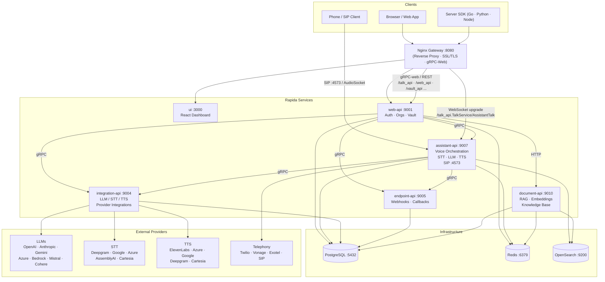
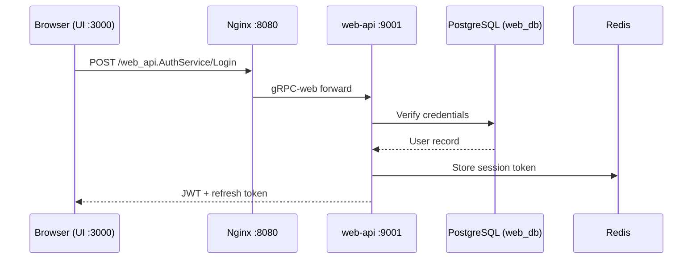
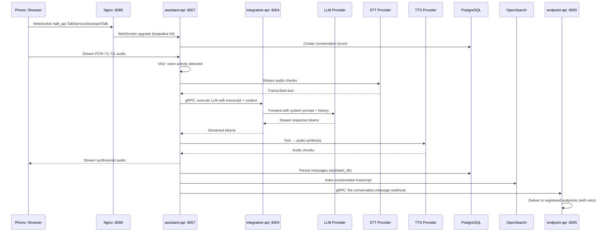
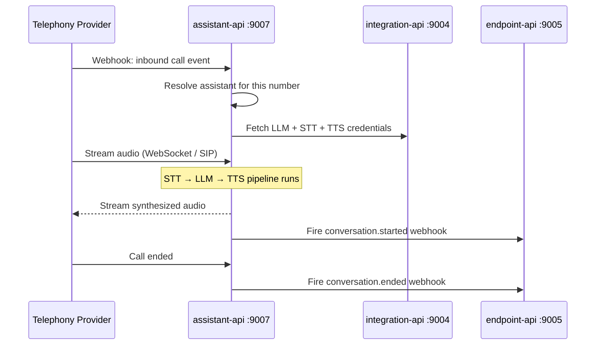
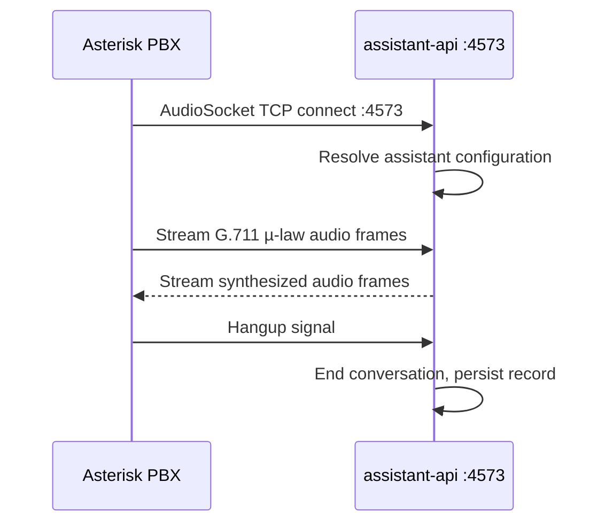
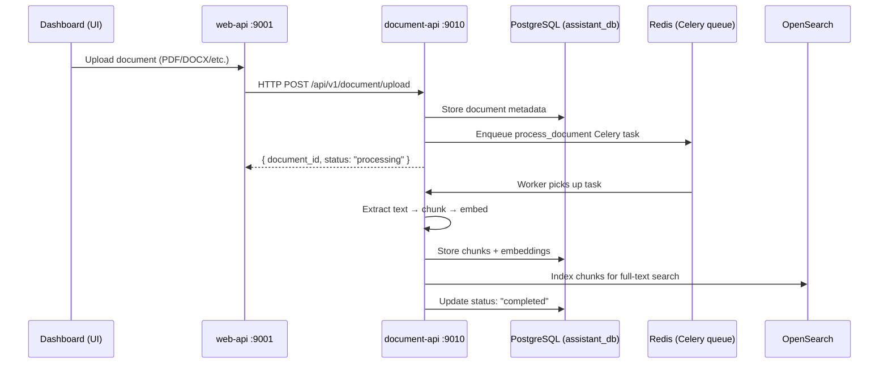
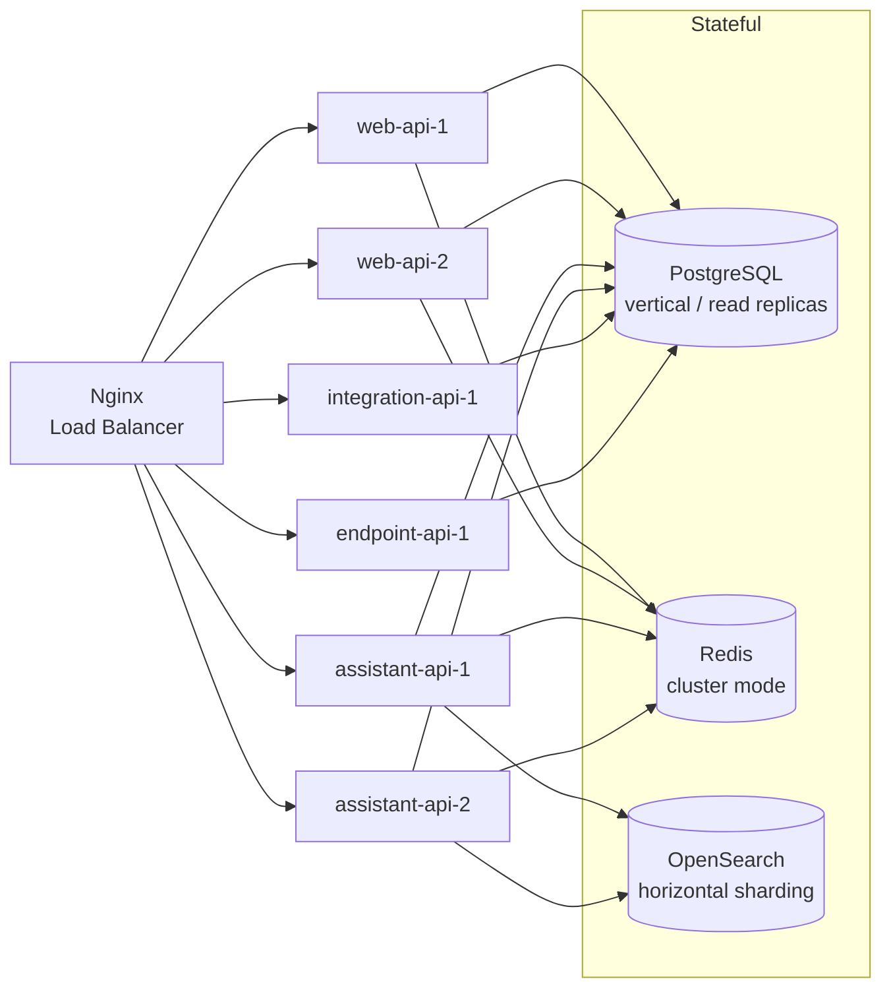

## System Architecture

Rapida is a Go-based microservices platform (module: `github.com/rapidaai`, Go 1.25). Services communicate over gRPC internally and expose REST and gRPC-web APIs via a shared Nginx gateway on port 8080. A single TCP port per service multiplexes HTTP/2 (gRPC), grpc-web, and HTTP/1.1 using [cmux](https://github.com/soheilhy/cmux).



---

## Service Responsibilities

| Service             | Port      | Language | Responsibility                                      |
| ------------------- | --------- | -------- | --------------------------------------------------- |
| **web-api**         | 9001      | Go       | Auth, organizations, projects, credential vault     |
| **assistant-api**   | 9007      | Go       | Voice orchestration, STT/TTS pipeline, telephony    |
| **integration-api** | 9004      | Go       | LLM/STT/TTS provider integrations, OAuth            |
| **endpoint-api**    | 9005      | Go       | Webhook management, event routing, retry            |
| **document-api**    | 9010      | Python   | Document processing, embeddings, RAG (FastAPI)      |
| **ui**              | 3000      | React/TS | Frontend dashboard                                  |
| **nginx**           | 8080      | —        | Reverse proxy, WebSocket upgrade, SSL/TLS           |

---

## Nginx Routing

The Nginx gateway at port 8080 routes requests based on the gRPC service path prefix:

| Path Pattern                              | Upstream          | Protocol         |
| ----------------------------------------- | ----------------- | ---------------- |
| `/talk_api.TalkService/AssistantTalk`     | assistant-api:9007 | WebSocket upgrade |
| `/talk_api`                               | assistant-api:9007 | gRPC-web         |
| `/tool_api`, `/web_api`, `/vault_api`, `/workflow_api`, `/assistant_api`, `/knowledge_api`, `/connect_api`, `/lead_api` | web-api:9001 | gRPC-web |
| `/rapida-data/assets/workflow/`           | Static files      | HTTP             |
| `/`                                       | web-api:9001      | HTTP proxy       |

> **Real-time audio** connections use the WebSocket upgrade path. The browser SDK connects to `ws://hostname:8080/talk_api.TalkService/AssistantTalk` for bidirectional audio streaming.

---

## Data Layer

### PostgreSQL Databases

PostgreSQL 15 is the primary relational store. Each service owns a dedicated database. The `init.sql` initializes all required databases on first container start.

| Database         | Owners                        | Purpose                                           |
| ---------------- | ----------------------------- | ------------------------------------------------- |
| `web_db`         | web-api                       | Users, organizations, projects, API keys, vault   |
| `assistant_db`   | assistant-api, document-api   | Assistants, conversations, messages, embeddings   |
| `integration_db` | integration-api               | Integrations, provider credentials, OAuth tokens  |
| `endpoint_db`    | endpoint-api                  | Webhooks, endpoints, delivery logs                |

```
PostgreSQL :5432
├── web_db        ← web-api
├── assistant_db  ← assistant-api + document-api
├── integration_db ← integration-api
└── endpoint_db   ← endpoint-api
```

> The `web_db` is defined as the default database in `POSTGRES_DB` in docker-compose and created automatically by the PostgreSQL image. The remaining three databases are created by `docker/postgres/init.sql`.

### Redis Databases

Redis 7 serves as the in-memory cache, session store, and job broker.

| DB  | Purpose                                          |
| --- | ------------------------------------------------ |
| 0   | General application cache (GORM second-level cache) |
| 1   | Session / auth token cache                       |
| 2   | Celery job broker (document-api background jobs) |

### OpenSearch Indices

OpenSearch 2.11.1 handles full-text search and vector similarity search.

| Index                     | Producer          | Purpose                                  |
| ------------------------- | ----------------- | ---------------------------------------- |
| `assistant-conversations` | assistant-api     | Searchable conversation transcripts      |
| `conversation-metrics`    | assistant-api     | Call latency and quality metrics         |
| `documents-*`             | document-api      | Knowledge base chunks and embeddings     |
| `logs-*`                  | assistant-api     | Structured application logs              |

---

## Data Flows

### 1. User Authentication



### 2. Voice Conversation



### 3. Inbound Phone Call (Twilio / Vonage)



### 4. SIP / Asterisk Connection



### 5. Document Upload and RAG Indexing



---

## Communication Patterns

### Synchronous

| Pattern       | Used For                                          | Implementation         |
| ------------- | ------------------------------------------------- | ---------------------- |
| **REST/HTTP** | External-facing API calls, health checks          | Gin framework          |
| **gRPC**      | Inter-service calls (typed, schema-enforced)      | gRPC + protobuf        |
| **gRPC-web**  | Browser → backend (gRPC over HTTP/1.1)            | improbable-eng grpc-web |
| **WebSocket** | Real-time audio streaming (assistant-api)         | gorilla/websocket      |

### Asynchronous

| Pattern            | Used For                                          | Implementation         |
| ------------------ | ------------------------------------------------- | ---------------------- |
| **Redis Pub/Sub**  | Real-time session updates, notifications          | go-redis               |
| **Celery tasks**   | Document processing, embedding generation         | Redis broker           |
| **Webhooks**       | External event delivery with retry                | endpoint-api           |

---

## Port Reference

| Service         | Port | Protocol          | Notes                                              |
| --------------- | ---- | ----------------- | -------------------------------------------------- |
| nginx           | 8080 | HTTP / WebSocket  | External entry point                               |
| ui              | 3000 | HTTP              | React development server / production build        |
| web-api         | 9001 | HTTP + gRPC + gRPC-web | cmux multiplexed                              |
| assistant-api   | 9007 | HTTP + gRPC + WebSocket | cmux multiplexed; real-time audio              |
| assistant-api   | 4573 | TCP (AudioSocket) | Asterisk AudioSocket integration                   |
| integration-api | 9004 | HTTP + gRPC       | cmux multiplexed                                   |
| endpoint-api    | 9005 | HTTP + gRPC       | cmux multiplexed                                   |
| document-api    | 9010 | HTTP (FastAPI)    | ASGI / uvicorn                                     |
| PostgreSQL      | 5432 | TCP               | Internal only (not exposed publicly)               |
| Redis           | 6379 | TCP               | Internal only                                      |
| OpenSearch      | 9200 | HTTP              | Internal; 9600 for metrics                         |

---

## Scaling

All application services are stateless and scale horizontally behind the Nginx load balancer.



| Layer           | Scaling Strategy                          |
| --------------- | ----------------------------------------- |
| Application     | Horizontal (stateless pods/containers)    |
| PostgreSQL      | Vertical + read replicas                  |
| Redis           | Vertical or cluster mode                  |
| OpenSearch      | Horizontal (node count + shard count)     |

---

## Next Steps

- [Installation](/opensource/installation) — Deploy locally with Docker Compose
- [Configuration](/opensource/configuration) — Environment variable reference
- [Services Overview](/opensource/services) — Per-service documentation
