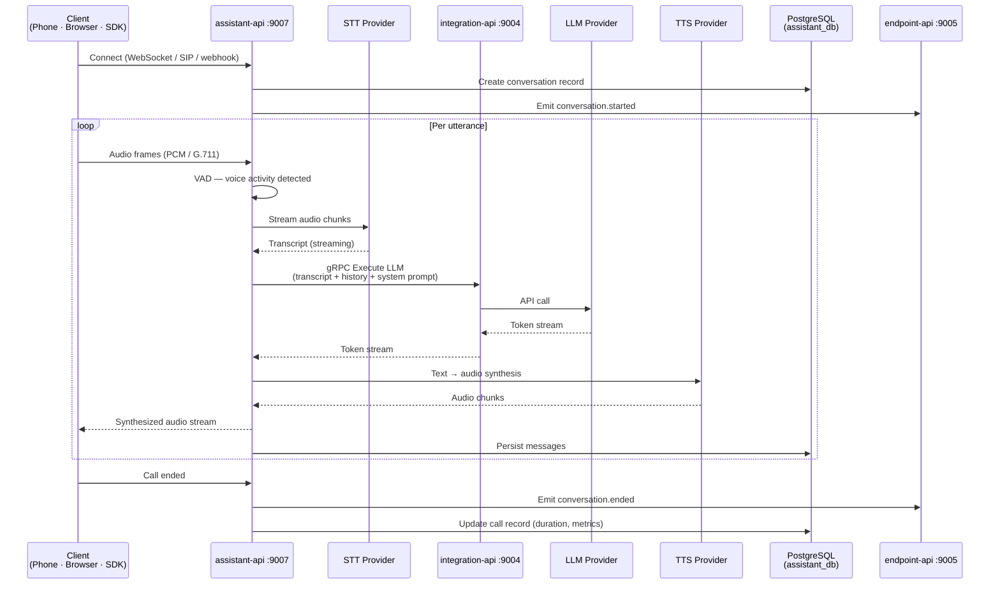

## Overview

The `assistant-api` is the voice orchestration engine of the Rapida platform. Every active call — whether inbound from a phone, a browser SDK session, or an Asterisk trunk — runs through this service. It owns the complete real-time pipeline: audio streaming, speech-to-text, LLM inference (via `integration-api`), text-to-speech, and call event emission (via `endpoint-api`).

<CardGroup cols={3}>
  <Card title="Port" icon="server">
    `9007` — HTTP · gRPC · WebSocket (cmux)
    `4573` — Asterisk AudioSocket (TCP)
  </Card>
  <Card title="Language" icon="code">
    Go 1.25
    gRPC inter-service
    cmux port multiplexing
  </Card>
  <Card title="Storage" icon="database">
    PostgreSQL `assistant_db`
    Redis (session, cache)
    OpenSearch (transcripts)
  </Card>
</CardGroup>

<Info>
  The `assistant-api` does **not** store provider credentials. It delegates all LLM, STT, and TTS calls to `integration-api`, which manages encrypted credential access. The assistant-api never touches raw API keys.
</Info>

---

## Components

The assistant-api is composed of four internal subsystems. Each subsystem has a well-defined boundary and can be extended independently.

<AccordionGroup>

<Accordion title="Voice Pipeline — STT / LLM / TTS orchestration">

The pipeline runs per-utterance within a conversation. When voice activity is detected, audio frames are forwarded to the configured STT provider. The transcript is sent to `integration-api` for LLM inference, and the response is synthesized by the configured TTS provider before being streamed back to the caller.

| Stage | Component | What Happens |
|-------|-----------|--------------|
| **Audio In** | Audio receiver | Raw PCM / G.711 frames arrive over WebSocket or SIP |
| **VAD** | Voice Activity Detector | Silence detection determines utterance start/end |
| **STT** | `internal/transformer/<provider>/stt.go` | Audio chunks streamed to provider; transcript returned |
| **LLM** | `integration-api:9004` via gRPC | Transcript + system prompt + conversation history sent; tokens streamed back |
| **TTS** | `internal/transformer/<provider>/tts.go` | LLM tokens synthesized to audio in real time |
| **Audio Out** | Audio sender | Synthesized audio chunks streamed back to caller |

</Accordion>

<Accordion title="Transformer Layer — STT and TTS provider adapters">

Each STT and TTS provider is implemented as a Go struct that satisfies one of two interfaces:

```go
// Speech-to-Text
type Transformers[AudioPacket] interface { ... }

// Text-to-Speech
type Transformers[TextPacket] interface { ... }
```

Provider directories live at `api/assistant-api/internal/transformer/<provider>/`. Each directory contains:

| File | Purpose |
|------|---------|
| `<provider>.go` | Client initialization and configuration |
| `stt.go` | Implements the `Transformers[AudioPacket]` interface |
| `tts.go` | Implements the `Transformers[TextPacket]` interface |
| `normalizer.go` | Audio format normalization (sample rate, encoding) |

**Supported STT providers**

| Provider | Notes |
|----------|-------|
| Google Cloud STT | Streaming recognition, 100+ languages |
| Azure Cognitive Services | Microsoft Neural Speech |
| Deepgram | Low-latency streaming, Nova models |
| AssemblyAI | Streaming and batch |
| Cartesia | Real-time with speaker diarization |
| Sarvam AI | Indian language support |

**Supported TTS providers**

| Provider | Notes |
|----------|-------|
| Google Cloud TTS | WaveNet / Neural2 voices |
| Azure Cognitive Services | Neural voices, 140+ languages |
| ElevenLabs | High-fidelity cloned voices |
| Deepgram Aura | Low-latency streaming synthesis |
| Cartesia | Streaming synthesis |
| Sarvam AI | Indian language support |

</Accordion>

<Accordion title="Telephony Channel Layer — inbound/outbound call handling">

Each telephony provider is implemented as a channel adapter under `api/assistant-api/internal/channel/<provider>/`. Channels handle connection negotiation, audio codec translation, and call lifecycle events (answer, transfer, hangup).

**Supported telephony channels**

| Provider | Integration Method | Audio Protocol |
|----------|--------------------|----------------|
| Twilio | HTTP webhook + Media Streams | WebSocket (µ-law) |
| Vonage | HTTP webhook + WebSocket | WebSocket (PCM) |
| Exotel | HTTP webhook | WebSocket |
| Asterisk | AudioSocket TCP | Raw G.711 µ-law frames |
| SIP (direct) | SIP INVITE | RTP |
| WebRTC (browser) | WebSocket / gRPC-web | PCM / Opus |

</Accordion>

<Accordion title="Communication Interface — core pipeline contract">

The `Communication` interface in `api/assistant-api/internal/type/` is the top-level contract that ties together the pipeline. It exposes:

- `OnAudioReceived` — called with each audio frame from the client
- `OnTranscript` — called when STT returns a transcript segment
- `OnLLMResponse` — called with each streamed LLM token
- `OnAudioSend` — called with each TTS audio chunk to deliver to the client
- `OnCallEnd` — called when the conversation terminates

All telephony channels and WebSocket handlers call into this interface. Swapping a channel type does not change pipeline logic.

</Accordion>

</AccordionGroup>

---

## Call Routing

<Tabs>

<Tab title="WebSocket / Browser SDK">

Browser clients and server SDKs connect via WebSocket through the Nginx gateway. Nginx upgrades the HTTP connection and proxies it to `assistant-api:9007` with keepalive.

**Connection URL**

```
ws://<host>:8080/talk_api.TalkService/AssistantTalk
```

In production with TLS:

```
wss://<host>/talk_api.TalkService/AssistantTalk
```

**Required headers**

| Header | Value |
|--------|-------|
| `Authorization` | `Bearer <jwt>` |
| `X-Assistant-Id` | Assistant UUID |

**Nginx routing rule (from `nginx.conf`)**

```nginx
location ~ ^/(talk_api.TalkService/AssistantTalk) {
    proxy_pass http://assistant-talk;   # → assistant-api:9007
    proxy_http_version 1.1;
    proxy_set_header Upgrade $http_upgrade;
    proxy_set_header Connection "upgrade";
}
```

<Tip>
  The [rapida-react](https://github.com/rapidaai/rapida-react) SDK manages the WebSocket connection, audio capture, VAD, and playback automatically. Use it for browser integrations instead of raw WebSocket.
</Tip>

</Tab>

<Tab title="Telephony Webhooks (Twilio / Vonage / Exotel)">

Configure your telephony provider to send inbound call events to the assistant-api webhook. The service establishes a media stream back to the provider and processes the call through the full pipeline.

**Webhook endpoints**

| Provider | Webhook URL |
|----------|-------------|
| Twilio | `https://<your-domain>/v1/telephony/twilio/inbound` |
| Vonage | `https://<your-domain>/v1/telephony/vonage/inbound` |
| Exotel | `https://<your-domain>/v1/telephony/exotel/inbound` |

**Twilio media stream configuration (TwiML)**

```xml
<?xml version="1.0" encoding="UTF-8"?>
<Response>
  <Connect>
    <Stream url="wss://your-domain/v1/telephony/twilio/stream">
      <Parameter name="assistant_id" value="<assistant-uuid>"/>
    </Stream>
  </Connect>
</Response>
```

<Note>
  The assistant UUID must correspond to a deployed assistant in your Rapida project. Configure the Twilio phone number's voice webhook URL to point to your hosted instance.
</Note>

</Tab>

<Tab title="SIP / Asterisk (AudioSocket)">

The assistant-api listens on port `4573` for Asterisk AudioSocket connections. Asterisk dials out via the AudioSocket application and streams raw G.711 µ-law audio frames bidirectionally.

**Connection details**

| Setting | Value |
|---------|-------|
| Host | `<assistant-api-host>` |
| Port | `4573` |
| Protocol | TCP (Asterisk AudioSocket) |
| Audio | G.711 µ-law, 8 kHz, mono |

**Asterisk dialplan (extensions.conf)**

```ini
[from-pstn]
exten => s,1,NoOp(Incoming call to Rapida)
exten => s,n,Answer()
exten => s,n,AudioSocket(assistant-api:4573,<assistant-uuid>)
exten => s,n,Hangup()
```

<Warning>
  Port `4573` must be open in your firewall and accessible from the Asterisk server. In Docker Compose, it is exposed as `4573:4573`. Verify with `docker port assistant-api 4573`.
</Warning>

</Tab>

<Tab title="Direct gRPC (Server SDK)">

Server-side SDKs and internal services connect directly to port `9007` over gRPC without going through Nginx.

**Connection details**

| Setting | Value |
|---------|-------|
| Host | `assistant-api` (Docker) · `localhost` (local dev) |
| Port | `9007` |
| TLS | Disabled by default (enable with `TLS__ENABLED=true`) |

**Go example**

```go
import (
    "google.golang.org/grpc"
    "google.golang.org/grpc/credentials/insecure"
    talk_api "github.com/rapidaai/protos/talk"
)

conn, err := grpc.Dial(
    "localhost:9007",
    grpc.WithTransportCredentials(insecure.NewCredentials()),
)
client := talk_api.NewTalkServiceClient(conn)
stream, err := client.AssistantTalk(ctx)
```

</Tab>

</Tabs>

---

## Voice Pipeline Flow

The sequence below shows a complete utterance cycle within an active call.



---

## Configuration

The assistant-api reads its configuration from `docker/assistant-api/.assistant.env` (Docker) or environment variables (local).

### Required variables

| Variable | Required | Default | Description |
|----------|----------|---------|-------------|
| `SECRET` | ✅ Yes | `rpd_pks` | JWT signing secret — must match all other services |
| `POSTGRES__HOST` | ✅ Yes | `postgres` | PostgreSQL host |
| `POSTGRES__DB_NAME` | ✅ Yes | `assistant_db` | Database name |
| `POSTGRES__AUTH__USER` | ✅ Yes | `rapida_user` | Database user |
| `POSTGRES__AUTH__PASSWORD` | ✅ Yes | — | Database password |
| `REDIS__HOST` | ✅ Yes | `redis` | Redis host |
| `OPENSEARCH__HOST` | ✅ Yes | `opensearch` | OpenSearch host |
| `INTEGRATION_HOST` | ✅ Yes | `integration-api:9004` | gRPC address of integration-api |
| `ENDPOINT_HOST` | ✅ Yes | `endpoint-api:9005` | gRPC address of endpoint-api |

### Tuning variables

| Variable | Default | Description |
|----------|---------|-------------|
| `LOG_LEVEL` | `debug` | `debug` · `info` · `warn` · `error` |
| `ENV` | `development` | `development` · `staging` · `production` |
| `POSTGRES__MAX_OPEN_CONNECTION` | `50` | Database connection pool size |
| `POSTGRES__MAX_IDEAL_CONNECTION` | `25` | Idle connections to keep open |
| `REDIS__MAX_CONNECTION` | `10` | Redis connection pool size |
| `OPENSEARCH__MAX_RETRIES` | `3` | Retry attempts on OpenSearch failure |
| `OPENSEARCH__MAX_CONNECTION` | `10` | OpenSearch connection pool size |

### Full environment file

```env
# ── Service identity ──────────────────────────────────────────────
SERVICE_NAME=workflow-api
HOST=0.0.0.0
PORT=9007
LOG_LEVEL=debug
SECRET=rpd_pks
ENV=development

# ── Asset storage ─────────────────────────────────────────────────
ASSET_STORE__STORAGE_TYPE=local
ASSET_STORE__STORAGE_PATH_PREFIX=/app/rapida-data/assets/workflow

# ── PostgreSQL ────────────────────────────────────────────────────
POSTGRES__HOST=postgres
POSTGRES__PORT=5432
POSTGRES__DB_NAME=assistant_db
POSTGRES__AUTH__USER=rapida_user
POSTGRES__AUTH__PASSWORD=rapida_db_password
POSTGRES__MAX_OPEN_CONNECTION=50
POSTGRES__MAX_IDEAL_CONNECTION=25
POSTGRES__SSL_MODE=disable

# ── Redis (second-level GORM cache) ───────────────────────────────
POSTGRES__SLC_CACHE__HOST=redis
POSTGRES__SLC_CACHE__PORT=6379
POSTGRES__SLC_CACHE__DB=1
POSTGRES__SLC_CACHE__MAX_CONNECTION=10

# ── Redis ─────────────────────────────────────────────────────────
REDIS__HOST=redis
REDIS__PORT=6379
REDIS__MAX_CONNECTION=10
REDIS__MAX_DB=0

# ── OpenSearch ────────────────────────────────────────────────────
OPENSEARCH__SCHEMA=http
OPENSEARCH__HOST=opensearch
OPENSEARCH__PORT=9200
OPENSEARCH__MAX_RETRIES=3
OPENSEARCH__MAX_CONNECTION=10

# ── Internal service addresses (gRPC) ─────────────────────────────
INTEGRATION_HOST=integration-api:9004
ENDPOINT_HOST=endpoint-api:9005
ASSISTANT_HOST=assistant-api:9007
WEB_HOST=web-api:9001
```

<Warning>
  Change `SECRET` to a cryptographically random value before any production deployment. All services must share the same `SECRET`. Generate one with `openssl rand -hex 32`. A mismatch will cause JWT validation to fail across services.
</Warning>

---

## Running

<Tabs>

<Tab title="Docker Compose">

```bash
# Start assistant-api and its dependencies (postgres, redis, opensearch)
make up-assistant

# Follow logs
make logs-assistant

# Rebuild image after code changes (no cache)
make rebuild-assistant

# Open a shell inside the container
make shell-assistant
```

</Tab>

<Tab title="From Source">

Requires Go 1.25, PostgreSQL 15, Redis 7, and OpenSearch 2.11 running locally.

```bash
# Load base env file
export $(grep -v '^#' docker/assistant-api/.assistant.env | xargs)

# Override Docker hostnames for local connectivity
export POSTGRES__HOST=localhost
export REDIS__HOST=localhost
export OPENSEARCH__HOST=localhost
export INTEGRATION_HOST=localhost:9004
export ENDPOINT_HOST=localhost:9005
export WEB_HOST=localhost:9001

# Run
go run cmd/assistant/assistant.go
```

</Tab>

</Tabs>

---

## Health & Observability

| Endpoint | Purpose |
|----------|---------|
| `GET /readiness/` | Reports whether the service is ready to accept traffic (DB + Redis + OpenSearch connected) |
| `GET /healthz/` | Liveness probe — confirms the Go process is alive |

```bash
curl http://localhost:9007/readiness/
```

---

## Troubleshooting

<AccordionGroup>

<Accordion title="Audio stream disconnects immediately">
- Verify the JWT token in the `Authorization` header is valid and not expired.
- Confirm the assistant UUID exists in `assistant_db`.
- Run `make logs-assistant` and look for `connection rejected` or `auth failed` entries.
</Accordion>

<Accordion title="STT returns empty or incorrect transcripts">
- Confirm the STT provider credentials are stored in `integration-api` and pass the credential test.
- Verify the audio sample rate matches the provider's expectation (most require 8 kHz or 16 kHz).
- Check that `OPENSEARCH__HOST` is reachable — OpenSearch indexing failures can surface as STT errors in logs.
</Accordion>

<Accordion title="LLM responses are slow or timing out">
- Check `integration-api` is healthy: `curl http://localhost:9004/readiness/`
- Verify the LLM provider API key is valid and has sufficient quota.
- Increase `POSTGRES__MAX_OPEN_CONNECTION` if database contention is visible in logs.
</Accordion>

<Accordion title="Asterisk AudioSocket: connection refused on port 4573">
- Confirm the port is exposed: `docker port assistant-api 4573`
- Check the Asterisk dialplan passes a valid assistant UUID.
- Verify firewall rules allow TCP from the Asterisk host to port 4573.
</Accordion>

<Accordion title="Twilio / Vonage: no audio or one-way audio">
- Confirm the webhook URL is publicly reachable from the provider's servers (not `localhost`).
- Check that the TwiML / Vonage NCCO returns the correct stream URL.
- Review `make logs-assistant` for codec negotiation errors.
</Accordion>

</AccordionGroup>

---

## Next Steps

<CardGroup cols={2}>
  <Card title="Integration API" icon="plug" href="/opensource/services/integration-api">
    Configure LLM, STT, and TTS provider credentials used by this service.
  </Card>
  <Card title="Document API" icon="book-open" href="/opensource/services/document-api">
    Connect knowledge bases to assistants for RAG-powered responses.
  </Card>
  <Card title="Architecture" icon="diagram-project" href="/opensource/architecture">
    Understand how all services connect and communicate.
  </Card>
  <Card title="Configuration Reference" icon="sliders" href="/opensource/configuration">
    Full environment variable reference for all services.
  </Card>
</CardGroup>
