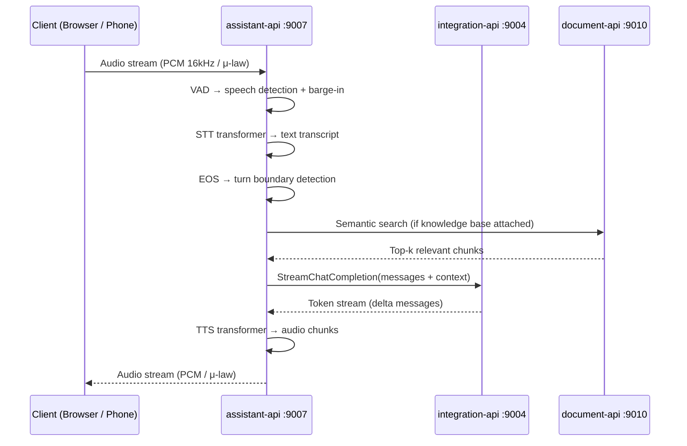

## Purpose

The `assistant-api` is the runtime core of the Rapida platform. Every active voice call passes through this service. It owns:

- Real-time audio streaming via WebSocket (browser and telephony)
- Voice Activity Detection (Silero, TEN, FireRed) — speech detection and barge-in
- Speech-to-text transcription (streaming, provider-agnostic)
- End of Speech detection (Silence-Based, Pipecat Smart Turn, LiveKit Turn Detector) — turn boundary detection
- LLM inference via `integration-api` (streaming token delivery)
- Text-to-speech synthesis (streaming, provider-agnostic)
- Telephony signalling for Twilio, Vonage, Exotel, Asterisk, and SIP
- Knowledge base retrieval (RAG) via `document-api`
- Conversation state and metrics persistence

<CardGroup cols={3}>
  <Card title="Port" icon="server">
    `9007` — HTTP · gRPC · WebSocket (cmux)
  </Card>
  <Card title="Port" icon="phone">
    `4573` — Asterisk AudioSocket (TCP)
  </Card>
  <Card title="Language" icon="code">
    Go 1.25
    Gin (REST) + gRPC
  </Card>
</CardGroup>

---

## Voice Pipeline

Every call follows this sequence. STT, LLM, and TTS run as streaming pipelines — the LLM begins generating before STT finishes, and TTS begins speaking before the LLM completes.



---

## Input Channels

| Channel | Transport | Entry Point | Use Case |
|---------|-----------|-------------|----------|
| WebSocket (browser) | `wss://host:8080/talk_api.TalkService/AssistantTalk` | gRPC-web | Web widget, SDK |
| Twilio | WebSocket per call | `wss://PUBLIC_ASSISTANT_HOST/v1/talk/twilio/ctx/{contextId}` | Inbound / outbound PSTN |
| Vonage | WebSocket per call | `wss://PUBLIC_ASSISTANT_HOST/v1/talk/vonage/ctx/{contextId}` | Inbound / outbound PSTN |
| Exotel | WebSocket per call | `wss://PUBLIC_ASSISTANT_HOST/v1/talk/exotel/ctx/{contextId}` | India / SEA PSTN |
| Asterisk AudioSocket | TCP `0.0.0.0:4573` | Raw TCP (AudioSocket protocol) | Self-hosted PBX |
| Asterisk WebSocket | WebSocket per call | `wss://PUBLIC_ASSISTANT_HOST/v1/talk/asterisk/ctx/{contextId}` | Self-hosted PBX |
| SIP | UDP `0.0.0.0:5090` | SIP INVITE | Direct SIP / Asterisk |

<Info>
  `PUBLIC_ASSISTANT_HOST` must be a publicly reachable hostname or IP. Twilio, Vonage, and Exotel call back to this host for WebSocket media streaming.
</Info>

---

## STT / TTS Providers

| Provider Identifier | STT | TTS | Notes |
|--------------------|-----|-----|-------|
| `deepgram` | ✅ | ✅ | Nova-2 / Nova-3; streaming |
| `google-speech-service` | ✅ | ✅ | Streaming STT; WaveNet / Neural2 TTS |
| `azure-speech-service` | ✅ | ✅ | Neural voices; streaming |
| `elevenlabs` | ✗ | ✅ | High-fidelity voice cloning |
| `cartesia` | ✅ | ✅ | Low-latency streaming |
| `assemblyai` | ✅ | ✗ | Streaming + batch |
| `sarvamai` | ✅ | ✅ | Indian languages |
| `revai` | ✅ | ✗ | Streaming STT |

Provider identifiers are the string constants used in `AudioTransformer` (`api/assistant-api/internal/transformer/transformer.go`). They map directly to the `provider` field in the assistant configuration.

---

## Key Components

<AccordionGroup>

<Accordion title="Transformer Layer (STT / TTS)">

Each provider lives under `api/assistant-api/internal/transformer/<provider>/`. All providers implement the same generic interface:

```go
// api/assistant-api/internal/type/transformer.go
type Transformers[IN any] interface {
    Initialize() error
    Transform(context.Context, IN) error
    Close(context.Context) error
}
```

The factory functions resolve the provider string to a concrete implementation at call time:

```go
// api/assistant-api/internal/transformer/transformer.go
func GetSpeechToTextTransformer(ctx, logger, provider, credential, onPacket, opts) (SpeechToTextTransformer, error)
func GetTextToSpeechTransformer(ctx, logger, provider, credential, onPacket, opts) (TextToSpeechTransformer, error)
```

See [STT / TTS Providers](/opensource/services/assistant-api/stt-tts) for how to add a new provider.

</Accordion>

<Accordion title="Telephony Channel Layer">

Telephony providers live under `api/assistant-api/internal/channel/telephony/internal/<provider>/`. The factory in `telephony.go` creates the correct provider at runtime:

```go
// api/assistant-api/internal/channel/telephony/telephony.go
const (
    Twilio   Telephony = "twilio"
    Exotel   Telephony = "exotel"
    Vonage   Telephony = "vonage"
    Asterisk Telephony = "asterisk"
    SIP      Telephony = "sip"
)
```

All providers implement the `Telephony` interface (`ReceiveCall`, `OutboundCall`, `InboundCall`, `StatusCallback`). See [Telephony](/opensource/services/assistant-api/telephony) for provider setup.

</Accordion>

<Accordion title="Call Context Store">

Call context (assistant ID, conversation ID, auth token, provider, caller number) is persisted in PostgreSQL via the `callcontext.Store` interface. The context ID is passed through the call URL path so the WebSocket or AudioSocket handler can resolve the full session without requiring the client to re-authenticate.

</Accordion>

<Accordion title="Communication Interface">

The `Communication` interface in `api/assistant-api/internal/type/` is the central contract tying together the STT callback, LLM execution, TTS callback, auth, tracing, and conversation state for a single call. Each channel (WebSocket, telephony, SIP) creates a `Communication` implementation per call.

</Accordion>

</AccordionGroup>

---

## Running

<Tabs>

<Tab title="Docker Compose">

```bash
# Start assistant-api and its dependencies
make up-assistant

# Follow logs
make logs-assistant

# Rebuild after code changes
make rebuild-assistant

# Shell access
make shell-assistant
```

</Tab>

<Tab title="From Source">

Requires Go 1.25, PostgreSQL 15, Redis 7, and OpenSearch 2.11 running locally.

```bash
# Load env file
export $(grep -v '^#' docker/assistant-api/.assistant.env | xargs)

# Override Docker hostnames
export POSTGRES__HOST=localhost
export REDIS__HOST=localhost
export OPENSEARCH__HOST=localhost
export INTEGRATION_HOST=localhost:9004
export ENDPOINT_HOST=localhost:9005
export WEB_HOST=localhost:9001
export DOCUMENT_HOST=http://localhost:9010

# Run
go run cmd/assistant/assistant.go
```

</Tab>

</Tabs>

---

## Health Endpoints

| Endpoint | Purpose |
|----------|---------|
| `GET /readiness/` | Service ready (DB + Redis + OpenSearch connected) |
| `GET /healthz/` | Liveness probe |

```bash
curl http://localhost:9007/readiness/
```

---

## Next Steps

<CardGroup cols={2}>
  <Card title="Configuration" icon="sliders" href="/opensource/services/assistant-api/configuration">
    All environment variables with defaults and descriptions.
  </Card>
  <Card title="Voice Activity Detection" icon="audio-waveform" href="/opensource/services/assistant-api/vad/overview">
    Silero, TEN, and FireRed VAD — setup, parameters, and model files.
  </Card>
  <Card title="End of Speech" icon="timer" href="/opensource/services/assistant-api/eos/overview">
    Silence-Based, Pipecat Smart Turn, and LiveKit Turn Detector — setup and model downloads.
  </Card>
  <Card title="STT / TTS Providers" icon="mic" href="/opensource/services/assistant-api/stt-tts">
    Supported providers, the transformer interface, and how to add a new provider.
  </Card>
  <Card title="Telephony" icon="phone" href="/opensource/services/assistant-api/telephony">
    Twilio, Vonage, Exotel, Asterisk AudioSocket, and SIP setup.
  </Card>
  <Card title="Integration API" icon="plug" href="/opensource/services/integration-api/overview">
    LLM provider execution layer called by assistant-api.
  </Card>
</CardGroup>
