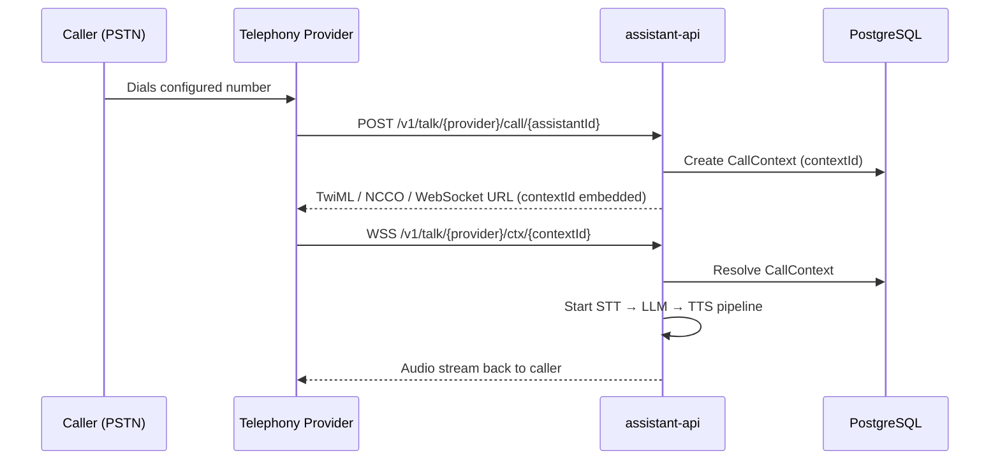

The `assistant-api` supports five telephony providers. Each is identified by a string constant defined in `api/assistant-api/internal/channel/telephony/telephony.go`.

```go
const (
    Twilio   Telephony = "twilio"
    Exotel   Telephony = "exotel"
    Vonage   Telephony = "vonage"
    Asterisk Telephony = "asterisk"
    SIP      Telephony = "sip"
)
```

---

## Provider Comparison

| Provider | Transport | Audio Format | Region |
|----------|-----------|--------------|--------|
| **Twilio** | WebSocket (Media Streams) | μ-law 8kHz | Global |
| **Vonage** | WebSocket | Linear PCM 16kHz | Global |
| **Exotel** | WebSocket | μ-law 8kHz | India / SEA |
| **Asterisk AudioSocket** | Raw TCP `0.0.0.0:4573` | Linear PCM 8kHz | Self-hosted PBX |
| **Asterisk WebSocket** | WebSocket (`chan_websocket`) | μ-law 8kHz | Self-hosted PBX |
| **SIP** | UDP `0.0.0.0:5090` + RTP | PCM | Direct SIP / SIP trunks |

<Info>
**Twilio, Vonage, and Exotel** are cloud providers — they call your server. You need `PUBLIC_ASSISTANT_HOST` set to a public HTTPS hostname (use ngrok locally).

**Asterisk AudioSocket and WebSocket** run on your own PBX — Asterisk connects out to Rapida.

**SIP** is a built-in server in `assistant-api` — any SIP client can call it directly.
</Info>

---

## URL Routing Pattern

All telephony paths follow this structure (source: `api/assistant-api/internal/type/telephony.go`):

```go
// Inbound call webhook — provider calls this when a call arrives
func GetContextAnswerPath(provider, contextID string) string {
    return fmt.Sprintf("v1/talk/%s/ctx/%s", provider, contextID)
    // Example: v1/talk/twilio/ctx/abc-123
}

// Status / event callback
func GetContextEventPath(provider, contextID string) string {
    return fmt.Sprintf("v1/talk/%s/ctx/%s/event", provider, contextID)
    // Example: v1/talk/twilio/ctx/abc-123/event
}
```

| Path | Method | Purpose |
|------|--------|---------|
| `/v1/talk/{provider}/call/{assistantId}` | POST / GET | Inbound call webhook (provider → Rapida) |
| `/v1/talk/{provider}/ctx/{contextId}` | WebSocket | Bidirectional audio stream |
| `/v1/talk/{provider}/ctx/{contextId}/event` | POST | Status / lifecycle events |

The `contextId` is created on the first webhook hit and binds the conversation to a provider session. It is stored in PostgreSQL with the assistant ID, conversation ID, and auth token.

---

## Inbound Call Flow



---

## What's Next

<CardGroup cols={2}>
  <Card title="Running with a Provider" icon="play" href="/opensource/services/assistant-api/telephony-running">
    Step-by-step setup for Twilio, Vonage, Exotel, Asterisk AudioSocket, Asterisk WebSocket, and SIP.
  </Card>
  <Card title="Adding a New Provider" icon="code" href="/opensource/services/assistant-api/telephony-developing">
    Implement the Telephony interface and register a new provider in the factory.
  </Card>
  <Card title="ngrok — Local Testing" icon="tunnel" href="/opensource/services/assistant-api/ngrok">
    Expose your local Rapida instance to Twilio, Vonage, and Exotel for development.
  </Card>
  <Card title="Configuration" icon="sliders" href="/opensource/services/assistant-api/configuration">
    All env vars: PUBLIC_ASSISTANT_HOST, SIP, AudioSocket, and more.
  </Card>
</CardGroup>
