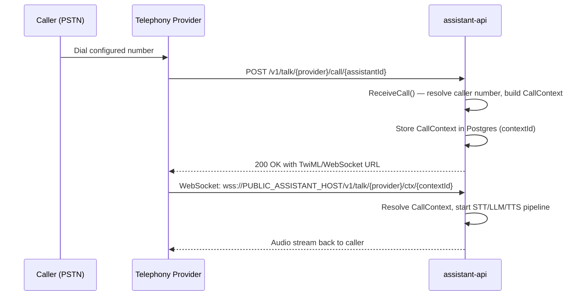

## Overview

The `assistant-api` supports five telephony providers. Each provider is identified by a string constant in `api/assistant-api/internal/channel/telephony/telephony.go`:

```go
const (
    Twilio   Telephony = "twilio"
    Exotel   Telephony = "exotel"
    Vonage   Telephony = "vonage"
    Asterisk Telephony = "asterisk"
    SIP      Telephony = "sip"
)
```

| Provider | Transport | Audio Format | Use Case |
|----------|-----------|-------------|----------|
| Twilio | WebSocket (Media Streams) | μ-law 8kHz | Cloud PSTN — global |
| Vonage | WebSocket | Linear PCM 16kHz | Cloud PSTN — global |
| Exotel | WebSocket | μ-law 8kHz | Cloud PSTN — India / SEA |
| Asterisk AudioSocket | Raw TCP `0.0.0.0:4573` | Linear PCM 8kHz | Self-hosted PBX |
| Asterisk WebSocket | WebSocket | μ-law 8kHz | Self-hosted PBX |
| SIP | UDP `0.0.0.0:5090` + RTP | PCM | Direct SIP / SIP trunks |

---

## URL Routing

All telephony media WebSocket paths follow this pattern (from `api/assistant-api/internal/type/telephony.go`):

```go
// WebSocket media stream path
func GetContextAnswerPath(provider, contextID string) string {
    return fmt.Sprintf("v1/talk/%s/ctx/%s", provider, contextID)
    // e.g. v1/talk/twilio/ctx/abc123
}

// Status callback path
func GetContextEventPath(provider, contextID string) string {
    return fmt.Sprintf("v1/talk/%s/ctx/%s/event", provider, contextID)
    // e.g. v1/talk/twilio/ctx/abc123/event
}
```

The `contextId` is generated when an inbound call webhook is received or when an outbound call is initiated. It is stored in PostgreSQL and encodes the full call session (assistant ID, conversation ID, auth token, provider).

---

## Inbound Call Flow



---

## Provider Setup

<Tabs>

<Tab title="Twilio">

### How Twilio Works

Twilio sends a webhook to your server when a call arrives. Rapida responds with TwiML that instructs Twilio to connect Media Streams (bidirectional audio over WebSocket).

### Vault Credential Keys

Store these in the Rapida credential vault under provider type `twilio`:

| Key | Description |
|-----|-------------|
| `account_sid` | Twilio Account SID (`ACxxxxxxxxxxxxxxxxxxxxxxxxxxxxxxxx`) |
| `account_token` | Twilio Auth Token |

### Inbound Call Webhook

Configure your Twilio phone number's **Voice webhook** to:

```
POST https://{PUBLIC_ASSISTANT_HOST}/v1/talk/twilio/call/{assistantId}
```

Rapida responds with TwiML connecting Twilio Media Streams:

```xml
<Response>
  <Connect>
    <Stream url="wss://{PUBLIC_ASSISTANT_HOST}/v1/talk/twilio/ctx/{contextId}"
            name="{assistantId}__{conversationId}"
            statusCallback="https://{PUBLIC_ASSISTANT_HOST}/v1/talk/twilio/ctx/{contextId}/event"
            statusCallbackEvent="initiated ringing answered completed">
      <Parameter name="assistant_id" value="{assistantId}"/>
      <Parameter name="client_number" value="{callerNumber}"/>
    </Stream>
  </Connect>
</Response>
```

### Outbound Call

Rapida calls `client.Api.CreateCall` via the Twilio Go SDK. The `StatusCallback`, `StatusCallbackEvent`, and `Twiml` are generated automatically using `PUBLIC_ASSISTANT_HOST`.

### Notes

- Audio: μ-law 8kHz, base64-encoded per Twilio Media Streams spec
- Status events: `initiated`, `ringing`, `answered`, `completed`
- `PUBLIC_ASSISTANT_HOST` must be an HTTPS hostname (Twilio rejects plain HTTP webhooks)

</Tab>

<Tab title="Vonage">

### How Vonage Works

Vonage sends a webhook when a call arrives. Rapida returns an NCCO (Vonage call control object) with a `connect` action pointing to a WebSocket URL.

### Vault Credential Keys

| Key | Description |
|-----|-------------|
| `api_key` | Vonage API key |
| `api_secret` | Vonage API secret |
| `application_id` | Vonage Application ID (for JWT auth) |
| `private_key` | Vonage Application private key (for JWT auth) |

### Inbound Call Webhook

Configure your Vonage application's **Answer URL** to:

```
POST https://{PUBLIC_ASSISTANT_HOST}/v1/talk/vonage/call/{assistantId}
```

Rapida responds with an NCCO connecting a WebSocket:

```json
[{
  "action": "connect",
  "endpoint": [{
    "type": "websocket",
    "uri": "wss://{PUBLIC_ASSISTANT_HOST}/v1/talk/vonage/ctx/{contextId}",
    "content-type": "audio/l16;rate=16000"
  }]
}]
```

</Tab>

<Tab title="Asterisk">

### Transport Options

Asterisk supports two transport modes. Choose based on your Asterisk version and setup:

| Mode | Transport | When to Use |
|------|-----------|-------------|
| **AudioSocket** | TCP `0.0.0.0:4573` | Asterisk 16+ with `app_audiosocket` |
| **WebSocket** | `wss://PUBLIC_ASSISTANT_HOST/v1/talk/asterisk/ctx/{contextId}` | Asterisk with `chan_websocket` |

### Vault Credential Keys (Outbound via ARI)

| Key | Required | Description |
|-----|----------|-------------|
| `ari_url` | ✅ | ARI base URL, e.g. `http://asterisk:8088` |
| `ari_user` | ✅ | ARI username |
| `ari_password` | ✅ | ARI password |
| `endpoint_technology` | No | SIP technology — default `PJSIP` |
| `trunk` | No | SIP trunk name, e.g. `mytrunk` |

### AudioSocket Setup

**assistant-api** binds an AudioSocket TCP server on `AUDIOSOCKET__PORT` (default `4573`).

**Step 1 — Asterisk AGI/dialplan: register the inbound call**

```
; Dialplan — extensions.conf
[rapida-inbound]
exten => _X.,1,NoOp(Inbound call to Rapida)
 same = n,Set(CALLER=${CALLERID(num)})
 ; Register call with Rapida — response is the contextId
 same = n,Set(CONTEXT_ID=${SHELL(curl -s "https://{PUBLIC_ASSISTANT_HOST}/v1/talk/asterisk/call/{assistantId}?from=${CALLER}")})
 ; Connect to Rapida AudioSocket using the contextId as UUID
 same = n,AudioSocket(${CONTEXT_ID},assistant-api-host:4573)
 same = n,Hangup()
```

**Step 2 — Verify `app_audiosocket` is loaded in Asterisk:**

```
asterisk -rx "module show like audiosocket"
```

### WebSocket Setup (chan_websocket)

```
; Dialplan — extensions.conf
[rapida-inbound]
exten => _X.,1,NoOp(Inbound call to Rapida via WebSocket)
 same = n,Set(CALLER=${CALLERID(num)})
 same = n,Set(CONTEXT_ID=${SHELL(curl -s "https://{PUBLIC_ASSISTANT_HOST}/v1/talk/asterisk/call/{assistantId}?from=${CALLER}")})
 same = n,Dial(WebSocket/wss://{PUBLIC_ASSISTANT_HOST}/v1/talk/asterisk/ctx/${CONTEXT_ID})
 same = n,Hangup()
```

### Outbound Call via ARI

Rapida uses ARI `POST /ari/channels` with the `RAPIDA_CONTEXT_ID` channel variable. The dialplan picks up this variable and connects to the AudioSocket:

```
; Dialplan — extensions.conf (outbound routing)
[rapida-outbound]
exten => _X.,1,NoOp(Outbound call from Rapida)
 same = n,AudioSocket(${RAPIDA_CONTEXT_ID},assistant-api-host:4573)
 same = n,Hangup()
```

ARI endpoint format: `PJSIP/{number}` or `PJSIP/{trunk}/{number}`.

</Tab>

<Tab title="SIP">

### How SIP Works

The built-in SIP server in `assistant-api` listens on UDP port `5090` (configurable). Any SIP client can call directly using the connection string below.

### SIP Connection String

```
sip:{assistantID}:{apiKey}@{SIP__EXTERNAL_IP}:{SIP__PORT}
```

| Field | Source |
|-------|--------|
| `assistantID` | The numeric assistant ID from the dashboard |
| `apiKey` | A Rapida API key scoped to the project |
| `SIP__EXTERNAL_IP` | `SIP__EXTERNAL_IP` env var (your public IP) |
| `SIP__PORT` | `SIP__PORT` env var (default `5090`) |

### Required Configuration

```env
SIP__SERVER=0.0.0.0           # Bind address
SIP__EXTERNAL_IP=203.0.113.10 # Your public IP (advertised in SDP)
SIP__PORT=5090                 # SIP signalling port (UDP)
SIP__TRANSPORT=udp
SIP__RTP_PORT_RANGE_START=10000
SIP__RTP_PORT_RANGE_END=20000
```

<Warning>
  `SIP__EXTERNAL_IP` must be your server's public IP. Leaving it as `0.0.0.0` will cause SDP to advertise a non-routable address, breaking media flow.
</Warning>

### Asterisk SIP Trunk Configuration

To connect Rapida as a SIP endpoint from Asterisk:

**pjsip.conf:**

```ini
[rapida-trunk]
type=endpoint
context=rapida-outbound
disallow=all
allow=ulaw
aors=rapida-trunk-aor
outbound_auth=rapida-trunk-auth

[rapida-trunk-auth]
type=auth
auth_type=userpass
username={assistantID}
password={apiKey}

[rapida-trunk-aor]
type=aor
contact=sip:{SIP__EXTERNAL_IP}:{SIP__PORT}

[rapida-dialer]
type=identify
endpoint=rapida-trunk
match={SIP__EXTERNAL_IP}
```

**extensions.conf:**

```
[rapida-outbound]
exten => _X.,1,NoOp(Route through Rapida)
 same = n,Dial(PJSIP/${EXTEN}@rapida-trunk)
 same = n,Hangup()
```

### Firewall Requirements

Open these ports on your server:

| Port | Protocol | Purpose |
|------|----------|---------|
| `5090` | UDP | SIP signalling |
| `10000–20000` | UDP | RTP media |

</Tab>

<Tab title="Exotel">

### How Exotel Works

Exotel (India / SEA) follows the same webhook → WebSocket pattern as Twilio.

### Vault Credential Keys

| Key | Description |
|-----|-------------|
| `api_key` | Exotel API key |
| `api_secret` | Exotel API secret |
| `account_sid` | Exotel Account SID |

### Inbound Call Webhook

Configure your Exotel ExoPhone's **App** to call:

```
POST https://{PUBLIC_ASSISTANT_HOST}/v1/talk/exotel/call/{assistantId}
```

Rapida responds with an Exotel passthru XML connecting a WebSocket stream at `wss://PUBLIC_ASSISTANT_HOST/v1/talk/exotel/ctx/{contextId}`.

</Tab>

</Tabs>

---

## Adding a New Telephony Provider

<Steps>

<Step title="Create the provider directory">

```bash
mkdir api/assistant-api/internal/channel/telephony/internal/<provider>
```

Create:

| File | Purpose |
|------|---------|
| `telephony.go` | `Telephony` interface implementation |
| `websocket.go` | WebSocket streamer implementation |

</Step>

<Step title="Implement the Telephony interface">

```go
// telephony.go
type Telephony interface {
    ReceiveCall(c *gin.Context) (*StatusInfo, error)
    OutboundCall(auth, toPhone, fromPhone string, ..., vaultCred, opts) (*CallInfo, error)
    InboundCall(c *gin.Context, ...) error
    StatusCallback(c *gin.Context, ...) (*StatusInfo, error)
    CatchAllStatusCallback(c *gin.Context) (*StatusInfo, error)
}
```

</Step>

<Step title="Register in the factory">

Add a case to `GetTelephony` and `NewStreamer` in `api/assistant-api/internal/channel/telephony/telephony.go`:

```go
// In const block:
MyProvider Telephony = "my-provider"

// In GetTelephony switch:
case MyProvider:
    return internal_myprovider.NewMyProviderTelephony(cfg, logger)

// In NewStreamer switch:
case MyProvider:
    return internal_myprovider.NewMyProviderStreamer(logger, opt.WebSocketConn, cc, vaultCred), nil
```

</Step>

</Steps>

---

## Next Steps

<CardGroup cols={2}>
  <Card title="Configuration" icon="sliders" href="/opensource/services/assistant-api/configuration">
    PUBLIC_ASSISTANT_HOST, SIP, and AudioSocket variables.
  </Card>
  <Card title="STT / TTS Providers" icon="mic" href="/opensource/services/assistant-api/stt-tts">
    Speech recognition and synthesis provider setup.
  </Card>
  <Card title="Architecture" icon="diagram-project" href="/opensource/architecture">
    Full system topology and call flow diagrams.
  </Card>
  <Card title="Overview" icon="server" href="/opensource/services/assistant-api/overview">
    Assistant API purpose and voice pipeline.
  </Card>
</CardGroup>
