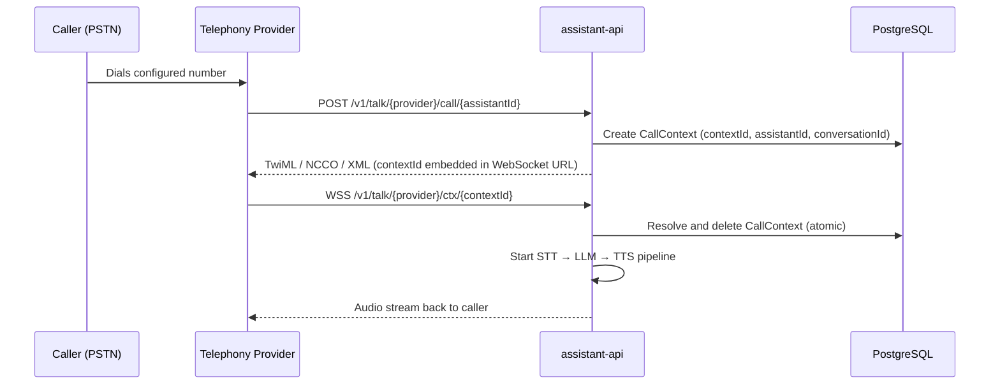

The `assistant-api` supports five telephony providers. Each is identified by a string constant in `api/assistant-api/internal/channel/telephony/telephony.go`.

```go
const (
    Twilio   Telephony = "twilio"
    Exotel   Telephony = "exotel"
    Vonage   Telephony = "vonage"
    Asterisk Telephony = "asterisk"
    SIP      Telephony = "sip"
)
```

---

## Provider Comparison

| Provider | Transport | Audio Format | Region |
|----------|-----------|--------------|--------|
| **Twilio** | WebSocket (Media Streams) | μ-law 8kHz | Global |
| **Vonage** | WebSocket | Linear PCM 16kHz | Global |
| **Exotel** | WebSocket | μ-law 8kHz | India / SEA |
| **Asterisk AudioSocket** | Raw TCP port 4573 | SLIN 16-bit 8kHz | Self-hosted PBX |
| **Asterisk WebSocket** | WebSocket (`chan_websocket`) | μ-law 8kHz | Self-hosted PBX |
| **SIP** | UDP port 5090 + RTP | PCM | Direct SIP / SIP trunks |

<Info>
**Twilio, Vonage, and Exotel** are cloud providers — they call your server. `PUBLIC_ASSISTANT_HOST` must be a publicly reachable HTTPS hostname. For local development, use [ngrok](/opensource/services/assistant-api/ngrok).

**Asterisk** connects from your PBX to Rapida — no public URL needed on Asterisk's side.

**SIP** is a built-in server in `assistant-api` — any SIP client dials it directly.
</Info>

---

## URL Routing

All telephony paths follow this pattern (source: `api/assistant-api/internal/type/telephony.go`):

| Path | Method | Purpose |
|------|--------|---------|
| `/v1/talk/{provider}/call/{assistantId}` | POST / GET | Inbound call webhook — provider → Rapida |
| `/v1/talk/{provider}/ctx/{contextId}` | WebSocket | Bidirectional audio stream |
| `/v1/talk/{provider}/ctx/{contextId}/event` | POST | Call status / lifecycle events |

```go
func GetContextAnswerPath(provider, contextID string) string {
    return fmt.Sprintf("v1/talk/%s/ctx/%s", provider, contextID)
}
func GetContextEventPath(provider, contextID string) string {
    return fmt.Sprintf("v1/talk/%s/ctx/%s/event", provider, contextID)
}
```

The `contextId` is generated on the first webhook hit. It is stored in PostgreSQL and binds together the call session, assistant, conversation, and auth token.

---

## Inbound Call Flow



---

## Provider Pages

<CardGroup cols={3}>
  <Card title="Twilio" icon="phone" href="/opensource/services/assistant-api/telephony/twilio">
    Global PSTN via WebSocket Media Streams
  </Card>
  <Card title="Vonage" icon="phone" href="/opensource/services/assistant-api/telephony/vonage">
    Global PSTN via WebSocket NCCO
  </Card>
  <Card title="Exotel" icon="phone" href="/opensource/services/assistant-api/telephony/exotel">
    India / SEA PSTN
  </Card>
  <Card title="Asterisk" icon="server" href="/opensource/services/assistant-api/telephony/asterisk">
    Self-hosted PBX — AudioSocket and WebSocket
  </Card>
  <Card title="SIP" icon="signal" href="/opensource/services/assistant-api/telephony/sip">
    Built-in SIP server, any SIP client
  </Card>
  <Card title="Configure Your Own" icon="code" href="/opensource/services/assistant-api/telephony/custom">
    Implement the Telephony interface
  </Card>
</CardGroup>
