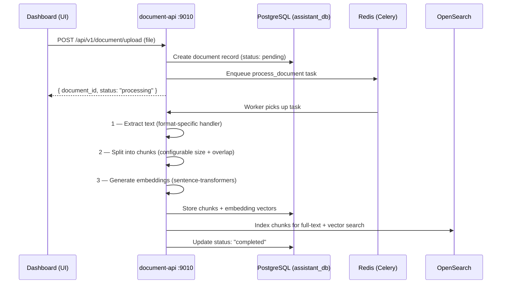

## Overview

<Warning>
  **This service is optional.** `document-api` and its dependency `opensearch` are only needed for knowledge base / RAG features. Voice assistants work fully without it. Use `make up-all-with-knowledge` (Docker) to start with knowledge base support.
</Warning>

The `document-api` is the knowledge backend for the Rapida platform. It processes documents from PDF, Word, CSV, and other formats into searchable vector embeddings and full-text search indices. At call time, `assistant-api` queries this service to inject relevant knowledge context into the LLM prompt.

<CardGroup cols={3}>
  <Card title="Port" icon="server">
    `9010` — HTTP (FastAPI / uvicorn)
  </Card>
  <Card title="Language" icon="code">
    Python 3.11+
    FastAPI + Celery
  </Card>
  <Card title="Storage" icon="database">
    PostgreSQL `assistant_db`
    Redis (Celery broker)
    OpenSearch (vectors + text)
  </Card>
</CardGroup>

<Info>
  Document processing is asynchronous. When a document is uploaded, the API immediately returns a `document_id` with `status: processing`. Text extraction, chunking, and embedding generation are handled by Celery workers in the background.
</Info>

---

## Components

<AccordionGroup>

<Accordion title="Document Ingestion Pipeline">

The processing pipeline runs as a Celery task after each upload. The stages are sequential and the document status is updated at each step.



| Stage | Library | Configurable |
|-------|---------|-------------|
| Text extraction | format-specific (see table below) | No |
| Chunking | custom splitter | `CHUNK_SIZE`, `CHUNK_OVERLAP` |
| Embeddings | sentence-transformers | `EMBEDDINGS_MODEL` |
| Full-text index | OpenSearch | — |

</Accordion>

<Accordion title="Supported File Formats">

| Format | Library | What is extracted |
|--------|---------|-------------------|
| PDF | PyPDF2, pdfplumber | Text content + metadata |
| Word (.docx) | python-docx | Text + paragraph structure |
| Excel (.xlsx) | openpyxl, pandas | Cell values as text |
| CSV | pandas | Row data as text |
| Markdown (.md) | built-in | Text preserving structure |
| HTML | BeautifulSoup | Cleaned text from HTML |
| Plain text (.txt) | built-in | Direct read |
| Images | pytesseract (OCR) | OCR-extracted text |

</Accordion>

<Accordion title="Embedding Models">

Embeddings are generated using [sentence-transformers](https://www.sbert.net/). The model is configurable:

| Model | Dimensions | Speed | Quality | Notes |
|-------|-----------|-------|---------|-------|
| `all-MiniLM-L6-v2` | 384 | Fast | Good | Default, ~80 MB |
| `all-mpnet-base-v2` | 768 | Medium | High | Larger model |
| `all-MiniLM-L12-v2` | 384 | Faster | Good | Lighter variant |
| `multilingual-e5-base` | 768 | Medium | Good | 100+ languages |

Set via `EMBEDDINGS_MODEL` in the config.

</Accordion>

<Accordion title="Audio Noise Reduction (RNNoise)">

The document-api includes RNNoise, a recurrent neural network noise suppressor, for processing audio documents. When enabled, noise reduction is applied before transcription.

| Setting | Variable | Values |
|---------|----------|--------|
| Enable/disable | `RNNOISE_ENABLED` | `true` · `false` |
| Suppression level | `RNNOISE_LEVEL` | `0.0` (off) to `1.0` (maximum) |

</Accordion>

</AccordionGroup>

---

## Semantic Search

At call time, `assistant-api` queries `document-api` with a text query. The service performs vector similarity search and returns the top-k most relevant chunks.

**Search request**

```bash
curl -X POST http://localhost:9010/api/v1/document/search \
  -H "Authorization: Bearer <jwt>" \
  -H "Content-Type: application/json" \
  -d '{
    "query": "customer billing issue",
    "knowledge_base_id": "kb_123",
    "top_k": 5,
    "threshold": 0.5
  }'
```

**Response**

```json
{
  "results": [
    {
      "chunk_id": "chunk_123",
      "document_id": "doc_456",
      "content": "Billing errors are handled by submitting a refund request...",
      "similarity_score": 0.87,
      "metadata": {
        "page_no": 5,
        "section": "Billing Policy"
      }
    }
  ]
}
```

---

## Configuration

The document-api uses a YAML config file at `docker/document-api/config.yaml` combined with environment variables.

### Required settings

| Variable | Required | Default | Description |
|----------|----------|---------|-------------|
| `postgres.host` | ✅ Yes | `localhost` | PostgreSQL host |
| `postgres.db` | ✅ Yes | `assistant_db` | Database name |
| `postgres.auth.user` | ✅ Yes | `rapida_user` | Database user |
| `postgres.auth.password` | ✅ Yes | — | Database password |
| `elastic_search.host` | ✅ Yes | `localhost` | OpenSearch host |
| `celery.broker` | ✅ Yes | `redis://localhost:6379/0` | Celery broker URL |
| `celery.backend` | ✅ Yes | `redis://localhost:6379/0` | Celery result backend URL |

### Tuning settings

| Setting | Default | Description |
|---------|---------|-------------|
| `CHUNK_SIZE` | `1000` | Characters per document chunk |
| `CHUNK_OVERLAP` | `100` | Character overlap between adjacent chunks |
| `MAX_FILE_SIZE` | `52428800` | Maximum upload size in bytes (50 MB) |
| `EMBEDDINGS_MODEL` | `all-MiniLM-L6-v2` | Sentence-transformers model name |
| `EMBEDDINGS_DIMENSION` | `384` | Embedding vector dimension |
| `CELERY_WORKERS` | `4` | Number of Celery worker processes |
| `RNNOISE_ENABLED` | `true` | Enable audio noise reduction |
| `RNNOISE_LEVEL` | `0.5` | Noise reduction level (0.0–1.0) |

### Full config file (`docker/document-api/config.yaml`)

```yaml
service_name: "Document API"
host: "0.0.0.0"
port: 9010

authentication_config:
  strict: false
  type: "jwt"
  config:
    secret_key: "rpd_pks"   # Must match SECRET in other services

elastic_search:
  host: "opensearch"        # Use "localhost" for local dev
  port: 9200
  scheme: "http"
  max_connection: 5

postgres:
  host: "postgres"          # Use "localhost" for local dev
  port: 5432
  auth:
    password: "rapida_db_password"
    user: "rapida_user"
  db: "assistant_db"
  max_connection: 10
  ideal_connection: 5

internal_service:
  web_host: "web-api:9001"
  integration_host: "integration-api:9004"
  endpoint_host: "endpoint-api:9005"
  assistant_host: "assistant-api:9007"

storage:
  storage_type: "local"
  storage_path_prefix: /app/rapida-data/assets/workflow

celery:
  broker: "redis://redis:6379/0"
  backend: "redis://redis:6379/0"

knowledge_extractor_config:
  chunking_technique:
    chunker: "app.core.chunkers.statistical_chunker.StatisticalChunker"
    options:
      encoder: "app.core.encoders.openai_encoder.OpenaiEncoder"
      options:
        model_name: "text-embedding-3-large"
        api_key: "your_openai_api_key"
```

---

## Running

<Tabs>

<Tab title="Docker Compose">

`document-api` is part of the `knowledge` Docker Compose profile and is not started by default.

```bash
# Start document-api together with all other services and opensearch
make up-all-with-knowledge

# Or start document-api individually (opensearch must already be running)
make up-document

# View logs
make logs-document

# Rebuild
make rebuild-document
```

</Tab>

<Tab title="From Source">

Requires Python 3.11+, PostgreSQL 15, Redis 7, and OpenSearch 2.11 running locally. All commands run from the **repository root**.

```bash
# 1. Create and activate virtual environment
cd api/document-api
python3 -m venv venv
source venv/bin/activate   # Windows: venv\Scripts\activate

# 2. Install dependencies
pip install -r requirements.txt

# 3. Return to repository root
cd ../..

# 4. Start the API server
PYTHONPATH=api/document-api uvicorn app.main:app --host 0.0.0.0 --port 9010

# 5. In a separate terminal — start the Celery worker
cd api/document-api && source venv/bin/activate && cd ../..
PYTHONPATH=api/document-api celery -A app.worker worker --loglevel=info
```

<Warning>
  All commands must be run from the **repository root** with `PYTHONPATH=api/document-api` set. Running `uvicorn` directly from inside `api/document-api/` will cause import errors.
</Warning>

</Tab>

</Tabs>

---

## Health & Observability

| Endpoint | Purpose |
|----------|---------|
| `GET /readiness/` | Reports whether the service is ready |
| `GET /healthz/` | Liveness probe |

```bash
curl http://localhost:9010/readiness/
```

---

## Troubleshooting

<AccordionGroup>

<Accordion title="Document stuck in 'processing' status">
The Celery worker is likely not running. Check:

```bash
# Docker
make logs-document

# Local — confirm Celery worker is running
PYTHONPATH=api/document-api celery -A app.worker inspect active
```
</Accordion>

<Accordion title="Embedding generation is slow">
Reduce batch size to lower memory pressure, or increase it for throughput on capable hardware:

```
EMBEDDINGS_BATCH_SIZE=8     # Low memory
EMBEDDINGS_BATCH_SIZE=64    # High throughput (GPU recommended)
```
</Accordion>

<Accordion title="OpenSearch index errors">
```bash
# List existing indices
curl http://localhost:9200/_cat/indices

# Delete a stale index and allow re-indexing
curl -X DELETE http://localhost:9200/documents-<index-name>
```
</Accordion>

<Accordion title="High memory usage">
```
# Reduce Celery worker concurrency
CELERY_CONCURRENCY=2

# Monitor per-container usage
docker stats document-api
```
</Accordion>

</AccordionGroup>

---

## Next Steps

<CardGroup cols={2}>
  <Card title="Assistant API" icon="mic" href="/opensource/services/assistant-api">
    How assistants use knowledge bases during calls.
  </Card>
  <Card title="Architecture" icon="network" href="/opensource/architecture">
    Full system topology and data flow diagrams.
  </Card>
  <Card title="Installation Guide" icon="rocket" href="/opensource/installation">
    Deploy the full platform with Docker Compose.
  </Card>
  <Card title="Configuration Reference" icon="sliders" href="/opensource/configuration">
    Full environment variable reference.
  </Card>
</CardGroup>
