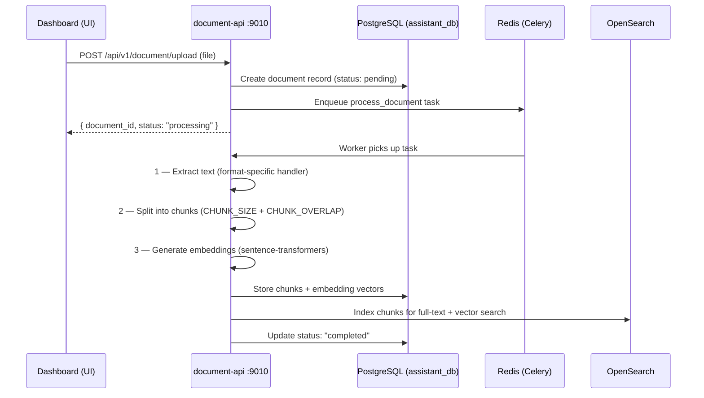

## Purpose

The `document-api` is the knowledge backend for the Rapida platform. It ingests documents (PDF, Word, CSV, and others), splits them into chunks, generates vector embeddings, and indexes everything in OpenSearch. At call time, `assistant-api` queries this service to inject relevant context into the LLM prompt.

<CardGroup cols={3}>
  <Card title="Port" icon="server">
    `9010` — HTTP (FastAPI / uvicorn)
  </Card>
  <Card title="Language" icon="code">
    Python 3.11+
    FastAPI + Celery
  </Card>
  <Card title="Storage" icon="database">
    PostgreSQL `assistant_db`
    Redis (Celery broker)
    OpenSearch (vectors + text)
  </Card>
</CardGroup>

<Info>
  Document processing is asynchronous. Upload returns immediately with `status: processing`. Text extraction, chunking, and embedding generation run as Celery background tasks.
</Info>

---

## Document Processing Pipeline



---

## Supported File Formats

| Format | Library | What is Extracted |
|--------|---------|------------------|
| PDF | PyPDF2, pdfplumber | Text content + metadata |
| Word (.docx) | python-docx | Text + paragraph structure |
| Excel (.xlsx) | openpyxl, pandas | Cell values as text |
| CSV | pandas | Row data as text |
| Markdown (.md) | built-in | Text preserving structure |
| HTML | BeautifulSoup | Cleaned text from HTML |
| Plain text (.txt) | built-in | Direct read |
| Images | pytesseract (OCR) | OCR-extracted text |

---

## Semantic Search

At call time, `assistant-api` sends a text query to `document-api`. The service performs vector similarity search and returns the top-k most relevant chunks.

**Request:**

```bash
curl -X POST http://localhost:9010/api/v1/document/search \
  -H "Authorization: Bearer <jwt>" \
  -H "Content-Type: application/json" \
  -d '{
    "query": "customer billing issue",
    "knowledge_base_id": "kb_123",
    "top_k": 5,
    "threshold": 0.5
  }'
```

**Response:**

```json
{
  "results": [
    {
      "chunk_id": "chunk_123",
      "document_id": "doc_456",
      "content": "Billing errors are handled by submitting a refund request...",
      "similarity_score": 0.87,
      "metadata": {
        "page_no": 5,
        "section": "Billing Policy"
      }
    }
  ]
}
```

---

## Embedding Models

Embeddings are generated using [sentence-transformers](https://www.sbert.net/). The model is configurable via `EMBEDDINGS_MODEL` in `config.yaml`:

| Model | Dimensions | Notes |
|-------|-----------|-------|
| `all-MiniLM-L6-v2` | 384 | **Default** — ~80 MB, fast |
| `all-mpnet-base-v2` | 768 | Higher quality, larger |
| `all-MiniLM-L12-v2` | 384 | Lighter variant of L6 |
| `multilingual-e5-base` | 768 | 100+ languages |

<Note>
  If you change `EMBEDDINGS_MODEL`, you must also update `EMBEDDINGS_DIMENSION` to match and re-index all existing documents. Existing embeddings stored with a different dimension will not match.
</Note>

---

## Running

<Tabs>

<Tab title="Docker Compose">

```bash
make up-document

make logs-document

make rebuild-document
```

</Tab>

<Tab title="From Source">

Requires Python 3.11+, PostgreSQL 15, Redis 7, and OpenSearch 2.11 running locally. All commands run from the **repository root**.

```bash
# 1. Create and activate virtual environment
cd api/document-api
python3 -m venv venv
source venv/bin/activate   # Windows: venv\Scripts\activate

# 2. Install dependencies
pip install -r requirements.txt

# 3. Return to repository root
cd ../..

# 4. Start the API server
PYTHONPATH=api/document-api uvicorn app.main:app --host 0.0.0.0 --port 9010

# 5. In a separate terminal — start the Celery worker
cd api/document-api && source venv/bin/activate && cd ../..
PYTHONPATH=api/document-api celery -A app.worker worker --loglevel=info
```

<Warning>
  All commands must be run from the **repository root** with `PYTHONPATH=api/document-api` set. Running `uvicorn` directly from inside `api/document-api/` will cause import errors.
</Warning>

</Tab>

</Tabs>

---

## Health Endpoints

| Endpoint | Purpose |
|----------|---------|
| `GET /readiness/` | Service ready |
| `GET /healthz/` | Liveness probe |

```bash
curl http://localhost:9010/readiness/
```

---

## Troubleshooting

<AccordionGroup>

<Accordion title="Document stuck in 'processing' status">
The Celery worker is likely not running.

```bash
# Docker
make logs-document

# Local — confirm Celery worker is running
PYTHONPATH=api/document-api celery -A app.worker inspect active
```
</Accordion>

<Accordion title="Embedding generation is slow">
Adjust the Celery worker batch size:

```
EMBEDDINGS_BATCH_SIZE=8     # Low memory
EMBEDDINGS_BATCH_SIZE=64    # High throughput (GPU recommended)
```
</Accordion>

<Accordion title="OpenSearch index errors">
```bash
# List existing indices
curl http://localhost:9200/_cat/indices

# Delete a stale index and allow re-indexing
curl -X DELETE http://localhost:9200/documents-<index-name>
```
</Accordion>

<Accordion title="High memory usage">
```
CELERY_CONCURRENCY=2
```

```bash
docker stats document-api
```
</Accordion>

</AccordionGroup>

---

## Next Steps

<CardGroup cols={2}>
  <Card title="Configuration" icon="sliders" href="/opensource/services/document-api/configuration">
    config.yaml reference — chunking, embedding, Celery, and storage settings.
  </Card>
  <Card title="Assistant API" icon="mic" href="/opensource/services/assistant-api/overview">
    How assistants query knowledge bases during calls.
  </Card>
  <Card title="Architecture" icon="diagram-project" href="/opensource/architecture">
    Full system topology and RAG data flow.
  </Card>
  <Card title="Overview" icon="rocket" href="/opensource/overview">
    Deploy the full platform with Docker Compose.
  </Card>
</CardGroup>
