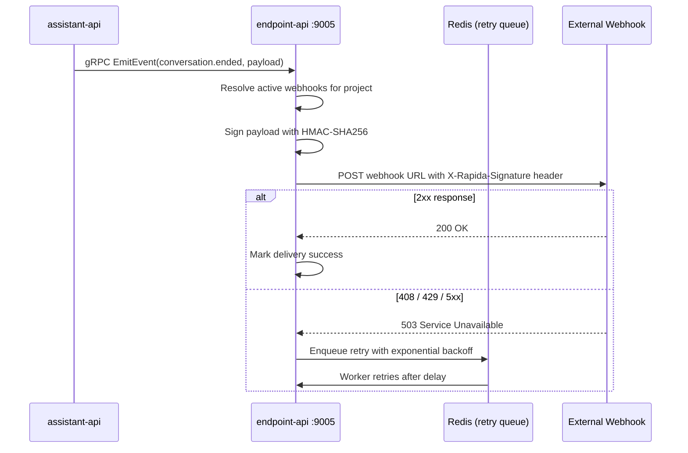

## Purpose

The `endpoint-api` delivers conversation events to external HTTP endpoints. When a call starts, ends, or a message is exchanged, `assistant-api` emits events to `endpoint-api` via gRPC. This service handles fan-out to all registered webhooks, retry with exponential backoff, HMAC-SHA256 payload signing, and delivery tracking.

<CardGroup cols={3}>
  <Card title="Port" icon="server">
    `9005` — HTTP · gRPC (cmux)
  </Card>
  <Card title="Language" icon="code">
    Go 1.25
    Gin (REST) + gRPC
  </Card>
  <Card title="Storage" icon="database">
    PostgreSQL `endpoint_db`
    Redis (retry job queue)
  </Card>
</CardGroup>

---

## Event Delivery Flow



---

## Core Components

<AccordionGroup>

<Accordion title="Webhook Registry">

Each webhook is scoped to a project and subscribes to one or more event types.

| Field | Type | Description |
|-------|------|-------------|
| `name` | string | Human-readable label |
| `url` | string | Destination HTTPS endpoint |
| `events` | string[] | Subscribed event types |
| `is_active` | bool | Enable / disable without deleting |
| `secret` | string | HMAC signing secret |
| `max_retries` | int | Default: `5` |
| `timeout_ms` | int | Default: `30000` |
| `headers` | JSON | Custom headers sent with each delivery |

</Accordion>

<Accordion title="Retry Strategy">

| Attempt | Delay |
|---------|-------|
| 1 | Immediate |
| 2 | 5 seconds |
| 3 | 25 seconds |
| 4 | 2 minutes |
| 5 | 10 minutes |

Retries trigger on HTTP `408`, `429`, and `5xx`. Status `2xx` = success. Status `4xx` (except `408`, `429`) = non-retriable failure.

</Accordion>

<Accordion title="Payload Signing">

Every delivery includes an `X-Rapida-Signature` header:

```
X-Rapida-Signature: sha256=<hmac-sha256-hex>
```

**Verification (Node.js):**

```javascript
const crypto = require('crypto');

function verifySignature(rawBody, signatureHeader, secret) {
  const expected = 'sha256=' + crypto
    .createHmac('sha256', secret)
    .update(rawBody)
    .digest('hex');
  return crypto.timingSafeEqual(
    Buffer.from(signatureHeader),
    Buffer.from(expected)
  );
}
```

</Accordion>

</AccordionGroup>

---

## Event Reference

| Event | Trigger | Key Payload Fields |
|-------|---------|-------------------|
| `conversation.started` | Call begins | `conversation_id`, `assistant_id`, `timestamp` |
| `conversation.ended` | Call terminates | `conversation_id`, `duration_ms`, `messages_count`, `end_reason` |
| `message.sent` | Assistant speaks | `conversation_id`, `message_id`, `content`, `role` |
| `message.received` | User speaks | `conversation_id`, `message_id`, `content`, `role` |
| `assistant.updated` | Config changed | `assistant_id`, `changes` |
| `assistant.deleted` | Assistant removed | `assistant_id`, `timestamp` |
| `error.occurred` | Pipeline error | `conversation_id`, `error_code`, `error_message` |

**Example payload — `conversation.ended`:**

```json
{
  "id": "evt_1234567890abcdef",
  "type": "conversation.ended",
  "timestamp": 1704067200000,
  "data": {
    "conversation_id": "conv_abc123",
    "assistant_id": "asst_def456",
    "duration_ms": 125000,
    "messages_count": 8,
    "end_reason": "user_hangup"
  }
}
```

---

## API Endpoints

| Method | Path | Description |
|--------|------|-------------|
| `GET` | `/readiness/` | Readiness probe |
| `GET` | `/healthz/` | Liveness probe |
| `POST` | `/api/v1/endpoint/webhooks` | Create webhook |
| `GET` | `/api/v1/endpoint/webhooks` | List webhooks |
| `GET` | `/api/v1/endpoint/webhooks/{id}` | Get webhook |
| `PUT` | `/api/v1/endpoint/webhooks/{id}` | Update webhook |
| `DELETE` | `/api/v1/endpoint/webhooks/{id}` | Delete webhook |
| `POST` | `/api/v1/endpoint/webhooks/{id}/test` | Send test event |
| `GET` | `/api/v1/endpoint/webhooks/{id}/deliveries` | List delivery history |
| `POST` | `/api/v1/endpoint/webhooks/{id}/replay` | Replay a specific event |

**Create a webhook:**

```bash
curl -X POST http://localhost:9005/api/v1/endpoint/webhooks \
  -H "Authorization: Bearer <jwt>" \
  -H "Content-Type: application/json" \
  -d '{
    "name": "CRM Sync",
    "url": "https://crm.example.com/webhooks/rapida",
    "events": ["conversation.ended", "message.sent"],
    "headers": {"Authorization": "Bearer crm-api-key"},
    "max_retries": 5,
    "timeout_ms": 30000
  }'
```

**Replay a failed event:**

```bash
curl -X POST http://localhost:9005/api/v1/endpoint/webhooks/{id}/replay \
  -H "Authorization: Bearer <jwt>" \
  -H "Content-Type: application/json" \
  -d '{"event_id": "evt_1234567890abcdef"}'
```

---

## Running

<Tabs>

<Tab title="Docker Compose">

```bash
make up-endpoint

make logs-endpoint

make rebuild-endpoint
```

</Tab>

<Tab title="From Source">

Requires Go 1.25, PostgreSQL 15, and Redis 7 running locally.

```bash
export $(grep -v '^#' docker/endpoint-api/.endpoint.env | xargs)
export POSTGRES__HOST=localhost
export REDIS__HOST=localhost

go run cmd/endpoint/endpoint.go
```

</Tab>

</Tabs>

---

## Health Endpoints

| Endpoint | Purpose |
|----------|---------|
| `GET /readiness/` | Service ready (DB + Redis connected) |
| `GET /healthz/` | Liveness probe |

```bash
curl http://localhost:9005/readiness/
```

---

## Next Steps

<CardGroup cols={2}>
  <Card title="Configuration" icon="sliders" href="/opensource/services/endpoint-api/configuration">
    Environment variables including webhook retry settings.
  </Card>
  <Card title="Assistant API" icon="mic" href="/opensource/services/assistant-api/overview">
    Event emitter — assistant-api fires conversation events to endpoint-api.
  </Card>
  <Card title="Architecture" icon="network" href="/opensource/architecture">
    Full system topology and data flows.
  </Card>
  <Card title="Integration API" icon="plug" href="/opensource/services/integration-api/overview">
    LLM provider execution layer.
  </Card>
</CardGroup>
