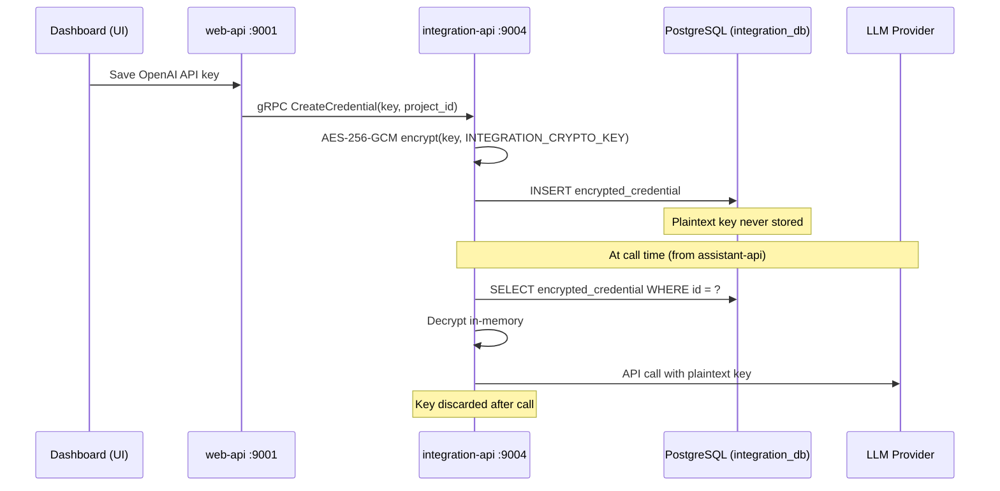

## Overview

The `integration-api` is the provider execution layer. It sits between `assistant-api` and every external AI provider — OpenAI, Anthropic, Deepgram, ElevenLabs, and others. It stores all provider credentials encrypted at rest and is the only service in the platform that ever holds or transmits plaintext API keys.

<CardGroup cols={3}>
  <Card title="Port" icon="server">
    `9004` — HTTP · gRPC (cmux)
  </Card>
  <Card title="Language" icon="code">
    Go 1.25
    Gin (REST) + gRPC
  </Card>
  <Card title="Storage" icon="database">
    PostgreSQL `integration_db`
    Redis (provider cache)
  </Card>
</CardGroup>

<Info>
  The `integration-api` is the **only** service that decrypts and uses provider API keys. Keys are decrypted in-memory per request and never written to logs, forwarded to other services, or stored in plaintext anywhere on disk.
</Info>

---

## Components

<AccordionGroup>

<Accordion title="Caller Layer — Provider API implementations">

Each external provider is implemented as a Go package under `api/integration-api/internal/caller/<provider>/`. Every package follows a consistent structure:

| File | Purpose |
|------|---------|
| `<provider>.go` | Client initialization, credential binding |
| `llm.go` | LLM caller — streaming token inference |
| `embedding.go` | Embedding model invocation (where supported) |
| `verify-credential.go` | Pre-storage credential validation |

The `caller/callers.go` factory registers all providers and routes execution to the correct implementation based on the credential type stored in `integration_db`.

**Adding a new LLM provider**

Create `api/integration-api/internal/caller/<provider>/` with the above files, then register in `callers.go`. No changes to other services are needed.

</Accordion>

<Accordion title="Credential Encryption">

Credentials follow a strict encrypt-on-write, decrypt-on-use lifecycle:



</Accordion>

<Accordion title="OAuth 2.0 Integration">

For providers that use OAuth (e.g., Google, GitHub), integration-api manages the full OAuth flow: redirect, callback, token storage, and automatic refresh.

| OAuth Setting | Variable |
|---------------|----------|
| Callback URL | `OAUTH_CALLBACK_URL` |
| Google client | `GOOGLE_OAUTH_CLIENT_ID`, `GOOGLE_OAUTH_CLIENT_SECRET` |
| GitHub client | `GITHUB_OAUTH_CLIENT_ID`, `GITHUB_OAUTH_CLIENT_SECRET` |

</Accordion>

</AccordionGroup>

---

## Supported Providers

<Tabs>

<Tab title="LLM">

| Provider | Notes |
|----------|-------|
| OpenAI | GPT-4o, GPT-4, GPT-3.5 · Function calling · Streaming |
| Anthropic | Claude 3.5 Sonnet, Claude 3 · Tool use · Streaming |
| Google Gemini | Gemini Pro · Flash · Streaming |
| Google Vertex AI | Enterprise Gemini deployment |
| Azure OpenAI | Enterprise GPT deployment with custom endpoint |
| AWS Bedrock | Llama, Titan, Mistral via AWS |
| Cohere | Command R+ · Streaming |
| Mistral | Mistral Large · Small · Streaming |
| HuggingFace | Inference API |
| Replicate | Model hosting via Replicate API |
| VoyageAI | Embeddings and reranking |

</Tab>

<Tab title="STT">

| Provider | Notes |
|----------|-------|
| Google Cloud STT | Streaming recognition, 100+ languages |
| Azure Cognitive Services | Microsoft Neural Speech, real-time |
| Deepgram | Low-latency streaming, Nova-2 and Nova-3 models |
| AssemblyAI | Streaming and batch transcription |
| Cartesia | Real-time with speaker diarization |
| Sarvam AI | Indian language support |

</Tab>

<Tab title="TTS">

| Provider | Notes |
|----------|-------|
| Google Cloud TTS | WaveNet / Neural2 voices |
| Azure Cognitive Services | Neural voices, 140+ languages |
| ElevenLabs | High-fidelity voice cloning, low latency |
| Deepgram Aura | Fast synthesis, multiple voices |
| Cartesia | Streaming synthesis |
| Sarvam AI | Indian language support |

</Tab>

<Tab title="Telephony">

| Provider | Notes |
|----------|-------|
| Twilio | Programmable Voice, Media Streams, bulk calling |
| Vonage | Voice API, WebSocket audio streaming |
| Exotel | Cloud telephony for India / SEA markets |

</Tab>

</Tabs>

---

## Configuration

Edit `docker/integration-api/.integration.env` before starting the service.

### Required variables

| Variable | Required | Default | Description |
|----------|----------|---------|-------------|
| `SECRET` | ✅ Yes | `rpd_pks` | JWT signing secret — must match all services |
| `POSTGRES__HOST` | ✅ Yes | `postgres` | PostgreSQL host |
| `POSTGRES__DB_NAME` | ✅ Yes | `integration_db` | Database name |
| `POSTGRES__AUTH__USER` | ✅ Yes | `rapida_user` | Database user |
| `POSTGRES__AUTH__PASSWORD` | ✅ Yes | — | Database password |
| `REDIS__HOST` | ✅ Yes | `redis` | Redis host |
| `INTEGRATION_CRYPTO_KEY` | ✅ Yes | — | AES-256-GCM key for credential encryption |
| `WEB_HOST` | ✅ Yes | `web-api:9001` | web-api gRPC address |

### Optional OAuth variables

| Variable | Required | Description |
|----------|----------|-------------|
| `OAUTH_CALLBACK_URL` | No | OAuth redirect URI |
| `GOOGLE_OAUTH_CLIENT_ID` | No | Google OAuth app client ID |
| `GOOGLE_OAUTH_CLIENT_SECRET` | No | Google OAuth app client secret |
| `GITHUB_OAUTH_CLIENT_ID` | No | GitHub OAuth app client ID |
| `GITHUB_OAUTH_CLIENT_SECRET` | No | GitHub OAuth app client secret |

### Full environment file

```env
# ── Service identity ──────────────────────────────────────────────
SERVICE_NAME=integration-api
HOST=0.0.0.0
PORT=9004
LOG_LEVEL=debug
SECRET=rpd_pks
ENV=development

# ── PostgreSQL ────────────────────────────────────────────────────
POSTGRES__HOST=postgres
POSTGRES__PORT=5432
POSTGRES__DB_NAME=integration_db
POSTGRES__AUTH__USER=rapida_user
POSTGRES__AUTH__PASSWORD=rapida_db_password
POSTGRES__MAX_OPEN_CONNECTION=10
POSTGRES__SSL_MODE=disable

# ── Redis ─────────────────────────────────────────────────────────
REDIS__HOST=redis
REDIS__PORT=6379

# ── Credential encryption ─────────────────────────────────────────
# Required: AES-256-GCM key for encrypting stored provider credentials
# Generate: openssl rand -hex 32
INTEGRATION_CRYPTO_KEY=your_32_char_encryption_key_here

# ── Internal service addresses ────────────────────────────────────
WEB_HOST=web-api:9001
```

<Warning>
  `INTEGRATION_CRYPTO_KEY` protects all stored provider credentials. Store it in a secret manager (AWS Secrets Manager, HashiCorp Vault, Kubernetes Secrets) — never commit it to version control. If this key is rotated or lost, all stored credentials must be re-entered, as the ciphertext becomes unreadable.
</Warning>

---

## Running

<Tabs>

<Tab title="Docker Compose">

```bash
# Start integration-api and its dependencies
make up-integration

# Follow logs
make logs-integration

# Rebuild after code changes
make rebuild-integration
```

</Tab>

<Tab title="From Source">

Requires Go 1.25, PostgreSQL 15, and Redis 7 running locally.

```bash
# Load base env file
export $(grep -v '^#' docker/integration-api/.integration.env | xargs)

# Override Docker hostnames
export POSTGRES__HOST=localhost
export REDIS__HOST=localhost
export WEB_HOST=localhost:9001

# Run
go run cmd/integration/integration.go
```

</Tab>

</Tabs>

---

## Health & Observability

| Endpoint | Purpose |
|----------|---------|
| `GET /readiness/` | Reports whether the service is ready (DB + Redis connected) |
| `GET /healthz/` | Liveness probe |

```bash
curl http://localhost:9004/readiness/
```

---

## Troubleshooting

<AccordionGroup>

<Accordion title="Credential test fails for a provider">
- Verify the API key has the correct permissions for your account tier.
- Check the provider's status page for outages.
- Confirm `INTEGRATION_CRYPTO_KEY` has not changed since the credential was stored.
</Accordion>

<Accordion title="LLM streaming times out">
- Check `make logs-integration` for provider-side timeout errors.
- Increase `POSTGRES__MAX_OPEN_CONNECTION` if database contention is visible.
- For Azure OpenAI: confirm the deployment name in the credential matches the actual Azure deployment.
</Accordion>

<Accordion title="Stored credentials unreadable after restart">
`INTEGRATION_CRYPTO_KEY` has changed between restarts. Credentials encrypted with the old key cannot be decrypted. Set the key back to its original value, or re-enter all provider credentials through the dashboard.
</Accordion>

</AccordionGroup>

---

## Next Steps

<CardGroup cols={2}>
  <Card title="Assistant API" icon="mic" href="/opensource/services/assistant-api">
    How integration-api is called during a live voice conversation.
  </Card>
  <Card title="Endpoint API" icon="webhook" href="/opensource/services/endpoint-api">
    Webhook delivery after call events.
  </Card>
  <Card title="Configuration Reference" icon="sliders" href="/opensource/configuration">
    Full environment variable reference.
  </Card>
  <Card title="Architecture" icon="diagram-project" href="/opensource/architecture">
    Full system topology.
  </Card>
</CardGroup>
