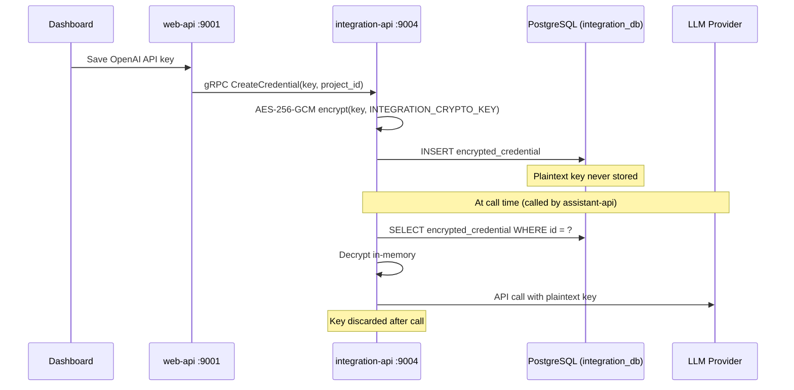

## Purpose

The `integration-api` is the single point of contact with every external AI provider in the platform. It:

- Stores provider API keys encrypted at rest using AES-256-GCM
- Decrypts credentials in-memory per request (never written to logs or disk)
- Executes LLM streaming and non-streaming inference
- Generates embeddings for RAG search
- Verifies provider credentials before saving them

<CardGroup cols={3}>
  <Card title="Port" icon="server">
    `9004` — HTTP · gRPC (cmux)
  </Card>
  <Card title="Language" icon="code">
    Go 1.25
    Gin (REST) + gRPC
  </Card>
  <Card title="Storage" icon="database">
    PostgreSQL `integration_db`
    Redis (provider cache)
  </Card>
</CardGroup>

<Info>
  `integration-api` is the **only** service that decrypts and uses provider API keys. Keys are decrypted in-memory per request and are never written to logs, forwarded to other services, or stored in plaintext anywhere.
</Info>

---

## Credential Encryption Flow



---

## Supported Providers

<Tabs>

<Tab title="LLM">

| Provider | Notes |
|----------|-------|
| OpenAI | GPT-4o, GPT-4, GPT-3.5 · Function calling · Streaming |
| Anthropic | Claude 3.5 Sonnet, Claude 3 · Tool use · Streaming |
| Google Gemini | Gemini Pro · Flash · Streaming |
| Google Vertex AI | Enterprise Gemini deployment |
| Azure OpenAI | Enterprise GPT with custom endpoint |
| AWS Bedrock | Llama, Titan, Mistral via AWS |
| Cohere | Command R+ · Streaming |
| Mistral | Mistral Large · Small · Streaming |
| HuggingFace | Inference API |
| Replicate | Model hosting |
| VoyageAI | Embeddings and reranking |

</Tab>

<Tab title="STT">

| Provider | Notes |
|----------|-------|
| Google Cloud STT | Streaming, 100+ languages |
| Azure Cognitive Services | Neural Speech, real-time |
| Deepgram | Nova-2 / Nova-3, low-latency streaming |
| AssemblyAI | Streaming and batch |
| Cartesia | Real-time |
| Sarvam AI | Indian languages |

</Tab>

<Tab title="TTS">

| Provider | Notes |
|----------|-------|
| Google Cloud TTS | WaveNet / Neural2 |
| Azure Cognitive Services | Neural voices, 140+ languages |
| ElevenLabs | High-fidelity voice cloning |
| Deepgram Aura | Fast synthesis |
| Cartesia | Streaming synthesis |
| Sarvam AI | Indian languages |

</Tab>

<Tab title="Telephony">

| Provider | Notes |
|----------|-------|
| Twilio | Programmable Voice, Media Streams, bulk calling |
| Vonage | Voice API, WebSocket audio |
| Exotel | Cloud telephony — India / SEA |

</Tab>

</Tabs>

---

## Caller Architecture

Each LLM provider lives under `api/integration-api/internal/caller/<provider>/`. The directory structure is:

```
api/integration-api/internal/caller/
├── callers.go              ← interfaces + factory
├── chat_options.go         ← ChatCompletionOptions, ToolDefinition
├── embedding_options.go    ← EmbeddingOptions
├── reranking_options.go    ← RerankerOptions
├── anthropic/
├── azure/
├── cohere/
├── gemini/
├── huggingface/
├── mistral/
├── openai/                 ← reference implementation
├── replicate/
├── vertexai/
└── voyageai/
```

Each provider package contains:

| File | Purpose |
|------|---------|
| `<provider>.go` | Client initialization, credential binding |
| `llm.go` | `LargeLanguageCaller` implementation |
| `embedding.go` | `EmbeddingCaller` (where supported) |
| `verify-credential.go` | Pre-storage credential validation |

---

## Running

<Tabs>

<Tab title="Docker Compose">

```bash
make up-integration

make logs-integration

make rebuild-integration
```

</Tab>

<Tab title="From Source">

Requires Go 1.25, PostgreSQL 15, and Redis 7 running locally.

```bash
export $(grep -v '^#' docker/integration-api/.integration.env | xargs)
export POSTGRES__HOST=localhost
export REDIS__HOST=localhost
export WEB_HOST=localhost:9001

go run cmd/integration/integration.go
```

</Tab>

</Tabs>

---

## Health Endpoints

| Endpoint | Purpose |
|----------|---------|
| `GET /readiness/` | Service ready (DB + Redis connected) |
| `GET /healthz/` | Liveness probe |

```bash
curl http://localhost:9004/readiness/
```

---

## Next Steps

<CardGroup cols={2}>
  <Card title="Configuration" icon="sliders" href="/opensource/services/integration-api/configuration">
    Environment variables including INTEGRATION_CRYPTO_KEY.
  </Card>
  <Card title="Adding Providers" icon="plug" href="/opensource/services/integration-api/providers">
    LargeLanguageCaller interface and how to add a new LLM provider.
  </Card>
  <Card title="Assistant API" icon="mic" href="/opensource/services/assistant-api/overview">
    How assistant-api calls integration-api during a live voice conversation.
  </Card>
  <Card title="Architecture" icon="diagram-project" href="/opensource/architecture">
    Full system topology.
  </Card>
</CardGroup>
